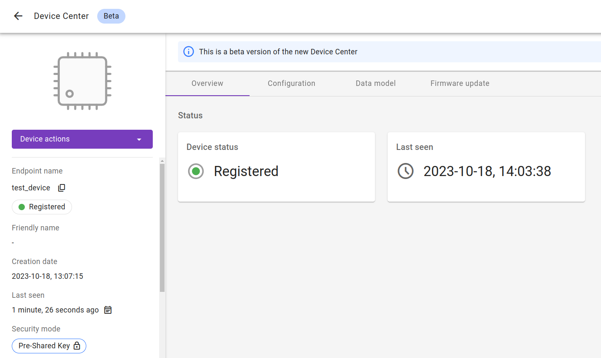

# OpenThread Border Router configurable through LwM2M server

In this tutorial, we will configure OpenThread Border Router with [**Svetovid**](https://github.com/AVSystem/Svetovid-raspberry-client) which is a LwM2M Client for Linux-based devices based on [**Anjay**](https://anjay.io).
With the help of **Svetovid**, we will be able to manage the Border Router remotely, through the LwM2M server. Within this guide, we will use the {{ coiote_long_name }} as the server.

## Prerequisites

- The [**nRF52840 DK**](https://www.nordicsemi.com/Products/Development-hardware/nrf52840-dk) or the [**nRF52840 Dongle**](https://www.nordicsemi.com/Products/Development-hardware/nrf52840-dongle).
- A Linux-based machine (in this tutorial we will use Raspberry Pi 3 model B with Raspbian) with `AMD64`, `ARMv7` or `ARM64` architecture.
- Installed [**Docker Engine**](https://docs.docker.com/engine/install/).
- Installed **nrfjprog** from [Nordic Semiconductor page](https://www.nordicsemi.com/Products/Development-tools/nrf-command-line-tools/download) (for **nRF52840 DK**)
- Installed **nrfutil** from [Nordic Semiconductor page](https://www.nordicsemi.com/Products/Development-tools/nRF-Util) (for **nRF52840 Dongle**)
- A user with access to the {{ coiote_long_name }}.

## Flash Radio Co-Processor

Our Border Router will run on an RCP design, which means that the core of the OpenThread stack will run on the host side and communicate via `Spinel` protocol with another device with a Thread radio.

Now we will build and flash image for Radio Co-Processor.

0. Connect your nRF board to your computer. In case of **nRF52840 DK** you should choose `MCU USB` port.

0. Clone the OpenThread repository:
```
    git clone --recursive https://github.com/openthread/ot-nrf528xx.git
```

0. Enter new directory:
```
    cd ot-nrf528xx
```

0. Install required dependencies:
```
    script/bootstrap
```

0. Build the image:

    === "**nRF52840 DK**"
        ```
            script/build nrf52840 USB_trans
        ```
    === "**nRF52840 Dongle**"
        ```
            script/build nrf52840 USB_trans -DOT_BOOTLOADER=USB
        ```

    !!! Note
        If you have built an image before, don't forget to remove the `build` directory before the next compilation:
        ```
            rm -rf build
        ```

0. Convert the image to the `hex` format:
```
    arm-none-eabi-objcopy -O ihex build/bin/ot-rcp build/bin/ot-rcp.hex
```

0. Flash the RCP:

    === "**nRF52840 DK**"
        ```
            nrfjprog -f nrf52  --verify --chiperase --program build/bin/ot-rcp.hex --reset
        ```
        After flashing, you must switch the `MCU USB` port to the `nRF USB` in order to communicate with the Border Router (although, if you would like to avoid this switching, you can disable the Mass Storage feature on the `MCU USB` port using `J-Link Commander`, so that it does not interfere with the core RCP functionalities, but then you will need to change selected transport to `UART_trans` in the build command). Afterward, set the `nRF power source` to USB by proper switch on the board.

    === "**nRF52840 Dongle**"
        Install `nrf5sdk-tools`:
        ```
            nrfutil install nrf5sdk-tools
        ```

        Generate the RCP firmware package:
        ```
            nrfutil pkg generate --hw-version 52 --sd-req=0x00 --application build/bin/ot-rcp.hex --application-version 1 build/bin/ot-rcp.zip
        ```

        Press the `reset` button to enter the bootloader mode, the onboard LED should start pulsing red.

        Check the dongle path:
        ```
            ls -l /dev/ttyACM*
        ```

        Flash the dongle (assuming that the dongle path is `/dev/ttyACM0`):
        ```
            nrfutil dfu usb-serial -pkg build/bin/ot-rcp.zip -p /dev/ttyACM0
        ```

## Connecting to the LwM2M Server

To connect to {{ coiote_long_name }}, please register at [{{ coiote_site_link }}]({{ coiote_site_link }}).

To connect the device:

1. Log in to {{ coiote_short_name }} and from the left side menu, select **Device Inventory**.
2. In **Device Inventory**, click **Add device**.
3. Select the **Connect your LwM2M device directly via the Management server** tile.
       
    3. In the **Device credentials** step:
         - In the **Device ID** enter your board endpoint name, e.g. `test_device`.
             
         - In the **Security mode** section, select the **PSK (Pre-Shared Key)** mode:
              - In the **Key identity** field, type the same name as in the `Endpoint name` field.
              - In the **Key** field, type the shared secret used in the device-server authentication.
    4. Click the **Add device** button and **Confirm** in the confirmation pop-up.
    5. In the **Connect your device** step, follow the next sections to run the client and connect it to the server.

## Switch to the target device

If you haven't worked on your target device thus far, it's time to switch to it, in our case it is the `Raspberry Pi 3B`. Connect the RCP to the target device and proceed with this tutorial while working on it.

## Downloading Docker image

Download the newest version of `svetovid-with-otbr` docker image:
```
    docker pull avsystem/svetovid-with-otbr
```

## Shell variables

To make it easier to run the docker container, we will set a bunch of shell variables (note that the variables in the below manner are set for current shell session only, which means that when a new session is opened, the previous variables will not be restored).

At first let's check the RCP path:
```
    ls -l /dev/ttyACM*
```

And set `RCP_PATH` variable, for example `/dev/ttyACM0`:
```
    RCP_PATH='/dev/ttyACM0'
```

Now we will set variables related to LwM2M server and credentials.

0. Server URI (e.g. {{ coiote_server }}):
```
    SERVER_URI='{{ coiote_server }}'
```

0. Endpoint name (it will also be used as an DTLS Identity):
```
    ENDPOINT_NAME='<your endpoint name>'
```

0. Pre-shared key:
```
    PSK='<your PSK>'
```

## Run docker container

Before you run docker container you need to add `ip6table_filter` module to Linux Kernel:
```
    sudo modprobe ip6table_filter
```

After that you can run your image in a new container:
```
    docker run --sysctl "net.ipv6.conf.all.disable_ipv6=0 net.ipv4.conf.all.forwarding=1 net.ipv6.conf.all.forwarding=1" -p 8080:80 -p 8081:8081 --dns=127.0.0.1 -it --volume $RCP_PATH:$RCP_PATH --privileged -e DNS64_ONLY=1 -e EP=$ENDPOINT_NAME -e PSK=$PSK -e SERVER_HOST=$SERVER_URI avsystem/svetovid-with-otbr --radio-url spinel+hdlc+uart://$RCP_PATH
```

## Configure your Border Router through {{ coiote_short_name }}

After a while you should see that your Border Router successfully connected to server. Now you can click **Next**, then **Go to Summary**, then **Finish**. You will see your Device Center view.
{:style="float: left;margin-right: 1177px;margin-top: 7px; margin-bottom: 17px;"}

Now you can switch to **Data model** tab. Here you can find objects related to **OpenThread Border Router**:

* **/33630** - `OTBR Configuration` - by using this object you can configure and form a Thread network

* **/33633** - `OpenThread Neighbor List` - each instance of this object shall correspond to an entry in the local Thread node's neighbor table

* **/33634** - `OpenThread Commissioner Joiner Table` - each instance of this object shall correspond to a single entry in the commissioner's joiner table

* **/33639** - `OpenThread Neighbor Networks` - each instance of this object shall correspond to one of the neighboring networks

* **/33640** - `OpenThread Join Existing Network` - by using this object you can join existing Thread network

## Form a Thread network

Use the **OTBR Configuration** object to form a Thread network. Replace all default values from the `Network Name`, `Network Extended PAN ID`, `PAN ID`, `Commissioner Credential` and `Network Key` resources to ensure a secure Thread network. Specify the `On_Mesh Prefix`, select the desired `Channel` and execute the `Form` resource to form your Thread network.
