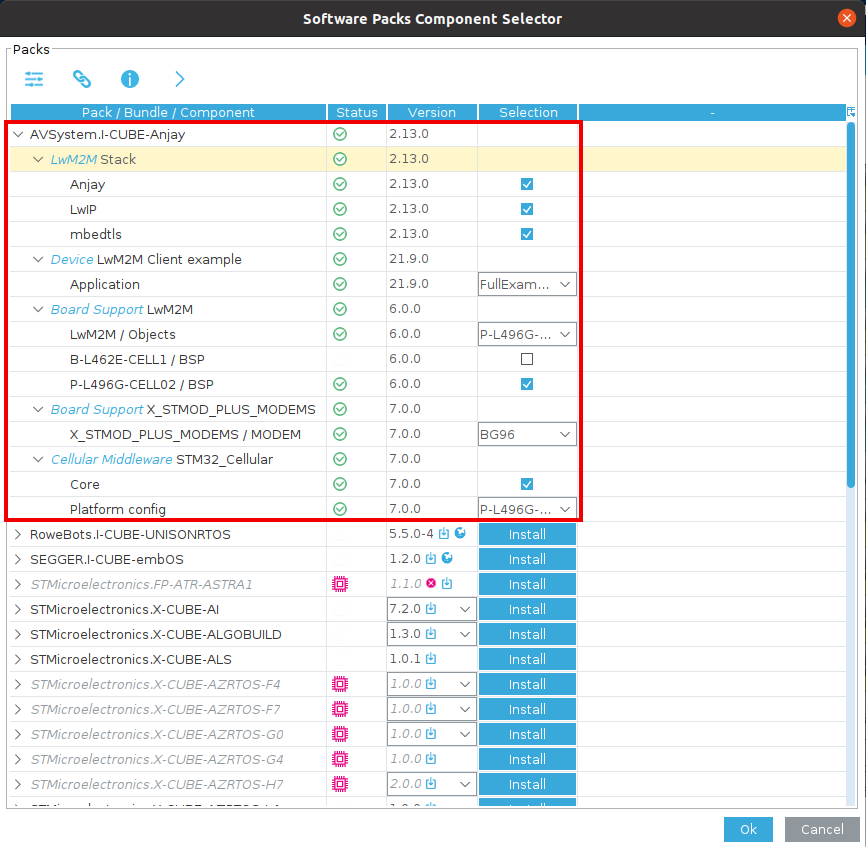
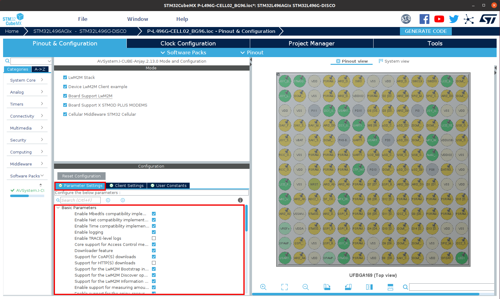
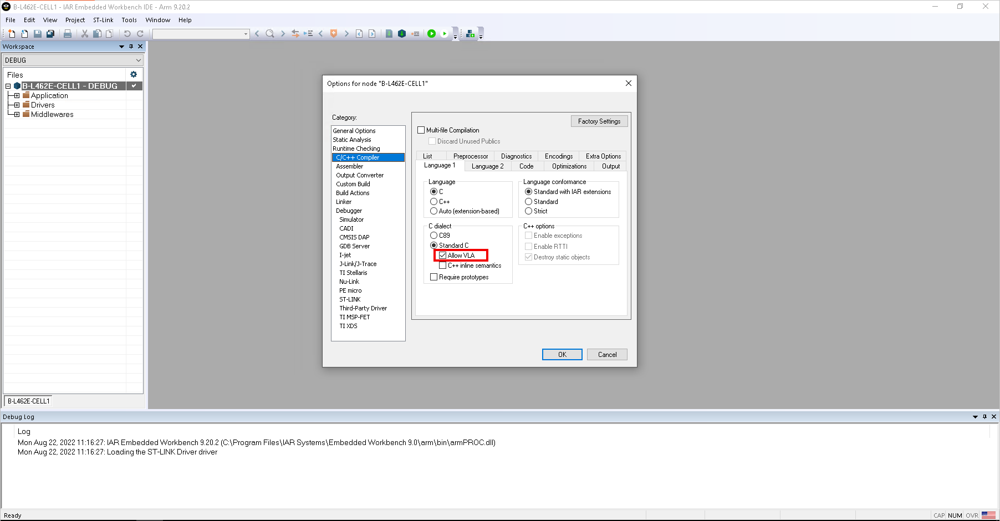
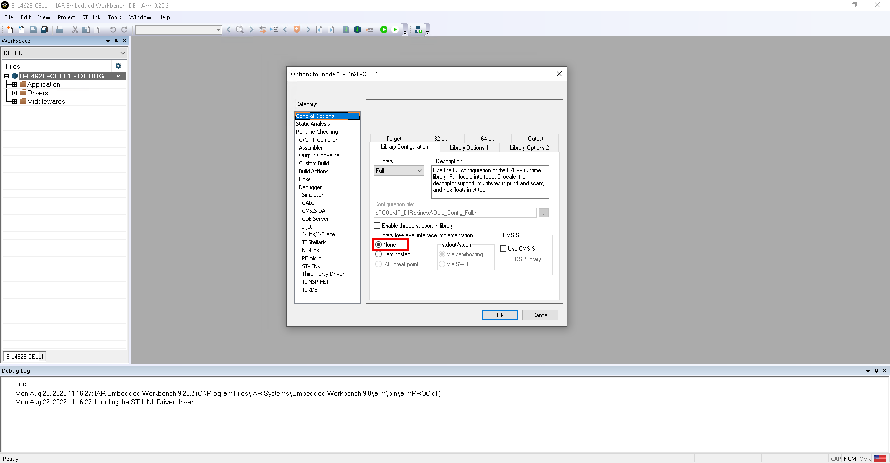
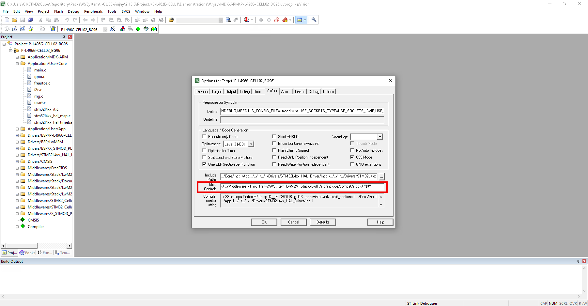

# Building LwM2M applications for STM boards with I-CUBE-Anjay

Start prototyping custom LwM2M applications on your STMicroelectronics board with I-CUBE-Anjay using STM32CubeMX.

## Prerequisites

- An STM board with a USB cable.
- Installed **STM32CubeMX**.
- Downloaded [**Anjay I-CUBE** pack file](https://avsystem.com/static/avssite/files/AVSystem/I-CUBE-Anjay/AVSystem.I-CUBE-Anjay.2.13.0.pack).

## Step 1: Installing the **Anjay I-CUBE** software pack

0. Open STM32CUBEMX and in the New project section, select **ACCESS TO BOARD SELECTOR**.

0. From the list of STM boards, select your board, click **Start project** and click **No** in the **Initialize all peripherals with their default mode** pop-up that appears.  

0. In the **Pinout & Configuration** tab, click **Software Packs** and select **Manage Software Packs**.

    - Click **From local** and select your Anjay I-Cube pack from your local disk.
    
    - After reading the license agreement, check the license agreement checkbox and click **Finish**. The pack will be installed in a few seconds.
0. Back in the **Pinout & Configuration** tab, click **Software Packs** and select **Select Components**.

0. From the list of packs, click **AVSystem.I-CUBE-Anjay** to expand a list of bundles and components.
    - Configure options according to the specific instruction for your board in the [Specific CubeMX settings](#specific-cubemx-settings).

## Step 2: Configuring the **Anjay I-CUBE** application

Before you generate code for your application, you need to configure it as per the specific requirements for your board:

0. Back in the **Pinout & Configuration** tab, expand the **Software Packs** tab that has appeared in the side menu and click **AVSystem.I-CUBE-Anjay.x.xx.x**:
     - In the **Mode** window that appears, check all the boxes next to the LwM2M Stack, Device LwM2M Client example, Board Support LwM2M, Board Support X STMOD PLUS MODEMS, Cellular Middleware STM32 Cellular options.
     
     - In the **Configuration** window:
         - Go to the **Parameter Settings** tab and configure your Anjay Library. For a detailed description of all Anjay library configuration options, see [here](https://avsystem.github.io/Anjay-doc/api/anjay__config_8h.html).
         
         - Go to the **Client Settings** tab and configure your LwM2M Client parameters like Endpoint name, PSK, PSK identity, server URI and others.
         
0. In the **Pinout & Configuration** tab:
     - Expand the **Connectivity**, **Middleware**, **Security** and **System Core** tabs:
         - Configure options according to the specific instruction for your board in the [Specific CubeMX settings](#specific-cubemx-settings).

## Step 3: Generating application code

0. Back in your project overview, select the **Project Manager** tab:
     - In the **Project** tab:
        - In the **Project Name** field, provide a name for your project.
        - From the Toolchain/IDE expandable list, select **STM32CubeIDE**.
        - In linker settings adjust Minimum Heap Size to 0x5000 and Minimum Stack Size to 0xC00.
     - In the **Code Generator** tab:
        - Check the **Generate peripheral initialization as a pair of '.c/.h' files per peripheral**.
0. Click **GENERATE CODE** and confirm by clicking **Yes** in the pop-up.

0. After the project is generated, you can use it further in the CubeIDE to develop, flash and debug your application.

## Specific CubeMX settings

### B-L462E-CELL1
Start from board selector with B-L462E-CELL1 board, do not initialize all peripherals with their default mode.

Through Select Components menu choose desired components from the pack, in this example select:

- LwM2M Stack
    - Anjay
    - LwIP
    - mbedtls
- Device Application - FullExample
- Board Support LwM2M
    - LwM2M Objects: B-L462E-CELL1
    - B-L462E-CELL1 BSP
- Board Support X_STMOD_PLUS_MODEMS - TYPE1SC
- STM32_Cellular
    - Core
    - Platform config: B-L462E-CELL1

Apply the following settings:

- Connectivity tab:
    - I2C1 - Enable I2C1
    - USART1 - Enable Asynchronous, enable global interrupts
    - USART2 - Enable Asynchronous, enable global interrupts
    - USART3 - Enable Asynchronous, enable global interrupts
- Middleware tab:
    - FreeRTOS
        - Interface - CMSIS_V1
        - TOTAL_HEAP_SIZE - 32768 Bytes
        - USE_COUNTING_SEMAPHORES - Enabled
- Project Manager:
    - Code Generator - Enable Generate peripheral initialization as a pair of '.c/.h' files per peripheral.
- Software Packs:
    - I-CUBE-Anjay - select all enabled components and modify Client Settings with connection parameters. Parameter settings can be modified to alter Anjay LwM2M Library configuration.

Generate the project and open it in **STM32CubeIDE**.

Right click on the project **Build Configurations -> Set Active -> Release**.

Select generated project and modify **Properties -> C/C++ Build -> Settings -> MCU Settings**

Change **Runtime library** to **Standard C**.

Flash the project using **Run As -> STM32 Cortex-M C/C++ Application**.

### P-L496G-CELL02
Start from board selector with STM32L496G-DISCO board, do not initialize all peripherals with their default mode.

Through Select Components menu choose desired components from the pack, in this example select:

- LwM2M Stack
    - Anjay
    - LwIP
    - mbedtls
- Device Application - FullExample
- Board Support LwM2M
    - LwM2M Objects: P-L496G-CELL02
    - P-L496G-CELL02 BSP
- Board Support X_STMOD_PLUS_MODEMS - BG96 or MONARCH (depending on your setup)
- STM32_Cellular
    - Core
    - Platform config: P-L496G-CELL02

Apply the following settings:

- Connectivity tab:
    - I2C1 - Enable I2C
    - USART1 - Enable Asynchronous, enable global interrupts
    - USART2 - Enable Asynchronous, enable global interrupts
- Security tab:
    - RNG - Enable
- Middleware tab:
    - FreeRTOS
        - Interface - CMSIS_V1
        - TOTAL_HEAP_SIZE - 32768 Bytes
        - USE_COUNTING_SEMAPHORES - Enabled
        - USE_TIMERS - Enabled
        - vTaskDelayUntil - Enabled
        - uxTaskGetStackHighWaterMark - Enabled
- System Core
    - SYS
        - Timebase Source - TIM1
- Project Manager:
    - Code Generator - Enable Generate peripheral initialization as a pair of '.c/.h' files per peripheral.
- Software Packs:
    - I-CUBE-Anjay - select all enabled components and modify Client Settings with connection parameters. Parameter settings can be modified to alter Anjay LwM2M Library configuration.

Generate the project and open it in **STM32CubeIDE**.

Select generated project and modify **Properties -> C/C++ Build -> Settings -> MCU Settings**

Change **Runtime library** to **Standard C**.

Flash the project using **Run As -> STM32 Cortex-M C/C++ Application**.

## Compiler-dependent options

When generating code, CubeMX might warn you that `USE_NEWLIB_REENTRANT` option must be set. However, not all the IDEs have *newlib* in their toolchain libraries and checking this option can make your project uncompilable. For IAR and Keil simply press `Yes` to skip it.

Depending on the Compiler Toolchain, redirecting standard output into the console via UART and serial port might require additional options in IDE and compiler-specific code. Solutions can be found below as well as in the Pack's demonstration projects.

### IAR Embedded Workbench

IAR Embedded Workbench for ARM version 9.20.2 or higher is required to compile the project.

0. To compile client application example, navigate to **Project -> Options ... -> C/C++ Compiler -> C dialect** and set **Allow VLA**.
    

0. To allow and handle serial output with application flashed on board and **not** attached to IAR, Semihosting has to be disabled.
    Navigate to **Project -> Options ... -> General Options -> Library low-level interface implementation** and set it to **None**.
    

    In `main.c` add the following lines of code:

    ```
    #include "plf_hw_config.h"
    #include <stdio.h>
    #include "trace_interface.h"
    #include <LowLevelIOInterface.h>

    // ...

    int iar_fputc(int ch);
    #define PUTCHAR_PROTOTYPE int iar_fputc(int ch)

    // ...

    size_t __write(int file, unsigned char const *ptr, size_t len)
    {
    size_t idx;
    unsigned char const *pdata = ptr;

    for (idx = 0; idx < len; idx++)
    {
        iar_fputc((int)*pdata);
        pdata++;
    }
    return len;
    }

    PUTCHAR_PROTOTYPE
    {
    /* Place your implementation of putchar here */
    /* e.g. write a character to the USART3 and Loop until the end of transmission */
    HAL_UART_Transmit(&TRACE_INTERFACE_UART_HANDLE, (uint8_t *)&ch, 1, 0xFFFF);

    return ch;
    }
    ```

### Keil uVision

0. The newest Keil MDK distribution no longer contains Arm Compiler 5, which is a target compiler when generating a project with STM32CubeMX. You have to either install Keil MDK version older than 5.37 or install the missing compiler manually - [more information here](https://developer.arm.com/documentation/ka005073/1-0/?lang=en).

0. Keil's `errno` defines conflict with LwIP's `errno` and it must be resolved by adding LwIP's include folder to the list of the system includes. To do so, navigate to **Project -> Options for Target (...) -> C/C++ -> Misc Controls** and add a following command control option (ensure proper path; incorrect path will not generate an error):<br>
    `-J ../Middlewares/Third_Party/AVSystem_LwM2M_Stack/LwIP/src/include/compat/stdc -J "$J"`

    

0. To ensure proper handling of serial output with application flashed on board and **not** attached to uVision, navigate to **Project -> Manage -> Run-Time Environment... -> Compiler -> I/O**, select checkboxes and choose **User** variant for **STRERR**, **STDIN** and **STDOUT**.
    

    In `main.c` add the following lines of code:
    ```
    #include "plf_hw_config.h"
    #include <stdio.h>

    // ...

    #define PUTCHAR_PROTOTYPE int fputc(int ch, FILE *f)

    // ...

    PUTCHAR_PROTOTYPE
    {
    /* Place your implementation of putchar here */
    /* e.g. write a character to the USART3 and Loop until the end of transmission */
    HAL_UART_Transmit(&TRACE_INTERFACE_UART_HANDLE, (uint8_t *)&ch, 1, 0xFFFF);

    return ch;
    }
    ```
