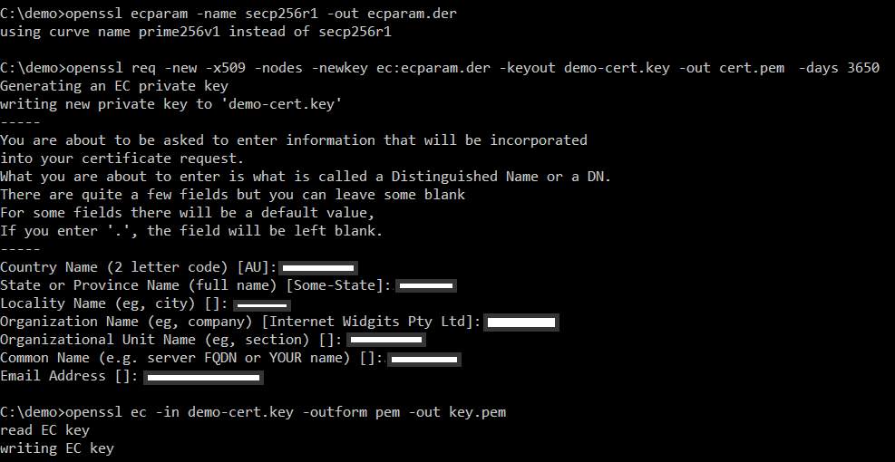

# Runtime Certificate and Private Key Configuration

## Introduction
Anjay library supports secure connection between device and server. Encryption can be achieved with the use of Pre-Shared Key as was described in [STM32L496G-DISCO/BG96](STM32L496G-DISCO/BG96.md), [B-L462E-CELL1/TYPE1SC](B-L462E-CELL1/TYPE1SC.md), [B-L475E-IOT01A](B-L475E-IOT01A.md), and [B-U585I-IOT02A/BG96](B-U585I-IOT02A/BG96.md) pages or with certificate-based cryptography.

In **Certificate Mode** an asymmetrical algorithm is used to authenticate the connection endpoints and initialize payload encryption. Appropriate certificates need to be generated for both the LwM2M Client and the LwM2M Server. Public certificates of both parties are mutually available, and each party also has access to its corresponding private key.

You can read more about secure communication on [Anjay's documentation](https://avsystem.github.io/Anjay-doc/BasicClient/BC-Security.html) page.


## Prerequisites
* The STM32L496G-DISCO/BG96 board with a USB cable.
* Installed **minicom** (for Linux), **RealTerm**, **PuTTy** (for Windows), or another serial communication program.
* Installed [OpenSSL](https://www.openssl.org/source/)
* An active [Coiote IoT DM](https://eu.iot.avsystem.cloud/) user account.

!!! Note
    In this tutorial we will use the STM32L496G-DISCO/BG96 board as an example.

## Build and flash the device
To get the latest binary file and flash the board:

0. Connect the STM32L496G-DISCO/BG96 board to a USB port of your machine.
0. Go to [Anjay-freertos-client](https://github.com/AVSystem/Anjay-freertos-client/releases/).
0. Download the `Anjay-freertos-client-STM32L496G-BG96.bin` file.
0. To flash the board, open your **File manager** and drag the downloaded `.bin` file to your **DIS_L496ZG** external device.
0. You will see a blinking diode on your board. The diode will stop blinking as soon as the flashing is finished.

## Generate certificate
The certificate and private key based on the SECP256R1 curve can be provided through the shell interface in PEM format. To generate them open terminal and use the following commands.


```
openssl ecparam -name secp256r1 -out ecparam.der
openssl req -new -x509 -nodes -newkey ec:ecparam.der -keyout demo-cert.key -out demo-cert.crt -days 3650
openssl x509 -in demo-cert.crt -outform pem -out cert.pem
openssl ec -in demo-cert.key -outform pem -out key.pem
```



!!! Important

    To use the certificate and private key configuration with Coiote IoT DM you must specify a common name that is the same as the client endpoint name.

You will see created `cert.pem` and `key.pem` files in the directory.

## Configure the Client

0. With the board still connected to a serial port interface, open a serial communication program.
0. Press the reset button located on the board. This should trigger the following prompt:

    ``Press any key in 3 seconds to enter config menu...``

0. Press any key and in the configuration menu, change the default credentials to your data by following the instructions presented below:
    - Set **4. Security (none/psk/cert)** to `cert`.
    - Set **5. Endpoint name** to your board endpoint name, e.g. `anjay-demo`.
    - Set **6. Public cert or PSK identity** and paste your generated certificate from `demo-cert.pem` file.
    - Set **7. Private cert or PSK** and paste your generated certificate private key from `demo-cert.key.pem` file.
    - Set **8. APN**, **9. APN username**, and **10. APN password** to compatibile with your SIM card.

    !!! important
        APN (Access Point Name) is the name of a gateway between a GSM, GPRS, 3G and 4G mobile network and another computer network. If you use built-in Truphone SIM card then change APN to **iot.truphone.com**.

    !!! Note
        If you use external SIM card you have to check APN used by SIM card's provider.

    

0. Save changes by clicking **1. Save & Exit**, and go to the next step to add a device to Coiote.

## Add device to Coiote IoT DM

0. Upon logging in to Coiote IoT DM for the first time, you will see the **Add your LwM2M device** panel.

    !!! note
        If you had previously added a device, in **Device inventory**, click the **Add device** button.

0. Select the **Connect your LwM2M device directly via the Management server** tile.
   
0. In the **Device credentials** step:
     - In the **Endpoint name** enter your LwM2M device endpoint name, e.g. `anjay-demo`.
     - In the **Security mode** section, select **Certificate** mode.
        
     - Click **Upload a new certificate** and **Browse**.
     - In the pop-up, go to the directory where your certificate has been generated, select the `demo-cert.crt` file and click **Open**.
     - Click **Add device**.

!!! Note
    The **Endpoint name** which you enter to the Coiote IoT DM should be the same as it is in the Client configuration.

0. Click **Next**, **Go to Summary** to skip the third step, and **Finish** to see your Device Center.
    
