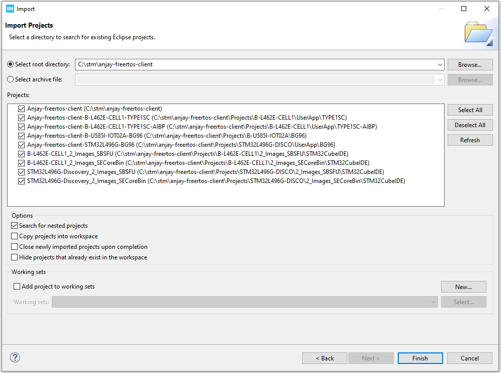
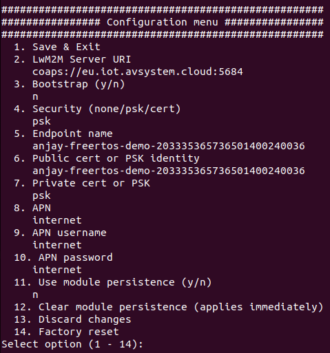

# STM32L496G-DISCO/BG96

Integrate your P-L496G-CELL02 Discovery kit board along with the default-provided Quectel BG96 modem.

## Prerequisites

- The STM32L496G-DISCO/BG96 board with a Micro-USB cable.
- Installed **STM32CubeIDE**.
- The serial communication program, such as **minicom** (for Linux) or RealTerm or PuTTY (for Windows) installed.
- A user with access to the Coiote IoT Device Management platform.

## Prepare binaries
### Use an already built binary

To get the latest binary file and flash it onto the board:

0. Go to [Anjay-freertos-client](https://github.com/AVSystem/Anjay-freertos-client/releases/).
0. Download the `Anjay-freertos-client-STM32L496G-BG96.bin` file.
0. To flash the board, open your **File manager** and drag the downloaded `.bin` file to your **DIS_L496ZG** external device.
0. You will see a blinking diode on your board. The diode will stop blinking as soon as the flashing is finished.

The board is now flashed: you can go to the [Connecting to the LwM2M Server](#connecting-to-the-lwm2m-server) step.

### Start development using samples
!!! Note
    This step is optional. If you've gone through the [Use an already built binary](#use-an-already-built-binary) step, you can go to [Connecting to the LwM2M Server](#connecting-to-the-lwm2m-server) right away.

#### Clone the Anjay freeRTOS client repository

Enter the command line interface on your machine and run the following command:

   ```
   git clone --recursive https://github.com/AVSystem/Anjay-freertos-client
   ```

#### Build binary and flash the board

0. Connect the STM32L496G-DISCO board to a USB port of your machine.
0. Go to the STM32CubeIDE.
0. Import the project cloned in the previous step to your workspace:
    - From the navigation bar, select **File** and click **Import**.
    - From the **General** list, select **Existing Projects into Workspace** and click **Next**.
    - In **Select root directory**, indicate the catalog containing the cloned Anjay freeRTOS client repository.
    - In the **Projects** field, select **Anjay-freertos-client-STM32L496G-BG96** and click **Finish**.
    
0. In the Project Explorer, navigate to the **Anjay-freertos-client-STM32L496G-BG96** project:
    - Right-click on the project name and select **Build Project**. Choose "Debug" configuration. The build should take less than one minute to complete.
    - After the build is finished, right-click on the project name, select **Run As** and click the **1 STM32 Cortex-M C/C++ Application** option.
    - In the **Lauch Configuration Selection**, choose the **Anjay-freertos-client-STM32L496G-BG96** option and click **OK**.
0. After the build and run are complete, the board is flashed with compiled binary.

## Connect to the LwM2M Server

To connect to Coiote IoT Device Management LwM2M Server, please register at [https://eu.iot.avsystem.cloud](https://eu.iot.avsystem.cloud).

!!! note
     If you use the BG96-based configuration, you need to upgrade the modem firmware to at least the `BG96MAR02A08M1G` revision. Older versions may cause unexpected loss of connection.
     <br />
     To upgrade the firmware, download the following .zip files:
     <br />
     - [Pack_BG96MAR02A08M1G_01.012.01.012](./resources/Pack_BG96MAR02A08M1G_01.012.01.012.zip "Pack_BG96MAR02A08M1G_01.012.01.012"),
     <br />
     - [Quectel_LTE_Windows_USB_Driver_V2.0](./resources/Quectel_LTE_Windows_USB_Driver_V2.0.zip "Quectel_LTE_Windows_USB_Driver_V2.10"),
     <br />
     - [QFlash_V4.10](./resources/QFlash_V4.10.zip "QFlash_V4.10").
     <br />
     Then, follow a step-by-step instruction in `Pack_BG96MAR02A08M1G_01.012.01.012`. Mind that links from steps 2 and 4 of this instruction don't work correctly. For this reason you will need to use the downloaded `Quectel_LTE_Windows_USB_Driver_V2.0` file for step 2 and `QFlash_V4.10` file for step 4.

To connect the board:

1. Log in to Coiote DM and from the left side menu, select **Device Inventory**.
2. In **Device Inventory**, click **Add device**.
3. Select the **Connect your LwM2M device directly via the Management server** tile.
       
    3. In the **Device credentials** step:
         - In the **Device ID** enter your board endpoint name, e.g. `test_device`.
             
         - In the **Security mode** section, select the **PSK (Pre-Shared Key)** mode:
              - In the **Key identity** field, type the same name as in the `Endpoint name` field.
              - In the **Key** field, type the shared secret used in the device-server authentication.
    4. Click the **Add device** button and **Confirm** in the confirmation pop-up.
    5. In the **Connect your device** step, follow the next [section](#configuring-the-client) to run the client and connect it to the server.

## Configure the Client

0. With the board still connected to a serial port interface, open your serial communication program.
0. Press the reset button located on the board. This should trigger the following prompt:

    ``Press any key in 3 seconds to enter config menu...``

0. Press any key and in the configuration menu, change the default credentials to your data by following the instructions presented in the program and save it.
   {:style="float: left;margin-right: 1177px;margin-top: 17px;margin-bottom: 17px;"}

    !!! important
        APN (Access Point Name) is the name of a gateway between a GSM, GPRS, 3G and 4G mobile network and another computer network. If you use built-in eSIM card truphone then change APN to **iot.truphone.com**.

    !!! Note
        If you use external eSIM card you have to check APN used by SIM card's provider.

0. Go to Coiote DM to check if your device is connected. Click **Next**, then **Go to Summary**, then **Finish**. You will see your Device Center view:


!!! tip
    LwM2M Server URI, endpoint name and other information can be found in the **Configuration** tab.

## Anjay-freertos-client with FOTA (Firmware update Over the Air)

Anjay application can be built in basic version (without FOTA) as described in the [Compiling the board](#compiling-the-board) section. In order to use FOTA, a few additional steps needs to be done, e.g. **Secure Boot** and **Secure Firmware Update** compilation.

The **X-CUBE-SBSFU Secure Boot and Secure Firmware Update** solution allows the update of the STM32 microcontroller built-in
program with new firmware versions, adding new features and correcting issues. The update process is performed
in a secure way to prevent unauthorized updates and access to confidential on-device data such as code and
firmware encryption key.

The **Secure Boot** (Root of Trust services) is immutable code, always executed after a system reset, that checks STM32
static protections, activates STM32 runtime protections and then verifies the authenticity and integrity of user
application code before every execution in order to ensure that invalid or malicious code won't be run.

### Additional prerequisites
- **STM32CubeProgrammer** installed.
- Support for shell scripts execution (on Windows for example **Git** or **Cygwin** can be used).
- [Python](https://www.python.org/downloads/) with the following modules: `pycryptodomex`, `ecdsa`, `numpy`, `pyelftools`.
- Import STM32L496G-Discovery_2_Images_SBSFU and STM32L496G-Discovery_2_Images_SECoreBin projects from previously cloned repository to workspace.

### Prepare binary

!!! important
    You need to follow a strict compilation order presented below.

0. Compile **SECoreBin** application<br/>
   This step is needed to create the Secure Engine core binary including all the trusted code and keys mapped inside
   the protected environment. The binary is linked with the SBSFU code in step 2.

0. Compile **SBSFU** application<br/>
   This step compiles the SBSFU source code implementing the state machine and configuring the protections. In addition,
   it links the code with the SECore binary generated at step 1 in order to generate a single SBSFU binary including the
   SE trusted code.
0. Compile **UserApp** application (set **Build configuration** to **Release**)<br/>
   It generates:<br/>
    - The user application binary file that is uploaded to the device using the Secure Firmware Update process <br/>
     (`Projects/STM32L496G-DISCO/UserApp/Binary/Anjay-freertos-client-STM32L496G-BG96.sfb`).
    - A binary file concatenating the SBSFU binary, the user application binary in clear format, and the corresponding
     FW header <br/>
     (`Projects/STM32L496G-DISCO/UserApp/Binary/SBSFU_Anjay-freertos-client-STM32L496G-BG96.bin`).

    !!! tip
        You can set a custom firmware version in the `Application/Inc/default_config.h` file (using `FIRMWARE_VERSION` define).
        It will be useful when performing FOTA to distinguish the firmware images from each other.

### Flash the board

Use **STM32CubeProgrammer** application with `SBSFU_Anjay-freertos-client-STM32L496G-BG96.bin` file to program the board (it is advisable to perform **Full chip erase** first). You can open serial port to change default credentials in order to connect to Coiote DM.

After that, you can use Coiote DM to perform firmware update with `Anjay-freertos-client-STM32L496G-BG96.sfb` file.

!!! important
    Disable Secure Protection

    When flashed board with Secure Boot you will need to switch off secure protection to be able to flash the board again. To deactivate secure application please run **STM32_Programmer_CLI** (Program provided with STM32CubeProgrammer) tool with specific options:

    ./< path_to_STM32_Programmer_CLI > -c port=SWD mode=UR -ob RDP=0xBB -ob RDP=0xAA WRP1A_STRT=0xFF WRP1A_END=0x0 -ob displ

### Perform firmware update

In order to perform firmware update:

0. Build the application and flash the board with `FIRMWARE_UPDATE` define set to the proper version (see [Flashing the board](#Flashing-the-board) step), e.g.
    ```
    #define FIRMWARE_VERSION "v1.0"
    ```
0. Make changes to the code (optionally), set `FIRMWARE_UPDATE` define to a different version, e.g.
    ```
    #define FIRMWARE_VERSION "v2.0"
    ```
    and build the application with a new firmware.
0. Upload the generated firmware file (`Anjay-freertos-client-STM32L496G-BG96.sfb`) to [Coiote DM](https://eu.iot.avsystem.cloud) (go to Device management and select `Firmware update`) and click `Upgrade`.
0. After the FOTA finishes, the device will reboot and the following log should appear:
    ```
    Firmware updated from version 'v1.0' to 'v2.0'
    ```
    where `v1.0` and `v2.0` will be set to firmware versions you set earlier.
