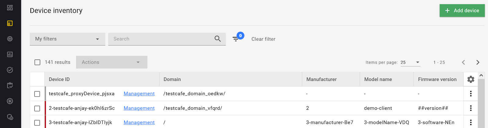

# v2021.22.1
Previous version: v2021.19.0

## Features

### New Device inventory view

The new Device inventory is now the default for viewing devices in the Coiote DM platform. It has an improved design as well as faster and more stable performance.

The new Device inventory is available directly from the left navigation bar. If you need to access the old Device inventory view, go to **Administration -> Device inventory**.

## Enhancements

### EST DER format support
We switched from the PEM to the DER content format of enrolling and re-enrolling requests sent to the EST server. Thanks to this change more EST Server implementations will be supported and compliance with RFC7030 is enhanced.

## Bug fixes

### Larger limits for HTTP request headers

Thanks to a new configuration for Jetty, you can now access REST API and Coiote DM GUI even with large HTTP request headers.

## Security
- Updated Grafana version to fix the CVE-2021-43798 vulnerability.
- Our security scan confirmed that Coiote DM isn’t affected by the Apache Log4j vulnerability.
