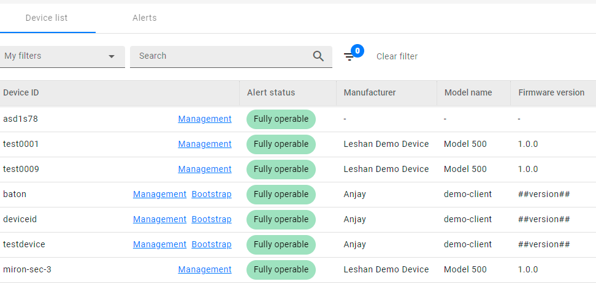
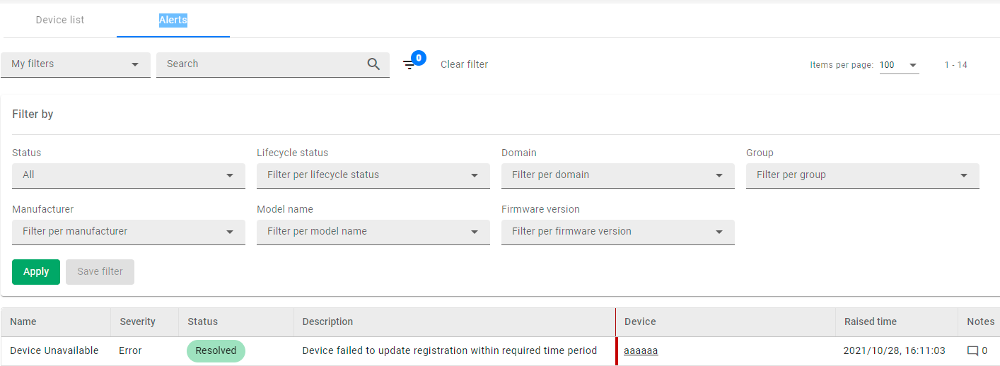

# v2021.24.5
Previous version: [v2021.23.0](v2021.23.0.md)

## Features

### Read Model Factory on EU Cloud installation

The data for the Dashboard and Device Inventory views is now provided by the Read Model Factory module deployed as a separate application to optimize resource consumption and data processing.

What changes in the application:

1. Both the Dashboard and Device Inventory views now display bootstrap and management device entities in a single line, with links to the Device Management Center for each device entity.

2. In the Dashboard view, you can now search for alerts by device data - lifecycle status, domain, group, manufacturer, model name, firmware version.

### Bypassing light sessions by HealthChecker

We have added a possibility to create a list of device IDs in `cdm.conf` that will have normal sessions even when the *light session* threshold is reached.

## Enhancements

### Whitelabelling and custom URLs in Identity and Access Management
When logging to Coiote DM (cloud installations) using a custom tenant hostname, the user can now be redirected to a login page under the same custom tenant hostname.  The change applies to the Coiote DM **login page**, **User Management** view and the **change password** view.
