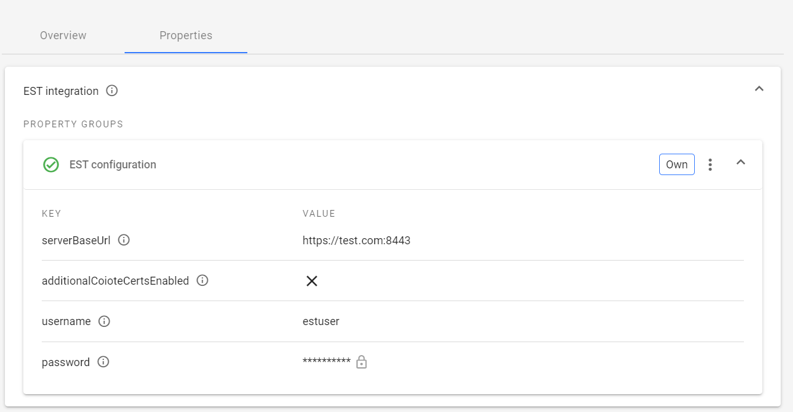
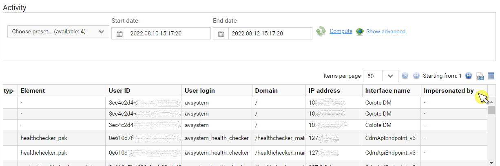

# v2022.17.0

Previous version: v2022.16.0

## Features

### Configuring EST integration via **Domain properties**

We have introduced dynamic EST integration configuration via the domain properties.
It is now possible for each client to set up its own EST server in the Domain management view.

The configuration is inherited (analogously to the Kafka settings e.g.). To use the EST configuration property, the `domainProperties.est` permission is required.
If there is no EST configuration on a given domain, then the system uses the value from Coiote DM `cdm.conf` config file as a fallback, which ensures backward compatibility.

Changes have also been made to the DTLS/TLS Certificates view. Now only certificates added in the given domain are presented to avoid cross-domain certificate visibility.

## Architectural Changes
There were no architectural changes in this release.

## Enhancements

### Minor GUI improvements
In Device Inventory, the filter counter is now hidden when there is no filter applied.

### ‘Impersonated by’ column in User activity table of Historical analysis

We have added a new column to the User activity table that shows the UserID of the actual user (impersonator) who executed the recorded action from the account of the user being impersonated.

## Bug Fixes

### Fixed Cancel all tests action in the Device tests tab of DMC
We have fixed the faulty behaviour of the Cancel all tests button used to stop the execution of tests inside the Device tests tab of the Device Management Center.

### Fixed loading data for multiresources with no instances in the data model
We have fixed an error occurring while loading a multiresource that has no instances in the data model. Now the multi-resource value is displayed in the same manner as a single resource without value.

### Fixed task execution status (report) not displayed after device domain change
When moving devices between domains, their task execution statuses (reports) are now updated accordingly.
