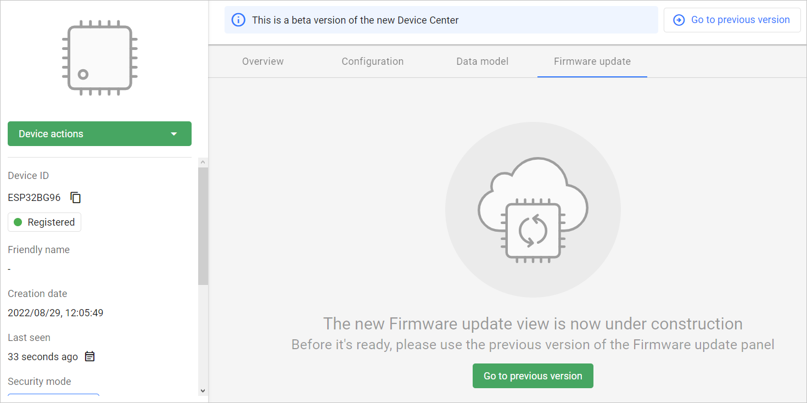
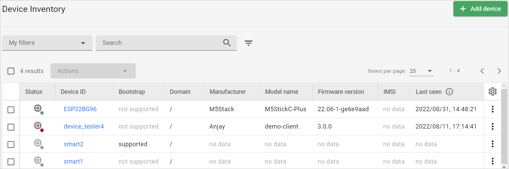

# v2022.18.3

Previous version: [v2022.17.0](v2022.17.0.md)

## Enhancements

### FOTA panel redirection page in Device Center

We have added a new FOTA tab in the Device Center. It redirects users to the previous version of the Device Management Center to perform a device Firmware upgrade. The new FOTA view is currently under development.

### Improvements in Device inventory and Operations center

We have introduced some enhancements to the **Device inventory** and **Operations center**.

- Now it is the **Device inventory** that is the default page displayed upon logging in to the platform. The order in the navigation menu has also been changed.
- In the **Operations center**, the **Alerts** tab is now the default view that is displayed.
- The tables that list devices and alerts have new columns:
    - **Device inventory**: *Status*, *Bootstrap*
    - **Operations center** **Alerts** tab: *Status*, *Alert status*
    - **Operations center** **Device list** tab: *Status*, *Device alert status*
- Sorting has been enabled in the newly added columns.

## Bug Fixes

### Fixed **Select template** button behaviour in **Task templates**
In the Task template panel, the **Select template** button now appears correctly even for long template names.
section for description of bug fixes.
### Fixed **Device registration status action**
We have fixed the behaviour of the **Devices registration status action** feature so that now the configured action is performed only for the domain it was set up in - no conflict of domains occurs.
### Fixed the `Leave` tag in XML tasks
We have fixed the behaviour of the `leave` tag in the XML tasks, so that the device now leaves all the defined subgroups and the task finishes successfully.
### Fixed loading page when migrating large numbers of devices between domains
We have fixed the GUI action of changing the domain for large numbers of devices via the **Device inventory**. Now the loading page doesn’t freeze while handling bulk migrations.
### Fixed no response for 2nd *Register Update* in some devices
As a result of failure to persist updated device lifetime, the Server responded with the 4.04 error for the second *Register Update* in some devices. We have fixed it so that concurrent update handling in the Coiote DM database is avoided.
