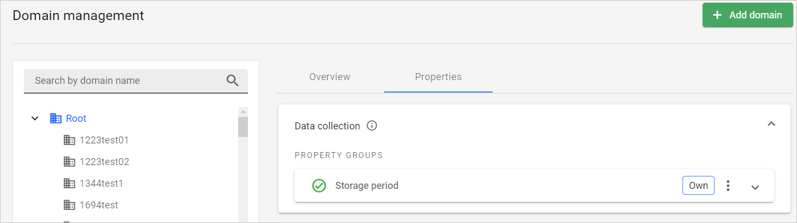

# v2022.21.6

Previous version: [v2022.20.4](v2022.20.4.md)

## Features

### New domain property group for configuring historical data storage period

In **Domain management**, we have introduced the possibility to define how long the device historical data should be stored. It can be configured using a property for a specific domain. The default maximum storage limit is 30 days.

## Bug Fixes

### Fixed no EST logs generated for device when EST request is made
EST logs are now generated correctly for the device bootstrap entity.

### Fixed no possibility to delete “billable” domain
We have restored the possibility to delete billing admin domains by superusers (under the standard condition that they don’t contain any subdomains, users, and devices).

### Fixed failing Azure IoT Hub device export
We have fixed the issue with exporting devices to Azure IoT Hub via GUI and API by upgrading the Azure SDK libraries to the newest versions. We have also added possibility to re-initialize client connection to Azure on demand via the REST API using the new `extensions/hyperscaler/restartClient` method.

### Fixed **Clear all** button that disabled searching the same phrase in Device inventory
We have fixed the behaviour of the **Device inventory** search field. Now clicking the **Clear all** button after having searched a phrase, then trying to search the same phrase works as intended.

### Fixed API user not able retrieve test results if the test definition comes from parent domain
We have fixed the inability to retrieve test results by REST API users for tests defined in parent domains by aligning the API with the correct behaviour of the feature in GUI.

### Fixed inactive scroll for domain list in XML task creation view
We have fixed scrolling for the drop-down domain list used when creating an XML task.
