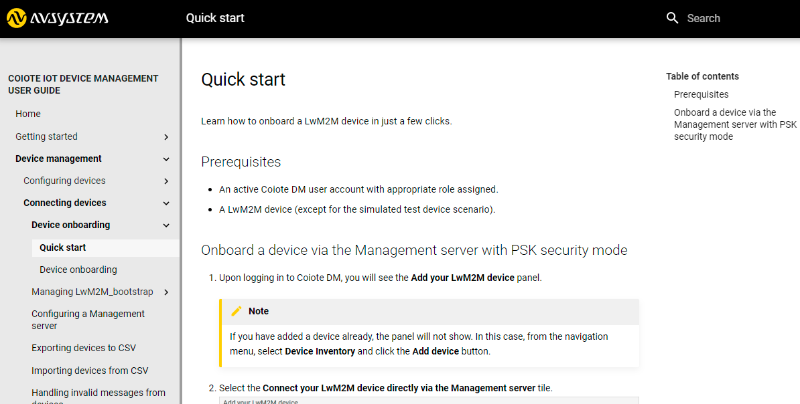

# v2022.3.2
Previous version: [v2021.24.5](v2021.24.5.md)

## Enhancements

### New design and search engine for User Guide
We have introduced a new design that changes the look and feel of the Coiote DM User Guide by switching from the Sphinx tool to the [MkDocs](https://www.mkdocs.org/) documentation generator.  Thanks to this, the search engine is improved to bring more accuracy to your search results. Also, navigating document sections is now easier with the new clickable table of contents on the right-hand side.

### Improved logic and added search in device variables management
We have improved the logic of the device variables management in DMC - a view that is used as part of the Protocol tests functionality. Also, we have added a possibility to search by name and value for both single and group variables.

## Bug Fixes

### Fixes in Hyperscaler Integration Center view

We have introduced a few changes to improve the UX and performance of HIC:

- The state of the devices list tab is now reloading when changing the domain.
- Adding/editing/deleting integration configurations is now performed while still inside the dialog window for each action.
- A 1000-character validator has been added to all fields in the integration configuration
- It's now possible to copy and preview inherited templates when the user is in a domain lower than that in which a given template was created.

### Fixed stepper component
We have adapted the stepper component so that its appearance is in line with the design system guidelines for Coiote DM.
