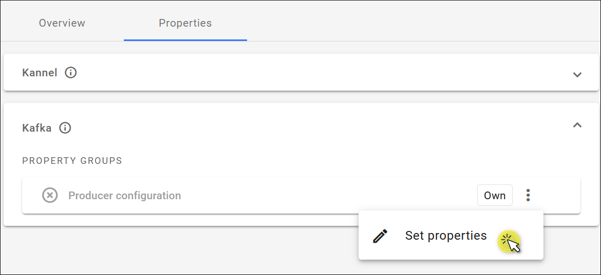
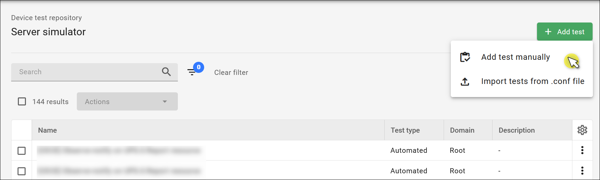

# v2022.5.3

Previous version: [v2022.3.2](v2021.3.2.md)

## Features

### LwM2M CBOR support

Coiote DM now supports LwM2M CBOR, a new encoding format that was introduced in the [Lightweight M2M 1.2 specification](https://www.openmobilealliance.org/release/LightweightM2M/V1_2-20201110-A/HTML-Version/OMA-TS-LightweightM2M_Core-V1_2-20201110-A.html). It allows to significantly reduce the payload size of the Composite operations (Composite Read, Composite Write, Composite Observe).

### Kafka producer

Kafka is a new property category in the **Domain properties** view. By setting the properties, you create a Kafka producer that enables you to forward data from devices to your Kafka broker.

## Enhancements

### New design of the Device test repository

We’ve introduced a new look and a few changes to improve the UX of the Device tests repository:

* The **Add test** button now has two options. You can add a test manually or import tests from a .conf file.
* Better UI of the search, filter, delete, and mass delete actions.
* The **Preview test** option is now available from the context menu.

## Bug Fixes

### HTTP status code 400

Fixed a bug where REST API returned the HTTP status code 500 instead of 400. Now the correct 400 status code is returned in cases when, for example, a DTLS identity is already taken, when PSK contains an odd number of characters, or for the PUT/devices request.
