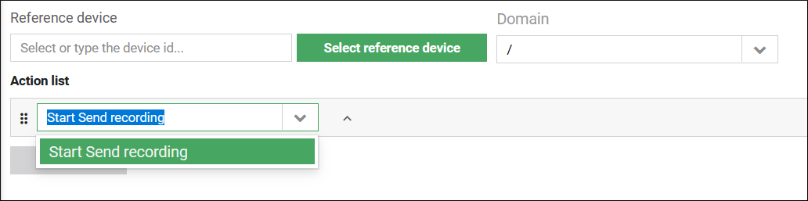
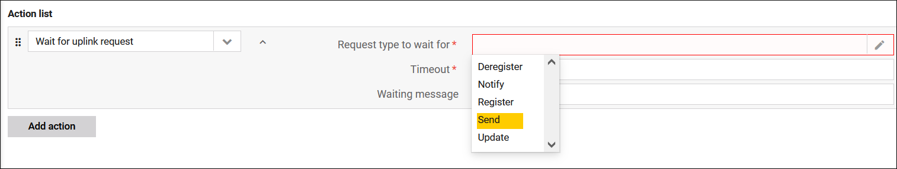
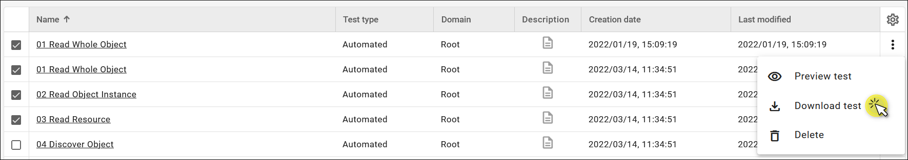

# v2022.7.3

Previous version: [v2022.5.3](v2022.5.3.md)

## Enhancements

### More formats in the XML Tasks

We’ve added a new option in the **readResource** XML Task. You can now specify the format in which the file content should be read. The available formats are UTF-8 (default) and binary (reads data into a hex string).

Furthermore, the REST tag now has the **outBinary** subtag. This means the payload of HTTP responses can be not only in JSON but also binary.

### New features in the Device test repository

#### SEND messages

You can now record and expect SEND messages when running your device tests. Previously, the record and expectation functionalities were only available for the Notify operations.

To run the **Start Send recording** and **Expect Send** tasks, go to **Device test repository > Server simulator**. Click **Add test > Add test manually** and then select the relevant task from the **Action list** drop-down menu.

In addition, the **Send** option was added to the **Wait for uplink request** task.

#### Creation and modification dates

The **Created** and **Last modified** columns have been added to the **Device test repository view**. If no creation and modification dates are found, then the time of the migration to the new version of {{ coiote_short_name }} is set.

#### Download device tests

You can download a single test or multiple tests as a `.conf` file. To do so, select the necessary tests from the list and click **Download test** from the context menu.

## Bug fixes

* Fixed a bug where uploading large CSV files failed if it took longer than one minute.
* Fixed a bug where {{ coiote_short_name }} sometimes didn’t reply to Register Update.
