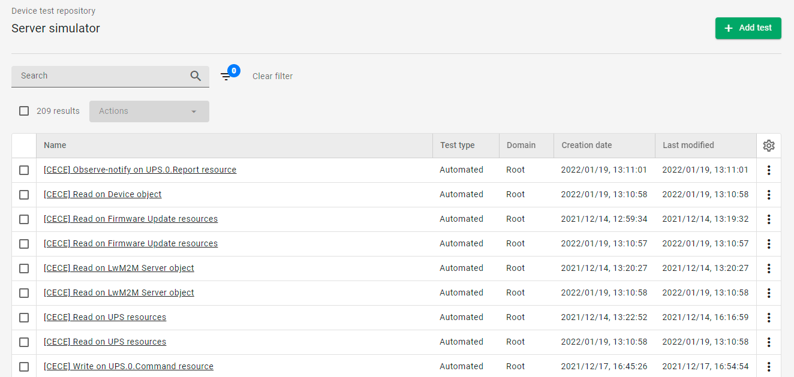

# v2022.8.2

Previous version: [v2022.7.3](v2022.7.3.md)

## Enhancements

### UDP connector in standalone mode or disabled

We have removed the option of embedding the UDP connector within the Coiote DM main system process. The UDP connector can be now either disabled or work in standalone mode. When disabling, there is no need for building a new package - setting a single config property in `cdm.conf` is enough:
```
udpConnector.mode = Disabled # Disabled or Enabled
```

### Simplified setup of AWS integration

We have simplified the setup of the AWS integration. Now building and updating new lambdas is automated using one configuration template with all the required lambdas and dependencies. The updated integration guide can be found [here](https://iotdevzone.avsystem.com/docs/AWS_Integration_Guide/Configuring_AWS_integration/).

### Modification and creation dates in Device test repository
We have added modification and creation dates as new columns in the Device test repository.  



### Updating user properties via API PATCH method
We have added a new PATCH method to the Users API. This allows for updating the following user properties via API: **emailVerified**, **userEnabled**, **domain**, **password**, **roles**, **permissions**, **tosAccepted**.
