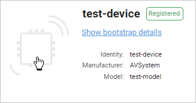
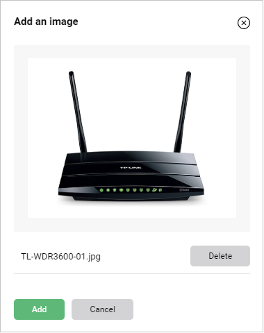
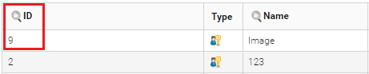
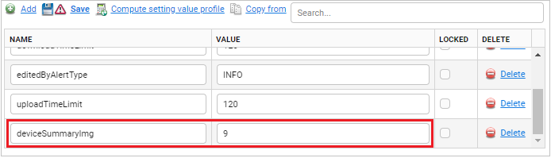
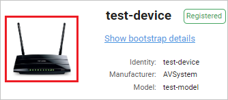

# Adding an image for a device

Read this section to learn how to add an image of a device to **Device summary** for a single device or a group of devices.

## Adding an image for a single device

The instruction shows how to add the image for one device.

To add an image for a single device:

1. Go to **Device inventory**.
2. From a list of devices, select a device to which you want to add the image.
3. In **Device summary**, click the default image.

    

4. To upload a picture from your disc, click the **Browse** button.

    

5. Select a picture and click the **Add** button. The picture is displayed.

    

    !!! tip
        To remove the image, in **Device summary**, click it and select the **Remove** button.

### Changing an image for a single device

To change an image for a single device:

1. Go to **Device inventory**.
2. From a list of devices, select a device for which you want to change the image.
3. In **Device summary**, click the image.
4. Click the **Change** button.
5. Upload a new image from your disc by clicking the **Browse** and **Add** buttons. The picture is changed and displayed for the device.

## Adding an image for a group of devices

**Prerequisites**:

- A device image added to the system using **Administration -> Resources**.

The instruction shows how to add the image for a group of devices using SV but you can also use this way to add it for a single device.

To add an image for a group of devices:

1. Go to **Device groups**.
2. From the list of groups, select a group to which you want to add a device image.
3. Go to the **Profiles** tab.
4. Click the **Add** link and:

   - Into the **Name** field, type the following SV: `deviceSummaryImg`.
   - Into the **Value** field, type the ID of the image uploaded via **Resources**.

     <figcaption>Example image ID</figcaption>

     

   - Click the **Save** link. The picture is displayed for all devices belonging to the group.

     

!!! tip
    To remove an image from a group of devices, remove the image file from the **Resources** and remove the `deviceSummaryImg` SV.

### Changing an image for a group of devices

To change an image for a group of devices:

1. Go to **Device groups**.
2. From a list of groups, select a group for which you want to change the image of the device.
3. Go to the **Profiles** tab.
4. Find the `deviceSummaryImg` SV and into the **Value** field, type an ID of the new image uploaded via **Resources**.
5. Click the **Save** link. The picture is changed and displayed for all devices in the group.
