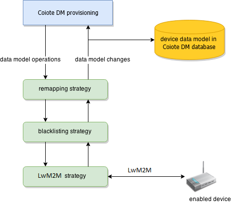

# Live data model strategies

The most common use case for dialects is data model virtualization. Virtualized data model is the device
data model, but with some modifications applied to it, for example:

- Some objects and parameters may be added or removed,
- Values and types of parameters may be modified.

These modifications are applied on-the-fly by Coiote DM when data model operations are invoked during provisioning.

## Live data model strategy architecture

The virtualized data model is defined by a chain of components called *live data model strategies*. Each strategy is
responsible for applying some specific change on the data model (for example, correcting values of some parameters).
Multiple strategies are then chained together to form the full data model virtualization pipeline.

The following figure shows an example live data model strategy chain configured for LwM2M devices:



The top-level strategy (remapping in above example) accepts data model operation requests (for example, to get or set parameter
values) from Coiote DM provisioning implementations (tasks, monitoring, etc.). Then it may apply some modifications to
the requests and finally passes them to the next strategy. Requests are passed like this through the entire strategy
chain until they finally reach the bottom-level strategy. That final strategy usually implements some particular
provisioning protocol (LwM2M in above example) and is able to send the requests to the device.

After the device responds with results of data model operations, the bottom-level strategy publishes data model changes
which should be applied to the device data model saved in the Coiote DM database. Changes are passed through the strategy chain, in
reverse order, until they reach the top-level strategy.

There may be arbitrary number of strategies configured in the chain. It is also possible to configure multiple instances
of the same type of strategy (for example, multiple remapping strategies).

## Configuring live data model strategy chain

The live data model strategy chain can be configured in a dialect. Every dialect contains a `liveDatamodelStrategies` property which is a list of HOCON objects. Every object contains a definition of a strategy. For the example showed above, the configuration may look similarly to:

    liveDatamodelStrategies = [
      { type: LwM2M },
      {
        type: BLACKLISTING
        // blacklisting definitions here
      },
      {
        type: REMAPPING
        // remapping definition here
      }
    ]

However, it is very likely that each strategy will be defined in a separate HOCON document. The above example may be
refactored into four separate dialect configurations:

- abstract dialect ``lwm2m.conf``:

    ```
    liveDatamodelStrategies += { type: LwM2M }
    // other LwM2M settings
    ```

- abstract dialect ``blacklisting.conf``:

    ```
    liveDatamodelStrategies += {
      type: BLACKLISTING
      // blacklisting definitions here
    }
    ```

- abstract dialect ``strategies.remapping.conf``:

    ```
    liveDatamodelStrategies += {
      type: REMAPPING
      // remapping definition here
    }
    ```

- concrete dialect ``lwm2m.virtualized.conf``:

    ```
    include "lwm2m"
    include "strategies.blacklisting"
    include "strategies.remapping"
    ```


## Patching strategy

The *Patching Live Data Model Strategy* is responsible for applying various small changes to the data model exposed
by a device without significantly changing the structure of the data model. Changes applied by the patching strategy are
usually intended as relatively minor corrections ("patches"). Examples of such corrections include:

- Adding a parameter which is lacking on devices of a particular type - such a parameter is usually forced to have a constant
  value,
- modifying an apparent value of an existing parameter, for example, by changing units of a numerical value,
- forcing existence of some data model object.

### Adding a patching strategy to a live data model strategy chain

The following snippet of dialect configuration adds the patching strategy to the chain:

    liveDatamodelStrategies += {
      type: PATCHING
      patching {
        // patching configuration goes here
      }
    }

!!! note
    By adding the above, the patching strategy will be the top-level strategy, this means that:

    - Outgoing data model requests go to patching > remapping > lwm2m,
    - incoming data model changes go to lwm2m > remapping > patching.

As with any other data model strategy, it is possible to modify this layout, for example, putting the patching strategy between LwM2M and the remapping strategy. It is also possible to configure multiple strategies of the same type (for example, one patching strategy before).

### Patching configuration structure

Patching configuration has a tree-like structure. The tree root must always be called ``Root`` and we may specify some
configuration attributes at each level. Every attribute name starts with ``%`` (available attributes are described in
detail later), for example:

    Root {
      LANDevice {
        %force-object-exists = true
        Stats.MyCustomStatisticParam {
          %force-value = 42
          %force-type = "xsd:string"
        }
      }
    }

Instead of some particular object or parameter name, you can also use ``%any`` wildcard marker which applies to given
default configuration attributes to every *direct* child object or a parameter of some object, for example: ::

    Root {
      Services.VoiceService.%any.VoiceProfile.%any {
        MyCustomParam.%force-value = my custom value
      }
    }

It is also possible to specify default attributes for entire subtrees with the ``%any-desc`` wildcard marker, for example:

    Root {
      Services.VoiceService.%any-desc {
        %fail-all-requests = Cannot access services!
      }
    }

You may also mix concrete configurations with wildcard markers, for example:

    Root {
      LAN {
        IPAddress.%force-value = 127.0.0.1
        %any.%force-type = "xsd:string"
        %any-desc.%ignore-set = true
      }
    }

In the above examples, all three attributes (``%force-value``, ``%force-type`` and ``%ignore-set``) will apply to
the ``LAN.IPAddress`` parameter. Additionally, if there were any conflicts then ``%any`` has a priority over ``%any-desc``
and direct configuration for ``IPAddress`` has a priority over both ``%any`` and ``%any-desc``.

There is also a ``%foreach-x`` construct that lets you specify a single configuration for multiple objects (subtrees)
or parameters at once. The number and names of these objects/parameters is specified using an expression. This way it
can be evaluated dynamically (e.g. by referring to SVs) and may change. This is useful for simulating multiple instances
of a data model object:

    Root {
      // the identifier `i` in `%foreach-i` is arbitrary and may be changed to anything else
      Table.%foreach-i {
        // expression must evaluate to a list of strings
        %in = "${range(1, sv.instances.toInt).map(_.toString)}"
        %force-object-exists = true
        // the identifier `i` can be used inside expressions in order to refer to actual instance number
        Param.%force-value = "Value${#i}"
      }
    }

### List of configuration attributes


* ``%override-tree`` (boolean) - when set to ``true`` on some key, indicates that the entire subtree rooted at this key
  is fully defined by this patching strategy **only**. This means that the patching strategy is responsible for handling
  all the requests falling into this subtree. In particular, the patching strategy itself responds to ``get-names`` and
  ``get-values`` operations, based on structure of the overridden tree, as defined in dialect.
  It is guaranteed that no request falling into overridden tree will ever get past the patching strategy to subsequent
  strategies and the device itself. If patching strategy is unable to handle some of the requests (e.g. ``add-object``),
  it will simply fail them, unless one of the ``%ignore-x`` attributes is used or ``%redirect-outgoing-value`` is
  specified for ``set-value`` operations.
  All parameters inside overridden tree **must** have ``%force-value`` specified. Also, note that intermediate objects
  inside overridden tree do **not** need ``%force-object-exists`` attribute.
  ``%override-tree`` attribute should be used when one wants to define a completely static portion of data model,
  invisible to the device itself.
* ``%force-object-exists`` (boolean) - when set to ``true``, an object with a given key will always appear in data model
  changes when its parent is refreshed with the ``get-names`` request or the ``get-values`` request.
* ``%force-value`` (string expression) - specifies that a parameter with a given key should always have a given value.
  When the ``get-value`` request is issued on this parameter, the value will be immediately reported in data model changes and the
  ``get-value`` request will *not* be passed to the next live data model strategy (so that - in particular - the LwM2M strategy will
  not see it). Specifying ``%force-value`` on a parameter also forces its existence under the same conditions as ``%force-object-exists``
  does for objects (a parameter parent needs to be refreshed).
* ``%fallback-value`` (string expression) - specifies that a parameter with a given key should have a given value when
  parameter is queried (directly or by a subtree refresh) and the device did not return any the value.
  When the ``get-value`` request is issued on this parameter, the request is passed to the next live data model strategy
  and contents of response are inspected to see if a fallback value needs to be applied.
  Specifying ``%fallback-value`` on a parameter also forces its existence under the same conditions as ``%force-object-exists``
  does for objects (a parameter parent needs to be refreshed).
* ``%force-type`` (string expression) - specifies that a parameter with a given key should always have a given type.
  Should usually be specified along with ``%force-value``.
* ``%force-writable`` (boolean expression) - specifies that an object or parameter with a given key should always have
  a writable flag set to a given value.
* ``%drop`` (boolean) - this attribute automatically applies to an entire subtree rooted at a given key and specifies
  that any incoming data model changes for this subtree should be dropped. Also all outgoing data model operations
  for this subtree are ignored. The ``%drop`` attribute does a similar job as a blacklisting live data model strategy
  and is actually intended as its replacement.
* ``%copy-value`` (a device entity field or property, for example, "``description``" or "``properties.connectionRequestUrl``")
  - specifies that whenever a value of a given parameter changes, the value should be also copied to some field of
  the ``Device`` entity or device property.
* ``%redirect-outgoing-value`` (a device entity field or property, the same as in ``%copy-value``) - specifies that whenever
  someone sets a value of a given parameter, the set-request should not be passed to the next strategy but the value
  should simply be written to some field of the ``Device`` entity or device property.
* ``%patch-value`` (string expression with access to an actual value) - specifies an expression that will be applied to
  a value of a given parameter whenever it changes. This may be used to correct some simple errors in parameter values
  reported by devices.
* ``%patch-type`` (string expression with access to an actual type) - the same as ``%patch-value``, but it applies to a parameter type.
* ``%patch-outgoing-value`` (string expression with access to an actual value) - specifies an expression that will be
  applied to a value that someone tries to set on a parameter.
* ``%patch-outgoing-type`` (string expression with access to an actual type) - the same as ``%patch-outgoing-value``,
  but applies to a parameter type.
* ``%ignore-get``, ``%ignore-set``, ``%ignore-getnames``, ``%ignore-getnames-rec``, ``%ignore-getnames-nonrec``,
  ``%ignore-add``, ``%ignore-delete``, ``%ignore-all-requests`` (boolean) - specify that some particular data model
  operations (``get-value``, ``set-value``, recursive or non-recursive ``get-names``, ``add-object`` or ``delete-object``)
  should be ignored when applied on a given data model key. Ignored operations will NOT be passed to next strategy
  (and therefore won't be sent to device). Instead they will be silently marked as successful and no data model changes
  will be published for these operations. If ``add-object`` is ignored, it will be marked as failed instead of successful
  because there is no sensible instance number that we can return as its result.
* ``%fail-get``, ``%fail-set``, ``%fail-getnames``, ``%fail-getnames-rec``, ``%fail-getnames-nonrec``, ``%fail-add``,
  ``%fail-delete``, ``%fail-all-requests`` (string) - specify that some particular data model operations
  (``get-value``, ``set-value``, recursive or non-recursive ``get-names``, ``add-object`` or ``delete-object``)
  should be immediately failed with a given error message when applied on a given data model key.

### Expressions

The following configuration attributes may contain expressions: ``%force-value``, ``%fallback-value``, ``%force-type``, ``%force-writable``,
``%patch-value``, ``%patch-type``, ``%patch-outgoing-value``, ``%patch-outgoing-type``, ``%fail-get``, ``%fail-set``,
``%fail-getnames``, ``%fail-getnames-rec``, ``%fail-getnames-nonrec``, ``%fail-add``, ``%fail-delete``, ``%fail-all-requests``,
``%in`` (inside ``%foreach-x`` block).
All expressions may access device data and SV values and some information about a data model object or parameter for which
the configuration attribute is applied:

* ``node.key`` and ``node.name`` may be used to refer to an object or parameter full key and name
* ``node.value`` may be used to access a parameter value in ``%patch-value``, ``%patch-outgoing-value`` and ``%fail-set``
* ``node.paramType`` may be used to access a parameter type in ``%patch-type``, ``%patch-outgoing-type`` and ``%fail-set``
* Variables may be used to access instance numbers dynamically evaluated for ``%foreach-variableName`` blocks.

### What the strategy actually does

When the patching strategy accepts a set of data model requests, it processes them in the following way:

!!! important
    The order of requests is important.

0. Immediately filters out possibly failed requests based on ``%drop``, ``%override-tree``, ``%ignore-x`` and
   ``%fail-x`` attributes.
0. Filters out ``get-value`` requests for which ``%force-value`` is configured and all the requests targeting
   overridden trees.
0. Modifies ``set-value`` requests based on ``%patch-outgoing-value`` and ``%patch-outgoing-type`` attributes.
0. Filters out ``set-value`` requests based on ``%redirect-outgoing-value`` attributes.

When the underlying strategy publishes data model changes, the patching strategy processes them in the following way:

!!! important
    The order of requests is important.

0. Immediately drops data model changes for which ``%drop`` or ``%override-tree`` attribute applies.
0. Modifies incoming values and types based on ``%patch-value`` and ``%patch-type`` attributes.
0. Forces existence of objects and parameters based on ``%override-tree``, ``%force-object-exists`` and ``%force-value`` attributes.
0. Overwrites values, types writable flags based on ``%force-value``, ``%force-type`` and ``%force-writable`` attributes.
0. If any of the requests were filtered out based on ``%override-tree``, ``%force-value`` and ``%redirect-ougoing-value``
   attributes, the strategy now handles these requests, filling their results and adding appropriate data model changes.
0. Values from ``set-value`` requests which had ``%redirect-outgoing-value`` specified are now written to device data.
0. At the very end, the strategy copies parameter values to device data, based on ``%copy-value`` attributes.

## Next steps

To learn more about protocol-specific applications, see the [Virtual Data Model section](Overview.md).
