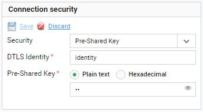

# Editing security settings

Read this section to learn how to edit the device security settings saved in the platform. This functionality can be useful when some credentials are not saved in the platform or they are incorrect.

To edit security settings:

1. Go to **Device inventory**.
2. From a list of devices, select a device whose security settings you want to edit.
3. Go to the **Configuration** tab.
4. In the **Connection security** panel:

   - From the **Security** list, select the appropriate security mode:

      - **NoSec** - no security mode is set, it could be used only in the test environment.
      - **Pre-Shared Key** - communication between the device and the server will be encrypted. To decrypt the communication, **PSK identity** and **PSK** are needed. Note that the bootstrap procedure will set these values on the device, but not on the server.
      - **Certificate** - encrypts the device-server communication using a previously uploaded certificate. 
      - **External Pre-Shared Key** - this option lets you store the device's pre-shared key externally. Here, only DTLS ID must be provided.

   - Type the appropriate data.

     

5. Click the **Save** link.
