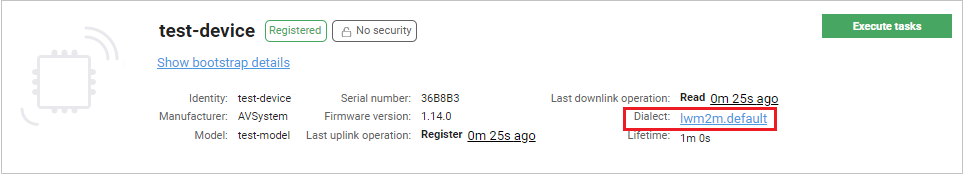
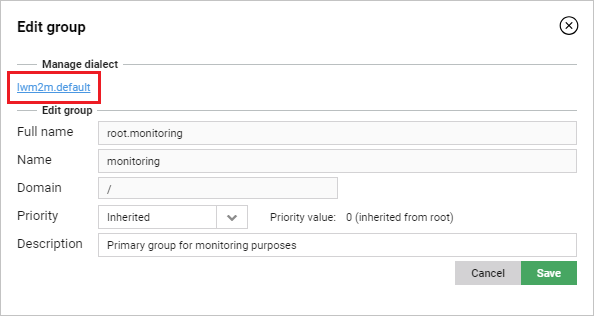

# Selecting dialects for devices and groups

Read this section to learn how to select a dialect for a single device or a group of devices. If you need a new dialect for your devices, contact the administrator of the system.

!!! Note
    If you need more information on what dialects are, please refer to (#Dialects_introduction).

## Selecting a dialect for a single device

To select a dialect for a single device:

1. Go to **Device inventory**.
2. From the list select a device.
3. Click the **Dialect** link which displays a name of a currently selected dialect.

4. Select a proper dialect.
5. Click the **Save dialect** button.
6. Click the **Yes** button.

## Selecting a dialect for a device group

To select a dialect for an entire group of devices:

1. Go to **Device groups**.
2. From the list of groups, select a group for which you want to add a dialect.
3. Click the **Edit** button.
4. In the **Manage dialect** section, click the dialect link.

   

5. Select a proper dialect.
6. Click the **Save dialect** button.
7. Click the **Yes** button.
