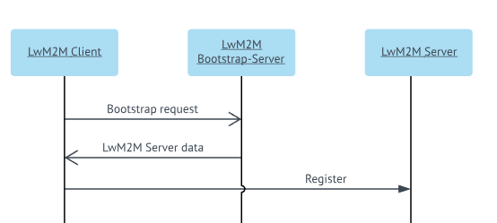
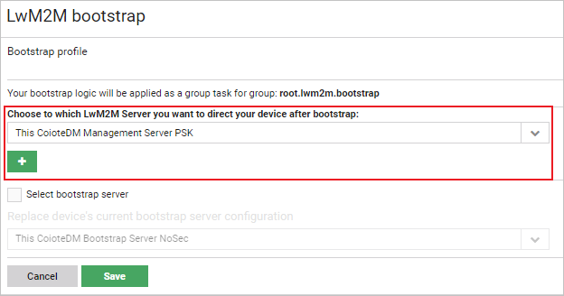

# Configuring a Management server

Read this chapter to learn how to configure a single Management server.

To configure a Management server:

1. Go to **Administration -> LwM2M servers**.
2. Click the **Add** button.
3. Configure a server. To learn more about particular fields, read the (LwM2M_servers.md) chapter.
4. Click the **Save** button.
5. Go to :menuselection:**Administration --> LwM2M bootstrap**.
6. From the **Management servers** list, select the appropriate server.

7. Click the **Save** button. The device will connect to this server whenever it sends the bootstrap request.
