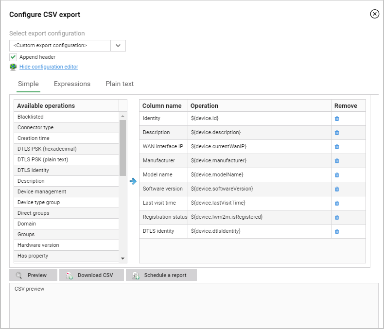

# Exporting devices to CSV

Read this instruction to learn how to export a list of devices to a CSV file to use data outside the system.

To export devices to a CSV file:

1. Go to **Device inventory**.
2. Below the **Add new device**, click the **Advanced export to CSV** icon.
3. From the **Select export configuration** list, select a template that was previously created in **Administration -> CSV Import/Export templates**.
4. If you do not use the template, click the **Show configuration editor** link and select one of editor modes:

    - **Simple** - to add a column, click it in the **Available operations** table.
    - **Expressions** - to add the column, click the **Add column** link and start typing expressions. To see expression suggestions for a device, use the **Select representative of exported devices** option.
    - **Plain text** - to add the column, start typing expressions. You should type one column name and expression per line, for example, `Identity,${device.id}`.

5. After adding all columns you can remove, edit or move them:

    - To remove a column in the **Expressions** or **Simple** tab, click the **Remove** icon next to it.
    - To edit the column, go to the **Expressions** or **Plain text** tab, and make necessary changes.
    - To change an order of columns, go to the **Simple** tab, and use the drag and drop functionality.

 

6. If you do not want to add headers (headers are column names), clear the **Append header** check box.
7. To see a preview of the CSV file, click the **Preview** button.
8. To export devices, click the **Download CSV** button.
9. To export devices to CSV periodically, click the **Schedule report** button and configure the report.
