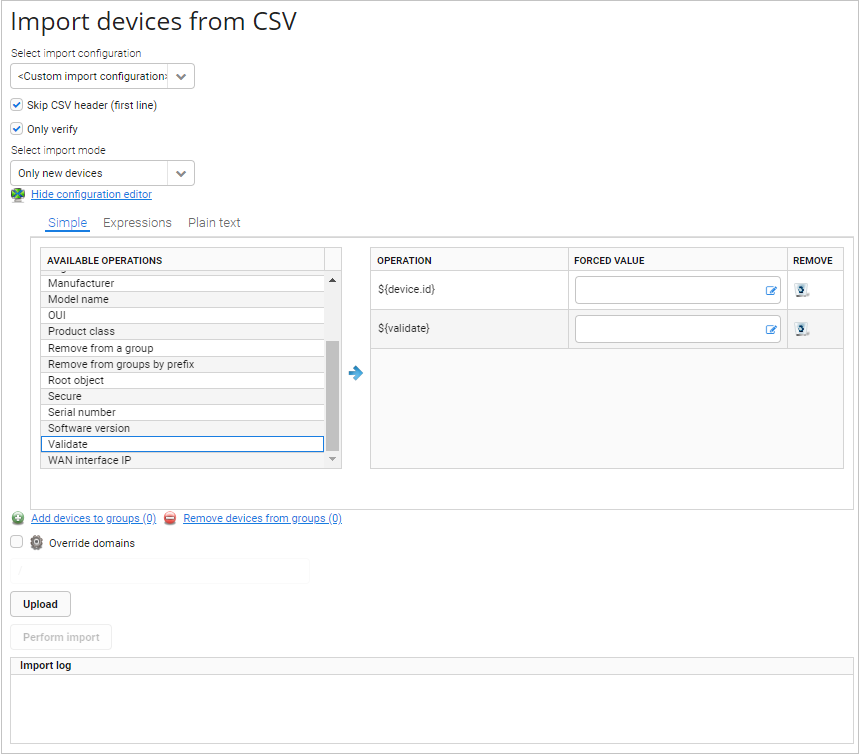

# Importing devices from CSV

Learn how to import a list of devices from a CSV file. You can use import to, for example, upload additional data, change some configuration or groups for multiple devices at the same time.

To import devices from a CSV file:

1. Go to **Device actions -> Import devices from CSV**.
2. From the list select whether you want to import devices.
3. From the **Select import configuration** list, select a template that was previously created in **Administration -> CSV Import/Export templates**.
4. If you do not use the template, click the **Show configuration editor** link and select one of editor modes:
    - **Simple** - to add a column, click it in the **Available operations** table.
    - **Expressions** - to add the column, click the **Add column** link and start typing expressions. To see expression suggestions for a device, use the **Select representative of imported devices** option.
    - **Plain text** - to add the column, start typing expressions. You should type one expression per line.

    !!! tip
        - Remember to add a column that specifies an ID of a device.
        - To set particular values for some columns and override values from a file, type them into the **Forced value** field.

5. Before importing the CSV file, you can validate it. For example, you can check if IP addresses of devices (they are in the third column in the file) are correct by selecting **Validate** from **Available operations** and typing into the **Forced value** field the following expression: *${net.isIp(columns.get(2))}*.
   If any IP address is incorrect, then the list will not be imported and a proper message will be shown in the **Import log** field. Add validation at the end of the import configuration if you do not want to skip content of any column from the CSV file or use this content as a validation condition.
   To use a current column content from the CSV file as the validation condition, use **Validate** with no value in the **Forced value** field.
6. After adding all columns you can remove, edit or move them:
     - To remove a column in the **Expressions** or **Simple** tab, click the **Remove** icon next to it.
     - To edit the column, go to the **Expressions** or **Plain text** tab, and make necessary changes.
     - To change an order of columns, go to the **Simple** tab, and use the drag and drop functionality.

    !!! note
        Remember that the order of columns in your template and in the file must be the same, otherwise data uploaded may be incorrect.

7. If you do not want to add headers (headers are column names), select the **Skip CSV header (first line)** check box.
8. If you want to only verify your CSV file, select the **Only verify** check box. Devices from the file will not be imported at this point.

9. From the **Select import mode** list, decide what devices you want to import.
10. To add imported devices to groups click the **Add devices to groups** link, and if you want to remove imported devices from groups, click the **Remove devices from groups** link.
11. If you select the **Override domains** check box, all domains will be overridden by a domain you select from the list.
12. To upload the file with a list of devices, click the **Upload** button.
13. To import devices, click the **Perform import** button.
