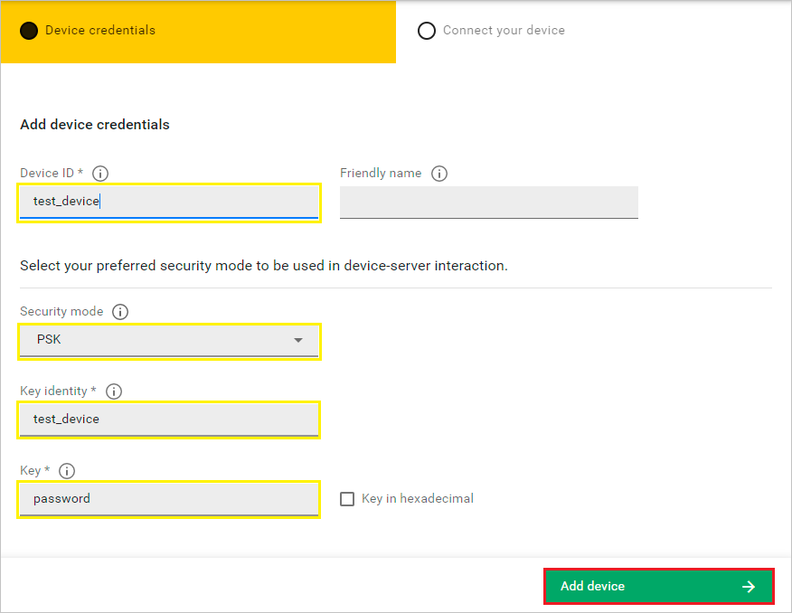
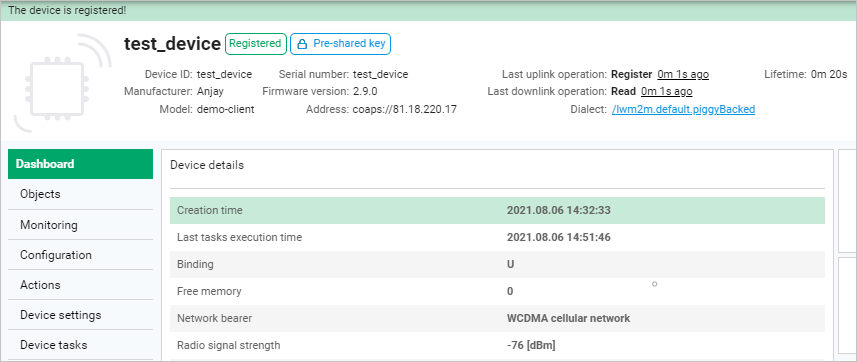

# Quick start

Learn how to onboard a LwM2M device in just a few clicks.   

## Prerequisites

- An active Coiote DM user account with appropriate role assigned.
- A LwM2M device (except for the simulated test device scenario).

## Onboard a device via the Management server with PSK security mode

1. Upon logging in to Coiote DM, you will see the **Add your LwM2M device** panel.

    !!! note
        If you have added a device already, the panel will not show. In this case, from the navigation menu, select **Device Inventory** and click the **Add device** button.

2. Select the **Connect your LwM2M device directly via the Management server** tile.
   
3. In the **Device credentials** step:
     - In the **Device ID** enter your LwM2M device endpoint name, e.g. `test_device`.
         
     - In the **Security mode** section, select the **PSK** mode:
          - In the **Key identity** field, type `test_device`
          - In the **Key** field, type the shared secret used in the device-server authentication.  
4. Click the **Add device** button and **Confirm** in the confirmation pop-up.
5. In the **Connect your device** step, insert the given connection parameters into your device to start connection.
    
6. Click **Go to device** to see your added device dashboard.
    
