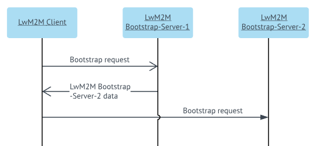
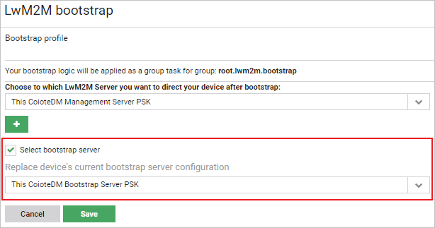
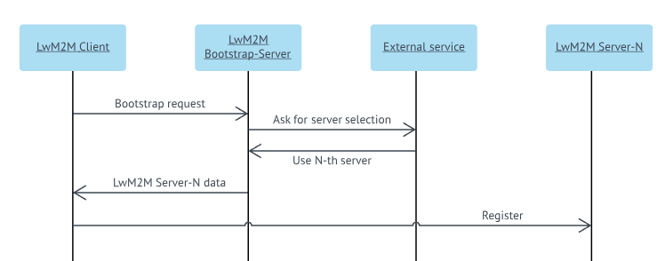
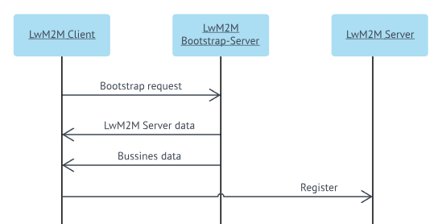

# Configuring a Bootstrap server

Read this chapter to learn how to configure a Bootstrap server using different approaches.

!!! tip
    A device should have only one Bootstrap server configured.



## Configuring a regular Bootstrap server

To configure a Bootstrap server:

1. Go to **Administration -> LwM2M servers**.
2. Click the **Add** button.
3. Configure a server. To learn more about particular fields, read the [LwM2M servers](LwM2M_servers.md) chapter.
4. Click the **Save** button.
5. Go to **Administration -> LwM2M bootstrap**.
6. Select the **Select bootstrap server** check box.
7. From the list, select the appropriate server.



8. Click the **Save** button. When the device will start the bootstrap procedure it will have the new bootstrap server configured.

!!! note
    Your bootstrap logic will be applied as a group task for your own bootstrap group and the bootstrap groups of your subtenants.

## Custom bootstrap procedure communicating with an external service

Read this chapter to learn how to configure a bootstrap procedure that communicates with external services. In this case a task must be used.



To configure a bootstrap procedure that communicates with external services:

1. Go to **Administration -> LwM2M servers**.
2. Click the **Add** button.
3. Configure a Management server. To learn more about particular fields, read the [LwM2M servers](LwM2M_servers.md) chapter.
4. Click the **Save** button.
5. Go to **Device groups** and from the list of groups, select the group.
6. Go to the **Group tasks** tab, and click the **Add task** link.
7. In the **Task settings** pane, click **Once and repeat** and select the **Automatic restart** check box.
8. In the **Task specific configuration** pane, enter a code snippet based to the following:

        <config>
         <rest url="http://external-service.example/serverFor/${device.id}">
           <out from="serverId" to="serverId" />
         </rest>
         <lwm2mBootstrapCleanse />
         <lwm2mBootstrapConfiguration serverId="${#serverId}" />
         <lwm2mBootstrap performBootstrapFinish="true" />           
        </config>

     * The below snippet makes a rest call to `http://external-service.example/serverFor/${device.id}`. Note that ``${device.id}`` will be substituted for the actual device ID. The external service will respond with a JSON, as in the following example ``{"serverId": 4}``. It will save the ``"serverId"`` value from JSON and make it accessible under the ``#serverId`` variable in the rest of the task. In this particular example the external service is aware of this ID, but the service response could be also translated to ID within the task. The ID of the server can be checked in **Administration -> LwM2M servers**:

         <rest url="http://external-service.example/serverFor/${device.id}">
             <out from="serverId" to="serverId" />
         </rest>

     * deletes any previous configuration of Bootstrap or Management servers on a device:

          <lwm2mBootstrapCleanse />

     * provides connections details to a previously configured server selected by ID returned by the rest service:

         <lwm2mBootstrapConfiguration serverId="${#serverId}" />

     * notifies the device that the bootstrap procedure is finished:

         <lwm2mBootstrap performBootstrapFinish="true" />

9. Click the **Add new task** button. Now each time the device sends the bootstrap request, this task will be executed. You can check its status in the **Group tasks** tab.

## Custom bootstrap procedure using low level mechanisms

This approach involves writing raw LwM2M resources to a device. While not recommended generally, but it might be useful in dealing with some more sophisticated scenarios or a faulty device. This approach does not use LwM2M bootstrap profiles or LwM2M servers.

To configure a custom bootstrap procedure using low level mechanisms:

1. Go to **Administration -> LwM2M servers**.
2. Click the **Add** button.
3. Configure a Management server. To learn more about particular fields, read the [LwM2M servers](LwM2M_servers.md) chapter.
4. Click the **Save** button.
5. Go to **Device groups** and from the list of groups, select the group.
6. Go to the **Group tasks** tab, and click the **Add task** link.
7. In the **Task settings** pane, click **Once and repeat** and select the **Automatic restart** check box.
8. In the **Task specific configuration** pane, enter a code snippet based to the following:

         <config>
           <store target="id" value="${sv.managementId}" />
          <store target="psk" value="${sv.password}" />
          <lwm2mBootstrap performBootstrapFinish="true">
            <write key="LwM2M Security.2.LwM2M Server URI" value="coaps://uri.example:5684" type="string" />
            <write key="LwM2M Security.2.Bootstrap-Server" value="false" type="boolean" />
            <write key="LwM2M Security.2.Security Mode" value="0" type="integer" />
            <write key="LwM2M Security.2.Short Server ID" value="2" type="integer" />
            <write key="LwM2M Security.2.Public Key or Identity" type="opaque" value="${#id.encodeHex}" />
            <write key="LwM2M Security.2.Secret Key" type="opaque" value="${#psk.encodeHex}" />
            <write key="LwM2M Security.2.Server Public Key" value="${''}" type="opaque" />
            <write key="LwM2M Server.0.Short Server ID" value="2" type="integer" />
            <write key="LwM2M Server.0.Lifetime" value="60" type="integer" />
            <write key="LwM2M Server.0.Notification Storing When Disabled or Offline" value="false" type="boolean" />
            <write key="LwM2M Server.0.Binding" value="U" type="string" />
          </lwm2mBootstrap>
         </config>

    The snippet carries out the following:

     * creates a variable that keeps a device identity within the *sv.managementId* value:
           ```
           <store target="id" value="${sv.managementId}" />
           ```
     * creates a variable that keeps a psk password within the *sv.password* value:
           ```
           <store target="psk" value="${sv.password}" />
           ```
     * shows that within this tag raw bootstrap operations can be done:
           ```
           <lwm2mBootstrap performBootstrapFinish="true">
           ```
     * after this tag is completed, the device will receive the Bootstrap Finish message:
           ```
           performBootstrapFinish="true"
           ```
     * sets a server address (note that schema *coap* or *coaps* depends on *Security Mode*, the same could be applied to a port):
           ```
           <write key="LwM2M Security.2.LwM2M Server URI" value="coaps://uri.example:5684" type="string" />
           ```
     * informs if a connection is to a LwM2M server:
           ```
           <write key="LwM2M Security.2.Bootstrap-Server" value="false" type="boolean" />
           ```
     * sets a security mode. *0* means Pre-Shared-Key:
           ```
           <write key="LwM2M Security.2.Security Mode" value="0" type="integer" />
           ```
     * informs about a server configuration ID from the device perspective. It allows to bind security settings with server settings:
           ```
           <write key="LwM2M Security.2.Short Server ID" value="2" type="integer" />
           ```
     * shows Hex encoded device identity:
           ```
           <write key="LwM2M Security.2.Public Key or Identity" type="opaque" value="${#id.encodeHex}" />
           ```
     * shows Hex encoded PSK password:
           ```
           <write key="LwM2M Security.2.Secret Key" type="opaque" value="${#psk.encodeHex}" />
           ```
     * shows that in this security mode (0 PSK) Server Public Key is not used, nevertheless it is a mandatory resource thus it is set to an empty value:
           ```
           <write key="LwM2M Security.2.Server Public Key" value="${''}" type="opaque" />
           ```
     * informs about a server configuration ID from the device perspective. It allows to bind security settings with server settings:
           ```
          <write key="LwM2M Server.0.Short Server ID" value="2" type="integer" />
           ```
     * informs about lifetime - in this case a number of seconds that the device will be accessible after registration:
           ```
           <write key="LwM2M Server.0.Lifetime" value="60" type="integer" />
           ```
     * sets if the device should store notifications for the LwM2M server when its in the **Deregister** phase, and then send them after new registration or discard them. In this case notifications would be discarded:
           ```
           <write key="LwM2M Server.0.Notification Storing When Disabled or Offline" value="false" type="boolean" />
           ```
     * sets a binding type, in this example it is U = UDP:
           ```
           <write key="LwM2M Server.0.Binding" value="U" type="string" />
           ```
9. Click the **Add new task** button. Now each time the device sends the bootstrap request, this task will be executed. You can check its status in the **Group tasks** tab.

## Custom bootstrap procedure with additional logic

Read this section to learn how to configure a server and add custom settings to it. In this case a task must be used.



To configure a custom bootstrap procedure with additional logic:

1. Go to **Administration -> LwM2M servers**.
2. Click the **Add** button.
3. Configure a Management server. To learn more about particular fields, read the [LwM2M servers](LwM2M_servers.md) chapter.
4. Click the **Save** button.
5. Go to **Device groups** and from the list of groups, select the group.
6. Go to the **Group tasks** tab, and click the **Add task** link.
7. In the **Task settings** pane, click **Once and repeat** and select the **Automatic restart** check box.
8. In the **Task specific configuration** pane, enter a code snippet based to the following:
         ```
         <config>
           <lwm2mBootstrapCleanse />
           <lwm2mBootstrapConfiguration serverId="8" />
           <set key="Device.Connectivity Statistics.0.Collection Period" value="60" />
           <execute key="Device.Connectivity Statistics.0.Start" />
           <lwm2mBootstrap performBootstrapFinish="true" />
         </config>
         ```
    The snippet carries out the following:

       * The below fragment deletes any previous configuration of Bootstrap or Management servers on a device
             ```
             <lwm2mBootstrapCleanse />
             ```
       * The below fragment provides connections details to one of previously configured servers selected by their IDs. Each server configuration has an ID assigned by the system. The ID of the server can be checked in **Administration -> LwM2M servers**:
             ```
             <lwm2mBootstrapConfiguration serverId="8" />
             ```
       * The below fragment is a custom setting, in this particular case it starts a connection monitoring but any piece of an XML code can be placed here:
             ```
             <set key="Device.Connectivity Statistics.0.Collection Period" value="60" />
             <execute key="Device.Connectivity Statistics.0.Start" />
             ```
       * The below fragment notifies the device that the bootstrap procedure is finished:
             ```
             <lwm2mBootstrap performBootstrapFinish="true" />
             ```

9. Click the **Add new task** button.
