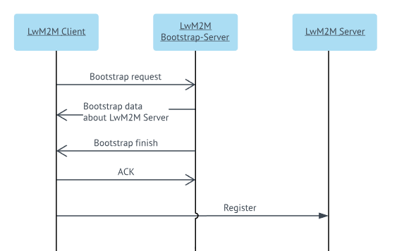

# LwM2M bootstrap - overview

Read this chapter to learn basic information about LwM2M bootstrap.

The bootstrap interface is used to provide essential information to a device (LwM2M Client) to enable it to connect to one or more LwM2M (Management) Servers.
During a bootstrap phase most commonly following data is set:

 * Information about LwM2M Servers (among others server URI, and security details)
 * New bootstrap connection settings
 * Access list - required only in multi-server environment.

Also other information can also be send to the device during the bootstrap phase.
There are four bootstrap modes:

 * **Factory Bootstrap**
 * **Bootstrap from Smartcard**
 * **Client Initiated Bootstrap**
 * **Server Initiated Bootstrap**.

Only two last modes involve LwM2M Server.

**Client Initiated Bootstrap** is the most common scenario:

 * The device sends a bootstrap request to a LwM2M Bootstrap-Server (Coiote-DM).
 * The LwM2M Bootstrap-Server sends some settings to the device, for example, connection details to the LwM2M Server (the same or other instance of Coiote-DM or other LwM2M Server).
 * The LwM2M Bootstrap-Server notifies the device, that the bootstrap procedure is finished.
 * The device accepts (or rejects) settings.
 * After the bootstrap procedure is finished, the device connects to the configured LwM2M Server. If the device cannot connect, then the whole procedure is restarted by sending the bootstrap request once again.

**Server Initiated Bootstrap** is the same procedure but it does not involve the bootstrap request form the device to the server. It assumes that the server knows when to perform bootstrap from an external source (for example, it is notified by another system).
