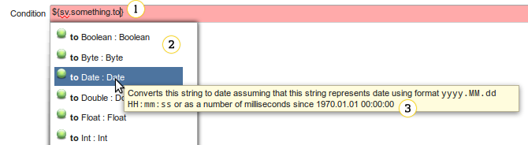

# Expressions - Overview

Expressions are small snippets of code that can be used to dynamically compute values based on some context.
For example, an expression ``${device.rootObject}`` will evaluate to device data model root object key (i.e. ``Device.``
or ``InternetGatewayDevice.``) when used in provisioning of a particular device. Expressions are relatively low-level and advanced feature of Coiote DM. They should be used by users with at least some
programming background.

## Where expressions are used

Expressions can be used in many contexts across various configuration points of Coiote DM. Most of the time, expressions
are evaluated during provisioning and have access to various data accessible in the provisioning session, for example, device
information, SV profile, current task information, etc. This means that the same expression may evaluate to a different
value for every device and provisioning session.
Usage of expressions includes:

   - **Migration rules** - expressions are used to define the migration condition and destination group.
   - Task configurations (see **Xml task editor**) - the value of every task configuration attribute can be an expression. For example, here is a simple XML task that writes some simple message to device logs. The message is defined using an expression:
   ```
   <config>
     <log message="Some message from ${device.id}" />
   </config>
   ```
    - Dialects, in particular:
       - The [patching strategy](/User_Guide/Device_management/Configuring_devices/Dialects/Virtual_Data_Model/Live_Data_Model_strategies#patching-strategy).

It is important to remember that expressions are *pure*, which means they can only be used to evaluate some values and
can never be used to *execute* some code. In particular, this means that expression evaluation can never result
in side effects like modifying a device property or communicating with provisioned device.

## Expression formats

The most trivial form of an expression is a *literal* expression - such expression will always evaluate to a constant
value. Examples of literal expressions include:

  ``Hello!`` (a literal "Hello!" text)

or

  ``123`` (a literal numeric value 123)

Literal expression can be made into a *template* expression by inserting dynamic parts into it. For example, you may want
to include the device identity into the "Hello!" message:

  ``Hello, ${device.id}!``

Each dynamic part is a subexpression enclosed in ``${}``. The dynamic part has access to expression API and can use various
language constructs like function calls, operators, etc.

There may be multiple dynamic parts in a template expression, forming a concatenation of literal and dynamic parts:

  ``Hello, ${device.id} - your last visit time was ${device.lastVisitTime}``

Because dynamic parts are concatenated with literal parts and each other, such expression will always yield a textual
value. However, if there are no literal parts and only one dynamic part, the expression will simply evaluate to
whatever that single dynamic part evaluates to. For example, in the following XML task:

  <config>
    <if expr="${device.oui == 'AABBCC'}">
      ...
    </if>
  </config>

The ``if`` tag requires that ``expr`` attribute is a boolean value. In such situation, the expression will
not yield a string but simply return the value of its only dynamic part (which is indeed a boolean).

## Data types


The expression language is a strongly, statically typed one, which means that expressions are thoroughly validated
before being evaluated to check if all operations use proper data types and if the result type of an expression
conforms to the type expected in the particular context. For example, in the previous example, the ``expr`` attribute of the ``if`` tag is required to yield boolean value. If you write:

  <if expr="${device.id}">

Then you will get an error, because ``device.id`` (device identity) is a textual value. Therefore, you need to remember that the same expression may be valid in one context but invalid in another one.

The most important data types used by the expression language are:

   * ``Boolean`` - ``true`` or ``false``
   * ``Char`` - characters
   * ``String`` - textual values
   * ``Int`` - integer numbers from the range -2\ :sup:`31` to 2\ :sup:`31`\ -1
   * ``Long`` - integer numbers from the range -2\ :sup:`63` to 2\ :sup:`63`\ -1
   * ``Double`` - 64-bit precision decimal numbers
   * ``Date`` - date-time values with millisecond precision
   * ``List[E]`` - lists (ordered collections) of arbitrary element type ``E``
   * ``Set[E]`` - sets (unordered collections without duplicates) of arbitrary element type ``E``
   * ``Map[K,V]`` - maps (key-value associations) of arbitrary key and value types ``K`` and ``V``
   * ``Entry[K,V]`` - represents a single key-value entry of ``Map[K,V]``
   * ``Collection[E]`` - a base type of lists and sets (that is, both lists and sets can be seen as collections)

You may also encounter other, less important numeric types:

   * ``Byte`` - integer numbers from range -128 to 127
   * ``Short`` - integer numbers from range -65536 to 65535
   * ``Float`` - 32-bit precision decimal numbers

There is also a special type ``Any`` which denotes "unknown type". Only :ref:`Universal API` can be
used on values of type ``Any``. It is also possible for an expression to yield a special ``null`` value, assuming that it is allowed in the particular context.

## Type checking and evaluation rules

How an expression is type checked (validated) and evaluated depends on its form and expected result type:

 * An empty expression evaluates either to *null* (if *null* is allowed by an expected result type) or fails otherwise.
 * A literal expression is evaluated by trying to parse the literal as the expected result type. When the expected result type is ``String``, the literal is simply returned unchanged.

    !!! example
        Expression ``123`` may either:

        * Evaluate to a numeric value 123 if an expected type is numeric
        * Evaluate to a textual value "123" if an expected type is ``String``
        * Fail to evaluate if ``123`` cannot be parsed as a value of an expected result type or when the result type does not have any literal representation

 * If a result type is ``String``, a template expression is evaluated by converting values of every dynamic part to textual representations and concatenating them with the literal parts. Data types of dynamic parts must have a textual
   representation (that is, the ``toString`` method available on them).

    !!! example

         * ``abc${123}`` will evaluate to textual value "abc123"
         * ``abc${list(1,2,3)}`` will fail to evaluate, because ``List[Int]`` does not have a textual representation
         * ``abc${list(1,2,3).map(_.toString).join}`` will evaluate to a textual value "abc123" - you are explicitly transforming
           each element of the list into its textual representation and then joining them together into the single textual value.

 * If the expected result type is not ``String``, an expression with a single dynamic part and no literal parts (for example, ``${123}``) is evaluated to the value of that sole dynamic part (that is, the subexpression inside ``${}``).
   Its type must match the expected result type of the expression.

    !!! example
         Expression ``${123}`` may either:

         * Evaluate to a numeric value 123 if an expected result type is numeric
         * Evaluate to a textual value "123" if an expected result type is ``String``
         * Fail to evaluate if an expected result type is something else, for example, ``Boolean``

 * If a result type is not ``String`` and an expression consists of both literal and dynamic parts, evaluation will fail.

Data types that have literal representation (literal expressions may be parsed into values of these types) include:

 * ``Boolean``, ``String``, ``Char``, all numeric and enumeration types
 * ``Date`` - using the date format ``yyyy.MM.dd HH:mm:ss`` and local time zone or trying to parse the literal value
   as integer denoting number of milliseconds since 01.01.1970 UTC
 * ``List[String]`` - the literal value is parsed by splitting it using comma as a separator

Data types that have automatic conversion to a textual value (have the ``toString`` method available and can be used as dynamic part in a template expression) include:

 * ``Boolean``, ``String``, ``Char``, all numeric and enumeration types
 * ``Date`` - using the date format ``yyyy.MM.dd HH:mm:ss`` and local time zone

The table below shows concrete examples of expressions and expected result types and how they are validated and evaluated in each case:

| Expression            | empty | 123           | abcd           | ${123}        | ${'123'}      | abc${123}        | ${null} |
|-----------------------|-------|---------------|----------------|---------------|---------------|------------------|---------|
| Expected result type  |       |               |                |               |               |                  |         |
| not specified         | null  | 123 (textual) | abcd (textual) | 123 (numeric) | 123 (textual) | abc123 (textual) | null    |
| String                | null  | 123 (textual) | abcd (textual) | 123 (textual) | 123 (textual) | abc123 (textual) | null    |
| Int, null not allowed | error | 123 (numeric) | error          | 123 (numeric) | error         | error            | error   |
| Int, null allowed     | null  | 123 (numeric) | error          | 123 (numeric) | error         | error            | null    |
| List[Int]             | null  | error         | error          | error         | error         | error            | null    |


## Syntax


Inside each dynamic part (enclosed with ``${}``), the expression language can be used. The following essential language constructs are available:

 * Literal ``Int`` values, for example, ``123``
 * Literal ``Long`` values, for example, ``123L``
 * Literal ``Double`` values, for example, ``3.14``
 * Literal ``String`` values, for example, ``"abcd"`` or ``'abcd'`` - characters ``'``, ``"``, ``\`` must be escaped with backslash (for example, string literal ``"ab\"cd"`` will evaluate to string ``ab"cd``)
 * Raw string literals that do not require escaping, for example, ``"""ab"cd"""`` - very useful for writing regular expressions which normally require a lot of escaping
 * Literal ``Boolean`` values, that is, ``true`` and ``false``
 * The literal ``null`` value
 * Identifiers - references to objects available in public expression API, for example, ``device`` gives access to device info in provisioning
 * Variables - references to dynamic variables, for example, ``#someArbitraryVariable``

Dynamic variables are textual values that can be accessed inside expressions. As opposed to public expression API, they can have arbitrary names and therefore you must use hash symbol (``#``) to distinguish them from public,
static API. Dynamic variables must be set by the particular context in which expressions are used, before the expression is
evaluated. In :ref:`XmlTask`, this is usually done by various tags. This an example of XMLTask which sets
a value of a dynamic variable ``greeting`` and then prints it to device logs via an expression:

     <config>
       <store target="greeting" value="Hello!" />
       <log message="${#greeting}" />
     </config>

Because variables can be only textual, you must use :ref:`Expression type conversions`, if you want to treat them
as values of other types (for example, numeric).

  * field/property access, for example, ``device.id``

If field/property name contains non-alphanumerical characters, it can be escaped with backticks, for example: ``device.property.`some.complex.property.name```

   * Function/method calls, for example, ``device.hasProperty('somePropertyName')`` - when method takes only one parameter, it may be called with infix syntax, for example, ``device hasProperty 'somePropertyName'``
   * Operators, for example, ``1 + 2``
   * Indexed array and list access, for example, ``someList(2)`` will return the *third* element of some list - indices start from 0
   * Map element access by key, for example, ``someMap('someKey')``
   * Conditional expressions, for example, ``if(device.oui == 'AABBCC') 'specific device' else 'other device'`` - note that this
     is still an expression that *evaluates to some value* - it does not *execute* anything.
   * Lambda expressions (anonymous functions) that can be passed to *higher-order functions*, for example: ``list(1,2,3).exists(x => x < 2)`` checks if a ``List[Int]`` contains any value that's less than 2 - in this case the expression can be shortened to ``list(1,2,3).exists(_ < 2)``
   * The special ``useAs`` method which allows you to give a short name to some longer subexpression - the short name can then be concisely reused, for example: ``sv.someLongSvName.useAs(s => if(s.endsWith('.')) s else s + '.')``

## Operators

The following operators are available:

  * Arithmetic operators ``+``, ``-``, ``*``, ``/`` and ``%`` (modulo)

    !!! warning
        Division operator ``/`` used on integral values (``Int`` and ``Long``) is an *integer* division, i.e. it will truncate the value down and strip the decimal part. For example ``3/2`` will evaluate to ``1``. If you need the division to work on decimal values, convert at least one of the operands to ``Double`` value, e.g. ``3.0/2`` or ``3.toDouble/2``.

  * Logical operators ``&&``, ``||``, ``and`` and ``or``
  * Equality testing operators ``==``, ``!=``
  * Ordered comparison operators ``<``, ``>``, ``<=``, ``>=`` - can be used on numeric values, textual values (lexicographical order), character and date values
  * Unary ``-`` (arithmetic negative) and ``!`` (logical negation) operators
  * String concatenation operator ``+``
  * List concatenation operator ``++``
  * Set union operator ``++``
  * Map merge operator ``++``
  * Pair operator ``->`` Creates a pair out of two values. Used primarily to create maps, e.g. ``map('one' -> 1, 'two' -> 2)``
  * Fallback value operator ``?`` The fallback value operator takes its left-hand-side and tries to evaluate it. If evaluation succeeded, it will simply return the value of left-hand-side. If the evaluation failed or the value was ``null`` a fallback value will be returned - the right-hand-side operand. Fallback value operator handles following types of failures:

   * Some intermediate value in left-hand-side was ``null``
   * parsing of some textual value failed (e.g. parsing ``String`` to ``Int``)
   * Some value was missing (e.g. in a map)
   * Someone tried to access array or list element at an index out of its bounds

      Example: ``sv.someNumericSv.toInt ? 0`` will evaluate to ``0``, if ``someNumericSv`` is either absent or parsing
      of its value failed.

!!! warning
    The ``?`` operator has very high precedence - higher than any other operator. Use parentheses to enforce precedence you want.

## Collections

Expression language exposes three collection data types - lists, sets, and maps. They can be easily created using
``list``, ``set`` and ``map`` functions. Examples:

 | ``list(1,2,3)``
 | ``list('a','b','c')``
 | ``set(1,2,3)``
 | ``map('one' -> 1, 'two' -> 2)``

A common way of obtaining a list of strings is to split some text value:

 ``sv.someCommaSeparatedText.splitBy(',')``

List of strings can be joined back into a single string:

 ``list('a','b','c').join(',')``

Having a list of some other type than ``String``, you need to convert each element into string before joining:

 ``list(1,2,3).map(_.toString).join(',')`` (you use higher-order method ``map``)

List elements can be accessed by integer index (first element has index 0)

 ``list(1,2,3)(1)``

Map values can be accessed by keys:

 ``map('one' -> 1, 'two' -> 2)('one')``

If you are not sure if there is a value under given key, use the ``?`` operator to provide a fallback value:

 ``someMap('someKey') ? 'fallbackValue'``

There is also a rich set of methods available on each collection type. See API reference for more details
(:ref:`Collection API`, :ref:`List API`, :ref:`Set API`).

## Data type conversions

As mentioned earlier, the expression language is very strict about using proper data types and rarely performs
automatic type conversions. Because of that, type conversions must be explicit. However, each data type has a set of convenient conversion methods:

   * Most data types have the ``toString`` method available which converts the to their string representation
   * ``String`` has at least the following conversions available: ``toInt``, ``toLong``, ``toDouble``, ``toBoolean``, ``toDate``
   * Every numerical data type has the following conversions available: ``toInt``, ``toLong``, ``toDouble``, ``toChar``

    !!! warning
        Conversions from broader to narrower numeric types may cause loss of precision and overflow.

   * List can be converted to set using the ``toSet`` method
   * Set can be converted to a list using the ``toList`` method
   * Collection of map entries can be converted to a map using the ``toMap`` method
   * You can convert every element of a collection by using the ``map`` higher-order method, for example, ``list(1,2,3).map(_.toString)``

## Expression editor

In most places where expressions can be used, Coiote DM will provide a convenient editor with automatic validation of expressions being typed and API suggestions.

Example:



0. Expression editor text field. Light red background indicates that a currently typed expression is invalid (in this
   case incomplete). You can hover your mouse over the editor and more detailed error message will be displayed in tooltip.
0. API suggestions. In the example above, the API of the ``String`` data type is suggested (because ``sv.something`` is
   of type ``String``). You have already typed part of the method name (``to``) and therefore only methods with names starting with "to" are being displayed in suggestions.
0. API documentation. Hover your mouse over selected suggestion to display documentation in tooltip.

You can also use the **Expressions Sandbox** to test your expressions.

## Expression contexts and API

   Expressions/Common_Data_Types
   Expressions/Common_Utility_API
   Expressions/Provisioning_Expression_Context
