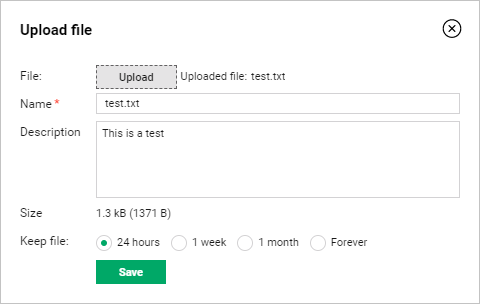
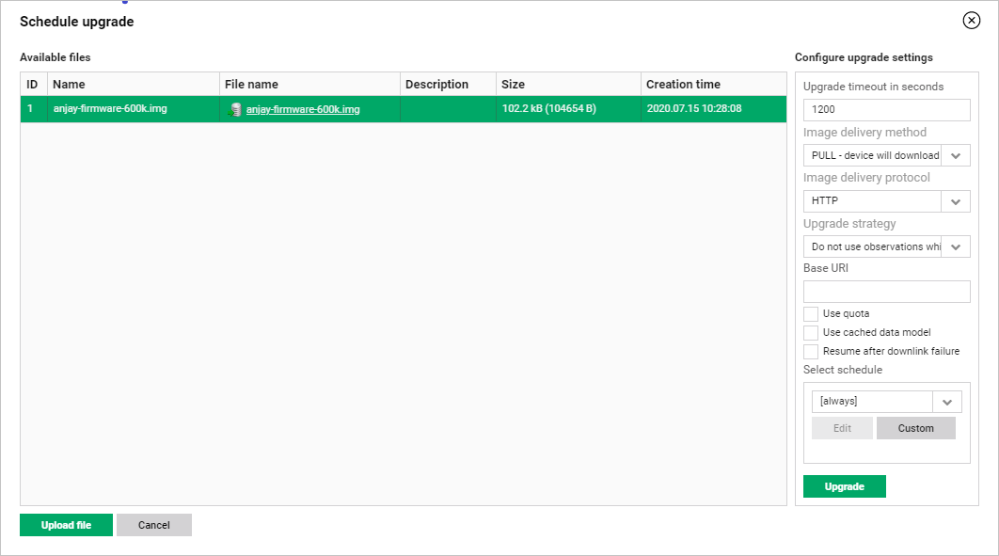

# Upgrading firmware for LwM2M devices

Read this instruction to learn how to upgrade firmware for LwM2M devices.

## Upgrading the firmware

To upgrade firmware on a device:

1. Go to **Device inventory**.
2. From a list of devices, select a device for which you want to upgrade firmware.
3. Go to the **LwM2M firmware** tab.
4. Click the **Schedule new firmware upgrade** link.
5. Configure your upgrade:

   * From a list of available firmware files, select a file that you want to use for upgrade. If you want to add a new file:

      * Click the **Upload file** button.
      * Click the **Upload** button and select a file.
      * Into the **Name** field, type the file name or leave the name added automatically.
      * Optional: Into the **Description** field, type the description.
      * Decide for how long you want to keep the file in the system by selecting the appropriate check box.
      * Click the **Save** button.
      

!!! tip
    You can also upload a firmware file using **Resources** but remember that you have to select **firmware** from the **Category** list to make this file visible in the **LwM2M firmware** tab.

   * Decide on the timeout of your upgrade (how much time can elapse before it fails) by typing a proper value into the **Upgrade timeout in seconds** field.
   * Decide on the delivery method by selecting an option from the **Image delivery method** list.
   * Decide on the delivery protocol by selecting an option from the **Image delivery protocol** list.
   * Decide on how your upgrade will be performed by selecting an option from the **Upgrade strategy**. Strategies differ in the way that the server handles the FOTA status updates from the device. Note that the more optimized a strategy is, the more requirements it puts on devices. You can choose among the following:

       * **Do not use observations while upgrading** - uses only LwM2M Read operations for status updates. LwM2M Reads are triggered by up-link messages (e.g. Register Update) from the device, which can take a lot of idle time and extend the upgrade duration. This is the most resilient approach as it works even with devices that implement LwM2M very poorly. It is not optimal in terms of economy of device-server message interchange.
       * **Use observations to trigger upgrade** - uses LwM2M Read and Observation on resource operations for status updates. This is similar to **Do not use observation while upgrading** but adds observations on single resources to eliminate idle time. It uses even more messages and requires the device to support simple observations, however, the upgrade procedure is significantly faster.
       * **Use observations to optimize upgrade** - uses LwM2M Observation on **Firmware Update** object instance for status updates. Highly optimized (eliminates idle time and uses a minimal number of messages, at the expense of greater Notification size). Recommended for devices that implement LwM2M correctly.
       * **Use send mechanism instead of observations** - uses LwM2M Send operations for status updates. This is the most optimized strategy but imposes requirements beyond the support of LwM2M. Note that to use this strategy you need to configure the device so that it sends the LwM2M Send requests (similarly to how a Notify would be sent when using observation-based FOTA) to the server each time the state inside the FOTA-state-machine changes. The Send payload should contain data from Device and Firmware Update objects, or at least the following resources: /3/0/3/, /3/0/19/, /5/0/3, /5/0/5, /5/0/8, /5/0/9.

  	!!! note
        Selecting this strategy without the support on the device side will make the procedure stuck until timeout occurs.

       * Provide the appropriate URI into the **Base URI** field.
       * Select the **Use quota** checkbox to restrict resources available for the task.
       * Select the **Use cached data model** checkbox to enable using cached device's data model for the initial Read to decide whether a FOTA state machine restart is needed. If the cached data model is empty, standard data model is checked as a fallback.
       * Select the **Resume after downlink failure** checkbox to make the task resume its execution upon next communication with the device if it was previously stopped due to a downlink failure. The moment the procedure had been interrupted is taken as the starting point so that the task will retry the last unsuccessful action.
       * Decide on the schedule for your upgrade. If you want the upgrade to start right away, from the **Select schedule** list, select **always**.

   

6. Click the **Upgrade** button.

    !!! tip
        In the **Configuration** tab, you can set the ``firmwareUpdateUseObserve`` setting value to ``true`` to issue an Observe on the "State" and "Update result" resources while upgrading. This will allow the server to check if the device has already completed each of the upgrade stages (e.g. downloaded the firmware image).

## Setting a custom task template for the FOTA procedure

The platform features an option to set your customized task template for the FOTA mechanism for a single device or a group of devices.

To set a customized task template:

1. Create your own FOTA task template.
2. Set the ``firmwareUpdateTaskTemplateName`` setting value on a device or a group and provide your created task template name as its value.
3. When executing the Firmware Upgrade for a device or a group, the task template defined in the setting value will be used.

!!! note
    If the template does not exist or the property is not set, a default system FOTA task will be used.

## Scheduling FOTA for temporarily offline devices

Use this option to schedule Firmware Upgrades for devices that may be temporarily offline using, e.g. a mobile application.

In order to enable this feature:

1. Set the ``mobileFotaEnabled`` property on your device or device group to ``true`` in order to enable automatic setting of the three remaining properties.

2. Then, proceed to schedule your upgrade using the **Schedule new firmware upgrade** link in the **LwM2M firmware** tab.

3. As a result, you should be able to see the following properties set for your device or device group:

| Name                   | Value                          |
|------------------------|--------------------------------|
| mobileFotaEnabled      | true                           |
| mobileFota             | available                      |
| mobileFotaFirmwareId   | <selectedResourceId>           |
| mobileFotaFirmwareName | <fileNameOfSelectedResourceId> |
