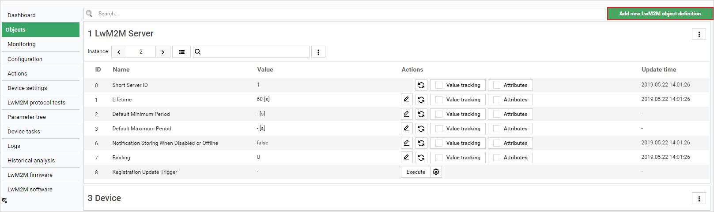
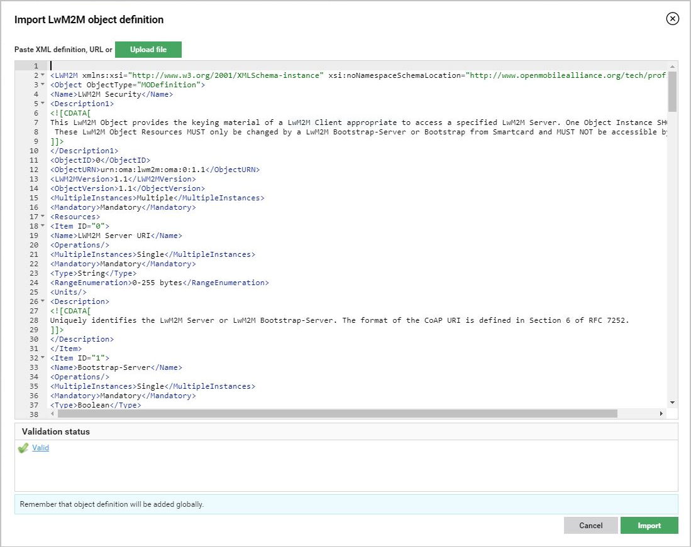
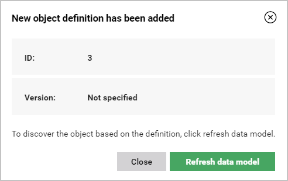
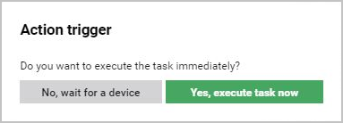
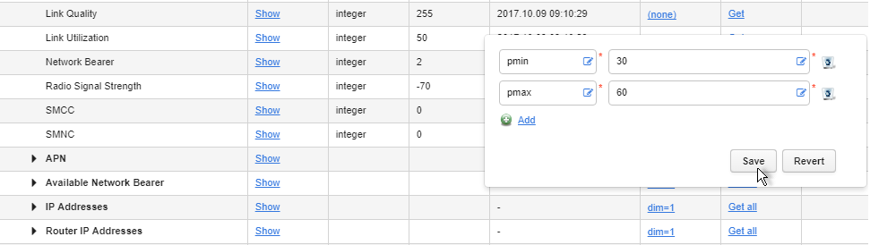
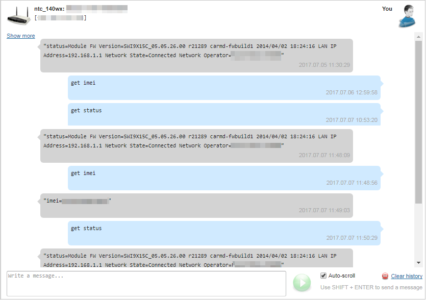

# LwM2M operations

## Adding new object definitions

To add a new object definition:

1. Go to **Device inventory --> Objects**.
2. In the **Objects** panel, click **Add new LwM2M object definition**.
    
3. In the window that opens, import the desired LwM2M object definition. You can paste an XML definition or an URL in the field, or use the **Upload file** button.

       !!! note
           The imported object definition will be validated. In the **Validation status** field, you will see errors associated with specific XML lines.

     
4. After the definition is positively validated, click **Import**.
5. The object definition is now added to the user domain. In the pop-up window, click **Refresh data model** to discover the defined object immediately, or click **Close**.
     

 !!! note
     The object will be visible in the panel only after refreshing the device's data model.

7. If you chose the refresh data model option, click **Yes, execute task now** to refresh the data model immediately.

     

## Setting and removing LwM2M attributes

To set an attribute:

1. Go to **Device inventory**.
2. From a list of devices, select a device.
3. Go to the **Parameter tree** tab and find a proper parameter to which you want to add the attribute.
4. Click the **(none)** link and click the **Add** button:
     * Click the first field and from the list select the attribute.
     * Into the second field, type a value of the attribute.
5. Click the **Save** button.

!!! tip
    To remove the attribute, click the **Delete** icon, then click the **Save** button.

## Sending and receiving messages from LwM2M devices

Use the **SMS connector** tab to trigger different operations on a device. You can, for example, get a status of a device, set some parameters or reset them.
The tab is visible only for LwM2M devices which have to have:

     * An active SIM card.
     * MSISDN setting value with a phone number added.

To send a message to a device:

1. Go to **Device inventory**.
2. From a list of devices, select a device to which you want to send a message.
3. Go to the **SMS connector** tab.
4. At the bottom of the view, into the field, type a message that you want to send and click the green icon or use :kbd:**Shift** + :kbd:**Enter**.

!!! tip
    If you want to be scrolled down to the bottom of a page when a new message from the device appears, select the **Auto-scroll** check box.
