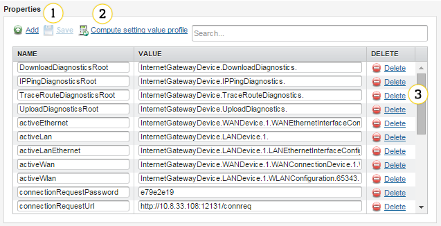
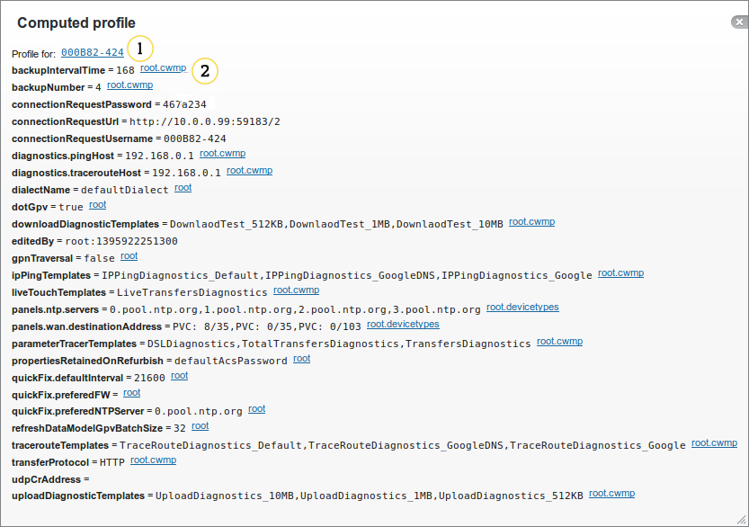

# Setting values - overview

Setting Value (SV or Property) is a single key-value entity of a profile. Set of a key-value pair is strongly and directly associated with a device. Every device can have many properties (this term is used interchangeably with SV).
SVs of the device can be found in **Device inventory --> General management** in the **Properties** panel. You can perform basic operations on both keys and values.

## Layout

1. **Add** - use it to add SV to a selected device.
2. **Compute setting value profile** - use it to get a device profile. Note that this window remains open when switching between different views, so necessary data can be easily copied or seen.
3. **Delete** - use it to delete a selected SV.

SVs can be also assigned to the group of devices from :menuselection:`Device groups --> Profiles`. Such properties will not be shown explicitly in the **Properties** panel but you can see them by clicking the **Compute setting value profile** link.
The profile for the device that has SVs inherited from several groups is shown in the picture below.

1. A device ID or group for which a current profile is computed.
2. A name of the group that has this property. The device profile includes SVs of all groups to which the current device belongs.

## Inheritance

If device CPE1 belongs to the *root.lwm2m* group, that is, it belongs to the sub-group *lwm2m* of the *root* group. Let's assume there is SV *a=1* (key is *a* and its value is *1*) defined in the *root* group and there are no SVs *a* neither at *root.lwm2m* nor at the device of interest (CPE1). Due to the inheritance mechanism in the computed profile of CPE1 value of SV *a* will be *1*, so it will be obtained from the SV profile of the group device belongs to. If in turn the device has this SV defined, for example, *a=NotOneAtAll*, then this value will be shown in the profile.

## Overriding

If the device belongs to several groups that have a different value for the same key, the displayed (active) value is the one that originates from **the deepest group in the group tree**. For example, the device belongs to *root.lwm2m*. The device has no SV *b* defined. For the *root* group *b=1*, for *root.lwm2m* *b=2*. In the calculated profile, the value of *b* will be *2*.
This is especially useful for **devicetype** groups. For such groups the following hierarchy is applied: **OUI > Model Name > Hardware version > Software version**. Such information and structure is available in **Device groups -> Statistics**.

## Practical use

SVs could be very helpful in many situations. You can use them to identify the device by its MAC address (or PPP credentials). In order to do so, the device must have a MAC address saved as SV *mac= MAC address*. Such devices then can be easily found using navigator search at the upper right corner of UMP. It is enough to print prefix *DMAC* and enter first digits to find the particular device.

## Setting values list

Consult this section to see what SVs are available in the system.

| Name                                     | Context                      | Default value | Description                                                                                                                                                                                                                                                                                                                                                                           |
|------------------------------------------|------------------------------|---------------|---------------------------------------------------------------------------------------------------------------------------------------------------------------------------------------------------------------------------------------------------------------------------------------------------------------------------------------------------------------------------------------|
| realTimeValuesTilePollingIntervalSeconds | Device inventory ‣ Dashboard | 5s            | Contains a polling interval in seconds for refreshing values in the Real time values panel. If the SV is missing, or if the SV value is not a valid integer or if the SV value as an integer is less or equal 0, then refreshing is disabled (and the Auto-refresh check box is not displayed at all). If the value is greater than 0 but less than 3 then the interval is 3 seconds. |
| geoTagOfSiteDeviceConnectedTo            | Multi-site                   | –             | Set to the geoTag of the most recent site to which the device has sent a CoAP message (either an uplink request, response for request or response for ping).                                                                                                                                                                                                                          |
| detectedTransport                        | Device Management Center     | –             | Defines the actual transport mode that the connected device is using (independently of the Binding mode parameter). It takes the following values: ‘U’, ‘T’, ‘S’, and ‘N’ (UDP, TCP, SMS i Non-IP respectively). It is set automatically and should not be modified by means of manual intervention.                                                                                  |
| verifyEpAgainstCertCn                    | Device Management            | –             | If set to true, it enables verification of the LwM2M EndpointName against certificate Common Name in the certificate security mode as per the LwM2M protocol specification.                                                                                                                                                                                                           |
