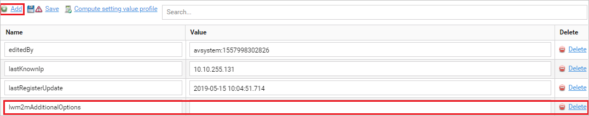
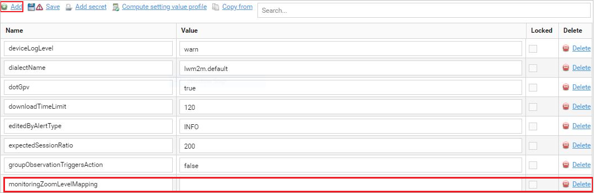
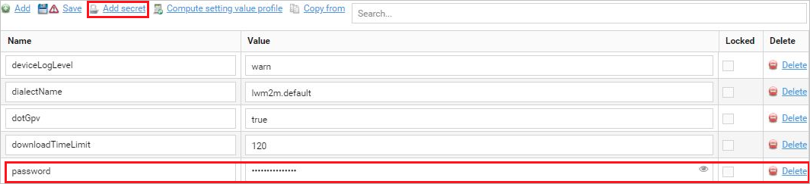

# Adding setting values for devices

Setting values (SVs) are properties associated with a device. Every device has its properties.

## Adding setting values to a device

To add a setting value to a device:

1. Go to **Device inventory** and from the list of devices, select a device.
2. Depending on the type of a device go to:

  * The **General management** tab
  * The **Configuration** tab.

3. In the **Properties** panel click the **Add** link. An empty row adds on the end of the list.
4. Provide a name into the **Name** field and a value into the **Value** field.

4. Click the **Save** link.
5. To delete a setting value, find it on the list and click the **Delete** link.
6. To get setting values from the device, click the **Compute setting value profile** link.

## Adding setting values to a group of devices

To add a setting value to a group of devices:

1. Go to **Device groups** and from the list of groups, select a group.
2. Go to **Profiles** and click the **Add** link.
3. Provide a name into the **Name** field and a value into the **Value** field.

   :align: center

   *Fig. Adding setting values to a group of devices*

4. To override values of setting values with the same name in all subgroups of the selected group, select the **Locked** check box.
5. Click the **Save** link.
6. To delete a setting value, find it on the list and click the **Delete** link.
7. To get setting values from the device, click the **Compute setting value profile** link.
8. To use the same setting values that are used in another group, click the **Copy from** link:

  * Select a group and click the **Copy** link.
  * Select check boxes next to setting values you want to copy.
  * Click the **Copy** link.

## Adding secret setting values to a group of devices

To create a secret setting value (hidden behind asterisks) for a group of devices:

1. Go to **Device groups** and from the list of groups, select a group.
2. Go to **Profiles** and click the **Add secret** link.
3. Provide a name into the **Name** field and a value into the **Value** field. The value will be hidden behind asterisks.

4. Click the **Save** link.
5. To view the hidden value, click the eye icon.
