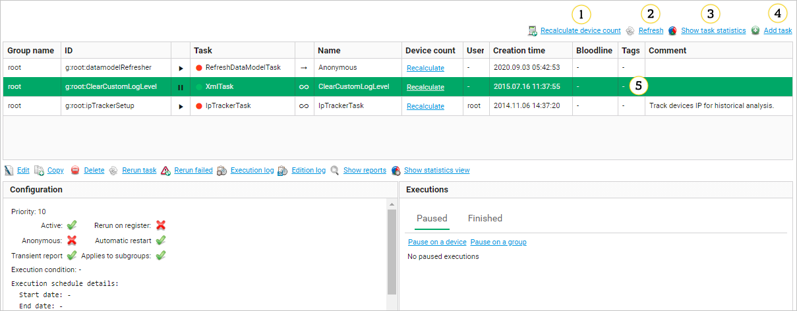
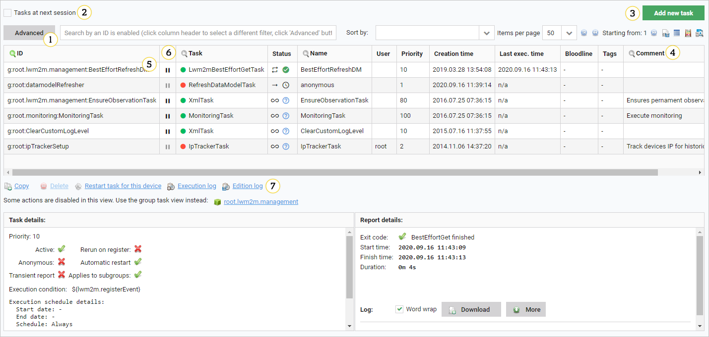

# Device and group tasks

Tasks can be scheduled either for a single device or for
[device groups](). In most real world scenarios, group tasks are more
useful - however, it is a good development practice to create a task on a single
device and then copy it to the desired group once it is well tested and production-ready.
This approach minimizes the risk of mistakes - however, there
are no technical obstacles to creating a task on a group level from scratch.
The only difference between a group task and a device task is the target - all
other configuration options are identical (except the
**Applies to subgroups** option which makes no sense in a single device
context).

## Group tasks

Tasks configured for a device group can be managed from **Device groups -> Group tasks**.

!!! tip
    Before you schedule a task on a group of devices, test it on a single device to see if your configuration is correct.

1. **Recalculate device count** - use it to recalculate a number of devices on which tasks have been executed.
   This is equivalent to clicking **Recalculate** in the **Device count** column of the task list.
2. **Refresh** - use it to refresh the task list.
3. **Show task statistics** - use it to display a number of all active and stopped tasks which can be grouped by task type.
4. **Add task** - use it to configure a new task assigned to the group.
5. Task list - a list of tasks currently scheduled for the group. Selecting an entry will display the bottom panel with task details and
   editing controls. Some of tasks are tasks inherited from the parent
   group. Their editing options are limited from the current view - to actually
   edit them, go to the parent group they are defined in. You can disable group task execution for specific devices.

## Device tasks

Tasks configured for a specific device can be managed from **Device inventory --> Device tasks**.

1. Search - it allows to enter a sub-string with which the list of tasks is filtered. By default, the entries are filtered by the column currently highlighted with
   the green |icon_SEARCH_CURRENT_16| icon. The |icon_SEARCH_16| icon on the left can be used to toggle the advanced (criteria-based) search window.
2. The **Tasks at next session** check box - select this check box to filter the list so that is shows only the tasks
   which will be executed during next management session between the device and server.
   Note the fact that tasks may be scheduled depending on a date and time, the set of
   tasks executed during a session may differ depending on the date and time as
   well. In the **Tasks at next session** view, a hypothetical session execution at exactly the present time is assumed by default.
   The **Session start time** widget will appear as well, it allows you to show which tasks will be executed, if the next session will occur at some
   arbitrary specified time.

!!! note
    If another session occurs before that time, the set of tasks executed may be different because some tasks may be already executed then.

3. **Add new task** - use it to configure a new task assigned to the device.
4. Export and statistic options:
     - **Lightweight table view** - use it to export data to the HTML view.
     - **CSV Export** - use it to export data to a CSV table.
     - **Number of tasks** - it displays a number of tasks that has been started for the current device.
     - **Current task statistics** - it shows a dialog box that displays a number of all, active and stopped tasks which can be grouped by a task type.

     !!! tip
         The above options, except **Current task statistics**, take the current list filter (that is, the search box and **Tasks at next session** check box) into account. However, pagination is not considered - all tasks fulfilling the filter criteria are exported (or counted).

5. Task list - a list of tasks currently scheduled for the device. Selecting an entry will display the bottom panel with task details and editing controls. This list includes both device and group tasks - all tasks affecting the selected device. They can be distinguished by the task ID - device tasks start with **d:** and group tasks start with **g:**.
6. **Activate for** - use it to activate the task/**Deactivate for** - use it to deactivate group task execution for a single specific device while still allowing it to execute for all other devices in the assigned group.
7. Task control - use these widgets to review and edit the task state and configuration.
