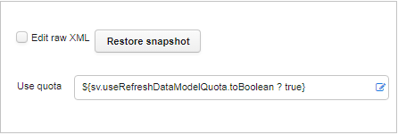
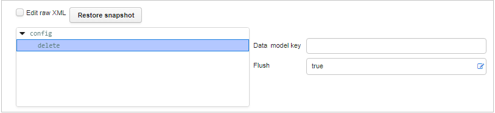
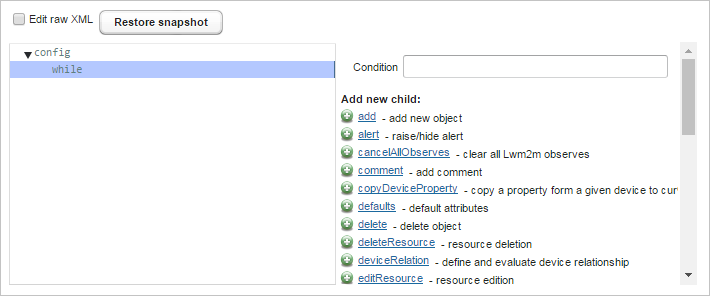

# CWMP

## AddObjectTask

It creates a new instance of a writable node.

| Property name | XML attribute | Type   | Description          |
|---------------|---------------|--------|----------------------|
| Array path    | objectName    | string | A name of the object |

This task allows for one subtag:

| Property name | Description                                                          |
|---------------|----------------------------------------------------------------------|
| with          | Specifies an initial value for a parameter of a new object instance. |

The following fields are available for the **with** subtag:

| Property name     | XML attribute | Type   | Description                                                                                      |
|-------------------|---------------|--------|--------------------------------------------------------------------------------------------------|
| Key for parameter | key           | string | A key relative to *parentKey.i.png.                                                                |
| Value             | value         | string | A new value.                                                                                     |
| Type              | type          | string | A type of a value. If it is left empty; then ACS will try to infer a type on a basis of the key. |

## DeleteObjectTask

It removes a particular instance of an object.

| Property name | XML attribute | Type   | Description                         |
|---------------|---------------|--------|-------------------------------------|
| Instance path | objectName    | string | A name of the object to be deleted. |

## GetNamesTask

It invokes GetParameterNames on a device.

| Property name  | XML attribute | Type    | Description                                                                                                                                                                                                                  |
|----------------|---------------|---------|------------------------------------------------------------------------------------------------------------------------------------------------------------------------------------------------------------------------------|
| Data model key | objectName    | string  | Object name used as GPN argument.                                                                                                                                                                                            |
| Recursive      | recursive     | boolean | Indicates whether GPN should obtain all the parameters in a single operation (set to *false*) or get entire subtree recursively, level by level (set to *true*). By default, it is set to a value of gpnTraversal.toBoolean. |

## GetValuesTask

It performs GetParameterValues on a device.

| Property name  | XML attribute | Type   | Description                                      |
|----------------|---------------|--------|--------------------------------------------------|
| Parameter      |               | button | Allows to add a parameter.                       |
| Data model key | name          | string | Object name used as GetParameterValues argument. |

## IpTrackerSetupTask

It generates data about IP changes for historical analysis.

## RefurbishTask

It performs full factory reset of a device with additional cleanup of all device tasks and stored properties.

| Property name       | XML attribute      | Type   | Description                                                          |
|---------------------|--------------------|--------|----------------------------------------------------------------------|
| Retained properties | retainedProperties | string | Names of device properties that should be retained during refurbish. |

## SetValuesTask

The task invokes the SetParameterValues method on a device.

| Property name  | XML attribute | Type   | Description                                                                                                                                             |
|----------------|---------------|--------|---------------------------------------------------------------------------------------------------------------------------------------------------------|
| Param          |               | button | Allows to add a parameter.                                                                                                                              |
| Data model key | name          | string | Parameter name set in a SPV request.                                                                                                                    |
| Value          | value         | string | Value set in the SPV request.                                                                                                                           |
| Type           | type          | string | Type set in the SPV request. When it is left blank, ACS will try to induce the **Param** type from GPV performed while retrieving a data model. |
