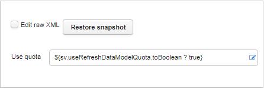
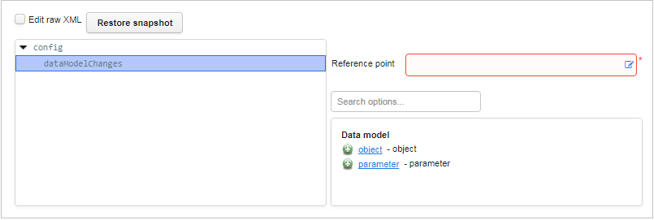
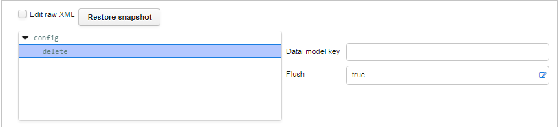
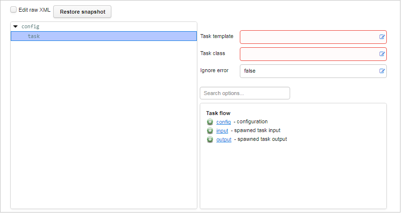
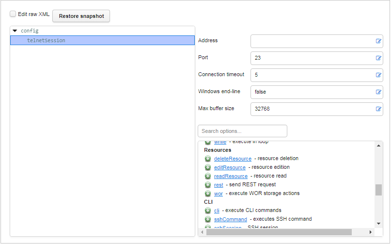
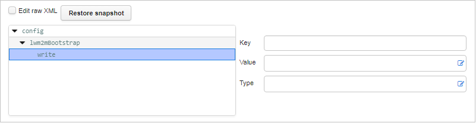
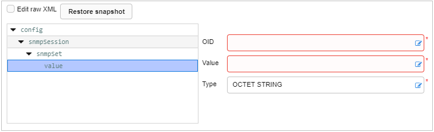

# General

## FactoryResetTask

This task performs a factory reset on a device.

## RebootTask

This task performs a reboot procedure.

## RefreshDataModelTask

This task updates the data model of a device, both its structure and parameter values. It invokes *GetParameterNames* and *GetParameterValues*. By default, it is set as inactive in the system and replaced by the [Lwm2mBestEffortGetTask](#lwm2mbesteffortgettask).

| Property name | XML attribute | Type    | Description                                                                   |
|---------------|---------------|---------|-------------------------------------------------------------------------------|
| Use quota     | useQuota      | boolean | It is recommended to set it to *true*. Read more in the :ref:`Quota` chapter. |

## ServiceManagementTask

It manages a state of services on devices.

## XMLTask

XMLTask offers the user multiple functionalities and tags selection. Each tag enables different configuration of subtags and parameters and will be separately described.

### Root tag

Root of XMLTask script processing. To add this tag you may add subtags that will be evaluated in a given order.

The following subtags are available:

| Name                        | Description                                                                                                                       |
|-----------------------------|-----------------------------------------------------------------------------------------------------------------------------------|
| add                         | Adds a new object instance in a data model array.                                                                                 |
| alert                       | Hides or raises an alert defined in a subtag.                                                                                     |
| cancelAllObserves           | This tag is supported by LwM2M. It cancels all configured observes for a given device.                                            |
| cli                         | Executes cli commands.                                                                                                            |
| comment                     | Content of this tag is treated as commentary.                                                                                     |
| copyDeviceProperty          | Copies a property (SV) from a device with a given source identity to the device on which the task is being executed.              |
| dataModelChanges            | Allows to manually publish data model changes.                                                                                    |
| defaults                    | Allows to modify a default attribute values of its subtags.                                                                       |
| delete                      | Deletes an instance from a data model array.                                                                                      |
| deleteResource              | Deletes resources associated with a current device for which a session is in progress.                                            |
| deviceRelation              | Defines and saves a relationship rule for a device, and then evaluates its results.                                               |
| editResource                | Allows to edit a resource (mainly a device configuration) by applying a series of regular expression replacements.                |
| execute                     | This tag is supported by LwM2M. It executes a data model parameter’s key to start a proper process on devices.                    |
| find                        | Performs a device live data model query.                                                                                          |
| finish                      | Ends the task with a specified massage and an execution status.                                                                   |
| flush                       | Flushes requests waiting to be sent to a device.                                                                                  |
| foreach                     | Executes actions for each element.                                                                                                |
| get                         | Gets a value of a data model parameters.                                                                                          |
| getParameters               | Obtains parameter names for a defined data model path.                                                                            |
| if                          | Executes subtags conditionally.                                                                                                   |
| in                          | Adds data model prefix to subtags.                                                                                                |
| join                        | Adds a device to a specified group.                                                                                               |
| leave                       | Removes a device from a specified group and (by default) all its subgroups.                                                       |
| limiter                     | Limit the number of concurrent executions of subtags.                                                                             |
| log                         | Adds a message to a task log.                                                                                                     |
| lwm2mBestEffortGet          | Gets parameters in the best effort way.                                                                                           |
| lwm2mBootstrap              | Performs a sequence of commands on the device’s BOOTSTRAP interface and then optionally finishes a provisioning session.          |
| lwm2mFirmwareUpdate         | Performs a firmware upgrade process on a LwM2M-enabled device.                                                                    |
| lwm2mSoftwareActivation     | Activates or deactivates software on a LwM2M-enabled device.                                                                      |
| lwm2mSoftwareManagement     | Installs or removes software on a LwM2M-enabled device.                                                                           |
| mail                        | Sends an email message to a configured list of recipients.                                                                        |
| mapping                     | Maps a data model parameter to a variable.                                                                                        |
| message                     | Logs a user activity message into the logs database with the USER_ACTIVITY tag.                                                   |
| observe                     | This tag is supported by LwM2M. It performs Observe and WriteAttributes operations.                                               |
| reloadDialect               | Reloads a dialect and the whole data model during the same session.                                                               |
| removeProperty              | Removes a property form a device.                                                                                                 |
| readResource                | Allows to read a resource and saves its value to a variable.                                                                      |
| rest                        | Sends a REST request using GET, POST, PUT or DELETE.                                                                              |
| requestConnection           | Allows to schedule a connection request.                                                                                          |
| set                         | Sets a data model parameter value.                                                                                                |
| setAttributes               | Allows to set or unset parameter attributes.                                                                                      |
| setDomain                   | Allows to change a domain which is either equal to a task’s domain or its subdomain. The domain name should start and end with /. |
| setParameterAttributes      | Modifies attributes associated with one or more device parameter.                                                                 |
| sms                         | Sends SMS.                                                                                                                        |
| sshCommand                  | Executes an SSH command, awaits a response and validates it.                                                                      |
| sshSession                  | Opens an SSH session.                                                                                                             |
| store                       | Stores a computed value to a specified type of a variable.                                                                        |
| task                        | Spawns a subtask with a given configuration.                                                                                      |
| telnetCommand               | Invokes a telnet command during session.                                                                                          |
| telnetSession               | Creates telnet session during session. Telnet commands can be then invoked as subtags.                                            |
| trap                        | Sends SNMP trap.                                                                                                                  |
| wait                        | Blocks XMLTask execution for a current session.                                                                                   |
| while                       | Executes actions in loop as long as the specified condition is met.                                                               |
| wor                         | Executes WOR storage actions in a transactional manner.                                                                           |
| lwm2mBootstrapConfiguration | Configures or reconfigures devices and connects them with LwM2M servers.                                                          |
| lwm2mBootstrapCleanse       | Deletes previous configuration of devices.                                                                                        |
| coioteRest                  | Sends the REST request to the LwM2M server.                                                                                       |
| lwm2mForwardNotification    | Sets a task to forward a message in a specified format upon receiving the LwM2M notification.                                     |
| readComposite               | Executes LwM2M read composite operation (only for LwM2M v1.1).                                                                    |
| writeComposite              | Executes LwM2M write composite operation (only for LwM2M v1.1).                                                                   |
| observeComposite            | Configures LwM2M observe composite.                                                                                               |
| cancelObservationComposite  | Configures the LwM2M cancel observation composite request.                                                                        |

### Data model

#### add tag

Adds a new object instance in a data model array. Furthermore, for subtags it works as the **in** tag setting created instance path as prefix for all subtags data model operations.

| Property name          | XML attribute        | Type    | Description                                                                                                                        |
|------------------------|----------------------|---------|------------------------------------------------------------------------------------------------------------------------------------|
| Data model key         | parentKey            | string  | Specifies a data model key of an array to which a new object instance will be added.                                               |
| Output variable        | output               | string  | An identifier for a variable where the new object number will be stored. It can be referenced and used later in a task definition. |
| Get parameters         | getChildren          | boolean | Indicates whether to retrieve a parameter of a newly created object instance.                                                      |
| LwM2M: Instance number | lwm2m.instanceNumber | integer | An instance number for use in payload of the Create request.                                                                       |

Available subtags are the same as for the **root** tag apart from the **with** subtag that is available for the **add** tag only. To learn more about the **with** subtag,
read the :ref:`AddObjectTask` chapter.

#### dataModelChanges tag

Allows to manually publish data model changes into a desired point in the live data model strategy chain.

| Property name   | XML attribute  | Type   | Description                                                                                    |
|-----------------|----------------|--------|------------------------------------------------------------------------------------------------|
| Reference point | referencePoint | string | Defines the point in the live data model strategy chain into which changes should be injected. |

This tag allows for two subtags:

| Property name | Description             |
|---------------|-------------------------|
| object        | A data model object.    |
| parameter     | A data model parameter. |

The **object** subtag represents a single object in the data model.
The following fields are available for the **object** subtag:

| Property name  | XML attribute | Type    | Description                                                                                     |
|----------------|---------------|---------|-------------------------------------------------------------------------------------------------|
| Key            | key           | string  | An object data model key.                                                                       |
| Writable       | writable      | boolean | Specifies whether the object is writable.                                                       |
| Refreshed      | refreshed     | boolean | Indicates that a list of direct children and parameters of the object will be refreshed.        |
| Retained       | retained      | boolean | Determines whether the object should be retained when the parent object is marked as refreshed. |
| Deleted        | deleted       | boolean | Indicates whether an entire subtree will be deleted from the data model.                        |
| Tree refreshed | treeRefreshed | boolean | Determines whether all objects in the subtree should be marked as **refreshed**.                |

The **object** subtag allows for two subtags: **parameter** and **object** (itself).

The **parameter** subtag represents a single parameter in the data model.
The following fields are available for the **parameter** subtag:

| Property name     | XML attribute    | Type    | Description                                                                                                    |
|-------------------|------------------|---------|----------------------------------------------------------------------------------------------------------------|
| Key               | key              | string  | A parameter data model key.                                                                                    |
| Value             | value            | string  | The parameter value.                                                                                           |
| Type              | type             | string  | The parameter type.                                                                                            |
| Writable          | writable         | boolean | Specifies whether the parameter is writable.                                                                   |
| Notification mode | notificationMode | string  | Allows to set a notification mode (similar to :ref:`setParameterAttributes <XmlTask_setParameterAttributes>`). |
| Retained          | retained         | boolean | Determines whether the parameter should be retained when the parent object is marked as refreshed.             |
| Deleted           | deleted          | boolean | Indicates whether the parameter will be deleted from data the model.                                           |

**Example usages:**

   * Adds a single key-value pair to a data model:

         <dataModelChanges referencePoint="real">
           <object key="someObject.">
             <parameter key="someParameter" value="someValue" />
           </object>
         </dataModelChanges>

   * Removes the single key-value pair from the data model:

         <dataModelChanges referencePoint="real">
           <object key="someObject.">
             <parameter key="someParameter" deleted="true" />
           </object>
         </dataModelChanges>

   * Removes an entire subtree from the data model:

         <dataModelChanges referencePoint="real">
           <object key="someObject." deleted="true" />
         </dataModelChanges>

   * `retained` and `refreshed` flags and suppose the data model contains:

         someObject.param1 = val1
         someObject.param2 = val2
         someObject.param3 = val3
         someObject.param4 = val4

    Tag:

         <dataModelChanges referencePoint="real">
           <object key="someObject." refreshed="true">
             <parameter key="param1" value="newVal" />
             <parameter key="param2" retained="true" />
             <parameter key="param3" retained="false" />
           </object>
         </dataModelChanges>

    Result:

           someObject.param1 = newVal
           someObject.param2 = val2

   * `treeRefreshed` flag and suppose the data model contains:

           obj.param1 = val1
           obj.obj2.param2 = val2
           obj.obj2.obj3.param3 = val3
           obj.obj2.obj4.param4 = val4

    Tag:

         <dataModelChanges referencePoint="real">
           <object key="obj" treeRefreshed="true">
             <object key="obj2">
               <parameter key="param2" retained="true" />
               <object key="obj3" retained="false" />
             </object>
           </object>
         </dataModelChanges>

    Result:

           obj.obj2.param2 = val2
           obj.obj2.obj3.

#### delete tag

Removes an existing object instance from a data model array.

| Property name  | XML attribute | Type    | Description                                                                |
|----------------|---------------|---------|----------------------------------------------------------------------------|
| Data model key | key           | string  | A data model key of an instance which will be removed from a parent array. |
| Flush          | flush         | boolean | Flushes all pending requests on devices.                                   |

#### find tag

Performs a live device data model query.

| Property name    | XML attribute | Type    | Description                                                                                                                 |
|------------------|---------------|---------|-----------------------------------------------------------------------------------------------------------------------------|
| Data model query | query         | string  | A data model query that will be executed to obtain an element list.                                                         |
| Use as prefix    | in            | boolean | Indicates whether a current element value should be used as a data model prefix.                                            |
| Output variable  | output        | string  | An identifier for a variable where a query result be stored. This way results can be referenced later in a task definition. |

Available subtags are the same as for the **root** tag.

#### get tag

Obtains a parameter value.

| Property name         | XML attribute       | Type    | Description                                                                                                                                                                                                                                           |
|-----------------------|---------------------|---------|-------------------------------------------------------------------------------------------------------------------------------------------------------------------------------------------------------------------------------------------------------|
| Parameter name        | key                 | string  | A name of a data model parameter or a parameter tree node for which values will be obtained.                                                                                                                                                          |
| Output variable       | output              | string  | An identifier of a variable under which the obtained parameter value will be stored. This variable can be referenced later in the task processing.                                                                                                    |
| Use cache             | fromCache           | boolean | Indicates whether the parameter value should be retrieved from cache (if true), or the device should be queried for the current value (otherwise).                                                                                                    |
| Ignore faults         | ignoreFaults        | boolean | Determines whether task execution will be terminated if any request processing failure occurs (it will if set to false). The property does not apply to any connection or other technical failures, in such case, execution is finished with failure. |
| Flush                 | flush               | boolean | Indicates whether to flush all pending requests to the device. If set to true, it works in the same way as the flush tag.                                                                                                                             |
| LwM2M: Content format | lwm2m.contentFormat | string  | Specifies the CoAP Accept option for the Read request.                                                                                                                                                                                                |

#### getParameters tag

Obtains parameter names for a defined data model path.

| Property name         | XML attribute       | Type   | Description                                                  |
|-----------------------|---------------------|--------|--------------------------------------------------------------|
| Data model key        | key                 | string | A data model key for which parameter names will be obtained. |
| LwM2M: Content format | lwm2m.contentFormat | string | Specifies the CoAP Accept option for the Read request.       |

#### in tag

Adds a data model prefix to subtags data model paths.

| Property name | XML attribute | Type    | Description                                                          |
|---------------|---------------|---------|----------------------------------------------------------------------|
| Key prefix    | key           | boolean | A data model key prefix that will be added to data model operations. |

Available subtags are the same as for the **root** tag.

#### mapping tag

Maps data model parameter to a task variable. Every parameter value change will be reflected in a variable value.

| Property name  | XML attribute | Type    | Description                                                                                                                                                                                                                                                |
|----------------|---------------|---------|------------------------------------------------------------------------------------------------------------------------------------------------------------------------------------------------------------------------------------------------------------|
| Data model key | key           | string  | A data model key for a parameter that will be mapped.                                                                                                                                                                                                      |
| Target         | target        | string  | A device property where a parameter value will be stored.                                                                                                                                                                                                  |
| Force refresh  | forceRefresh  | boolean | Forces refresh of the value stored in device properties. Every task execution will copy the parameter value into the device property, irrespective related property existence. It should be used if the related device property can be changed externally. |

#### set tag

Sets a data model parameter value.

| Property name         | XML attribute       | Type    | Description                                                                                                                                                                                                                           |
|-----------------------|---------------------|---------|---------------------------------------------------------------------------------------------------------------------------------------------------------------------------------------------------------------------------------------|
| Data model key        | key                 | string  | Data model key of a parameter which value will be set.                                                                                                                                                                                |
| Value                 | value               | string  | Value to be set.                                                                                                                                                                                                                      |
| Value type            | type                | string  | Type of a value to be set. If left empty, the system will try to determine the value type on its own basing on data obtained earlier from the device.                                                                                 |
| Ignore faults         | ignoreFaults        | boolean | Determines whether task execution will be terminated if any request processing failure occurs (if *false*). Property does not apply to any connection or other technical failures, in such case, execution is finished with failure.  |
| Flush                 | flush               | boolean | Indicates whether to flush all pending requests to device. If set to *true*, it works the same way as the **flush** tag.                                                                                                      |
| LwM2M: Content format | lwm2m.contentFormat | string  | Specifies the Content-Format CoAP option for the Write request.                                                                                                                                                                       |

#### setParameterAttributes tag

Invokes the setParameterAttributes method on the device.

| Property name       | XML attribute      | Type    | Description                                                                                                                                           |
|---------------------|--------------------|---------|-------------------------------------------------------------------------------------------------------------------------------------------------------|
| Data model key      | parameterName      | string  | This is the name of a parameter to apply the new attributes. Alternatively, this MAY be a partial path name, indicating that the new attributes are to be applied. [#f1]_ |
| Notification change | notificationChange | boolean | If *true*, the value of notification replaces the current notification setting for this parameter or group of parameters. If *false*, no change is    |
|                     |                    |         | made to the change notification setting. [#f1]_                                                                                                       |
| Notification type   | notification       | boolean | Indicates whether (and how) the device will notify the ACS when the specified parameters change their values. The following values are defined:       |
|                     |                    |         | * 1 = **Passive notification**, whenever the specified parameter value changes, the device MUST include the new value in the ParameterList in the     |
|                     |                    |         |   Inform message that is sent the next time a session is established to the ACS. If the device has rebooted, or the URL of the ACS has changed since  |
|                     |                    |         |   the last session, the device MAY choose not to include the list of changed parameters in the first session established with the new ACS.            |
|                     |                    |         | * 2 = **Active notification**, whenever the specified Parameter value changes, the device MUST initiate a session to the ACS, and include the new     |
|                     |                    |         |   value in the ParameterList in the associated Inform message.                                                                                        |
|                     |                    |         | * 3 = **Passive lightweight notification**, whenever the specified Parameter value changes, the device MUST include the new value in the              |
|                     |                    |         |   ParameterList in the next Lightweight Notification message that is sent.                                                                            |
|                     |                    |         | * 4 = **Passive notification with passive lightweight notification**, this combines the requirements of the values 1 (**Passive notification**) and 3 |
|                     |                    |         |   (**Passive lightweight notification**). The two mechanisms operate independently.                                                                   |
|                     |                    |         | * 5 = **Active lightweight notification**, whenever the specified Parameter value changes, the device MUST include the new value in the ParameterList |
|                     |                    |         |   in the associated Lightweight Notification message and send that message.                                                                           |
|                     |                    |         | * 6 = **Passive notification with active lightweight notification**, this combines the requirements of the values 1 (**Passive notification**) and 5  |
|                     |                    |         |   (**Active lightweight notification**). The two mechanisms operate independently. [#f1]_                                                             |
| Access list change  | accessListChange   | boolean | If *true*, the value of AccessList replaces the current access list for this parameter or group of parameters. If *false*, no change is made to the   |
|                     |                    |         | access list. [#f1]_                                                                                                                                   |
| Access list         | accessList         | string  | A comma separated list of entities with write access to parameters. Currently the standard only supports **Subscriber** entity but it is also         |
|                     |                    |         | possible to enter additional entities with **X_AVS_** prefix. [#f1]_                                                                                  |
| Ignore faults       | ignoreFaults       | boolean | Determines whether task execution will be terminated if any request processing failure occurs (if *false*). Property does not apply to any connection or other technical failures, in such case, execution is finished with failure. [#f1]_ |                                                           |

### System

#### alert tag

Raises or hides an alert instance with specified parameters. A target of an alert may be freely chosen.

| Property name | XML attribute | Type    | Description                                                                                                                                                                            |
|---------------|---------------|---------|----------------------------------------------------------------------------------------------------------------------------------------------------------------------------------------|
| Type          | type          | string  | A type of an alert that will be handled by this action.                                                                                                                                |
| Caption       | caption       | string  | A short caption of the managed alert.                                                                                                                                                  |
| Description   | description   | string  | A description of the managed alert.                                                                                                                                                    |
| Raise         | raised        | boolean | Indicates whether the managed alert should be raised (when *true*) or hidden.                                                                                                          |
| Severity      | severity      | integer | A severity level of the managed alert. The thresholds for alert severity levels are: **DEBUG** - 0, **INFO** - 500, **WARN** - 1000, **ERROR** - 2000. |
| Target        | target        | string  | A target of the managed alert - when it is left empty, the device on which the task is being executed will be taken as the target.                                                     |

#### copyDeviceProperty tag

Copies a property (SV) from a device with a given source identity to the device on which the task is being executed.

| Property name     | XML attribute   | Type    | Description                                                                    |
|-------------------|-----------------|---------|--------------------------------------------------------------------------------|
| Source identity   | sourceIdentity  | string  | An identity of a source device.                                                |
| Source property   | sourcePropName  | string  | A name of a source property on the source device.                              |
| Target property   | targetPropName  | string  | A name of a target property on the device on which the task is being executed. |
| Skip non-existing | skipNonExisting | boolean | Skip this command, if the source property is not defined in the source device. |

#### deviceRelation tag

Defines and saves a relationship rule for a device, and then evaluates its results. To create relationships between devices, you have to use this tag in a task that will be executed on a group level.

| Property name | XML attribute | Type   | Description                                                                                                                              |
|---------------|---------------|--------|------------------------------------------------------------------------------------------------------------------------------------------|
| Name          | name          | string | A device relationship rule name (it should be unique).                                                                                   |
| Condition     | condition     | string | An expression that defines, if the relationship will be created for the device. The expression can only access device, data model or SV. |
| Target        | target        | string | An expression that creates an identifier for related devices. The expression can contain only access to device, data model or SV.        |

#### join tag

Adds a device to a specified group.

| Property name | XML attribute | Type   | Description                                          |
|---------------|---------------|--------|------------------------------------------------------|
| Group name    | group         | string | A name of a group to which the device will be added. |

#### leave tag

Removes a device from a specified group and (by default) all its subgroups.

| Property name   | XML attribute  | Type    | Description                                                                              |
|-----------------|----------------|---------|------------------------------------------------------------------------------------------|
| Group name      | group          | string  | A name of a group from which a device will be removed.                                   |
| Leave subgroups | leaveSubgroups | boolean | If set to *true*, the device will be also removed from subgroups of the specified group. |

#### reloadDialect tag

Reloads a dialect and the whole data model during the same session.

#### removeProperty tag

Removes a property from a device.

| Property name | XML attribute | Type   | Description                                  |
|---------------|---------------|--------|----------------------------------------------|
| Property name | target        | string | A name of the property that will be removed. |

#### setDomain tag

Allows to change a domain which is either equal to a task's domain or its subdomain. The domain name should start and end with /.

| Property name | XML attribute | Type   | Description                               |
|---------------|---------------|--------|-------------------------------------------|
| Domain        | domain        | string | A domain to which a device will be added. |

#### requestConnection tag

Allows scheduling a connection request.

| Property name | XML attribute | Type    | Description                               |
|---------------|---------------|---------|-------------------------------------------|
| Date          | date          | integer | A data of a scheduled connection request. |

#### store tag

Stores a computed value as a specified variable.

| Property name | XML attribute | Type   | Description                                                                                                                    |
|---------------|---------------|--------|--------------------------------------------------------------------------------------------------------------------------------|
| Variable type | type          | string | Defines a type of a variable under which a computed value will be stored. Currently the following possibilities are available: - **devProp** - stores as a device property, - **history** - sends to warehouse as a device parameter, - **var** - stores as variable in current task context.   |                                                                                                           |
| Variable name | target        | string | A target variable name where the parameter value will be stored.                                                               |
| Value         | value         | string | A value to set onto the variable.                                                                                              |

### Task flow

#### comment tag

Content of this tag is treated as commentary.

#### finish tag

Ends the task with a specified massage and an execution status.

| Property name | XML attribute | Type    | Description                                                                                                                                                                  |
|---------------|---------------|---------|------------------------------------------------------------------------------------------------------------------------------------------------------------------------------|
| Status        | status        | string  | A task execution status. The following statuses are possible: **ERROR`, **IN_PROGRESS`, **NOT_STARTED`, **SUCCESS`, **WARNING`. |
| Message       | message       | string  | A message that will be displayed after the task is finished.                                                                                                                 |
| Blocking      | blocking      | boolean | Blocks execution of consecutive tasks in the provisioning session.                                                                                                           |

#### flush

A flush requests waiting to be sent to a device.

#### foreach tag

Executes sub-actions for each element either from a provided list or from a live data model query result list.

| Property name    | XML attribute | Type    | Description                                                                                    |
|------------------|---------------|---------|------------------------------------------------------------------------------------------------|
| Data model query | query         | string  | A data model query which will be executed to obtain a list of elements.                        |
| Element list     | list          | string  | The element list which will be iterated over.                                                  |
| Use as prefix    | in            | boolean | Indicates whether a current element value should be used as a data model prefix.               |
| Iterator         | iterator      | string  | An identifier of a variable under which a current value of an iterated element will be stored. |

Available subtags are the same as for the **root** tag.

#### if tag

Executes subtags only if a provided condition evaluates to *true*.

| Property name | XML attribute | Type    | Description                                |
|---------------|---------------|---------|--------------------------------------------|
| Condition     | expr          | boolean | A logical condition for executing subtags. |

In addition to subtags taken from the **root** tag this tag also allows for the following subtag:

| Name | Description                                                                       |
|------|-----------------------------------------------------------------------------------|
| else | The tag is executed only when the parent **if** tag condition is not met. |

#### limiter tag

Limits the number of concurrent executions of subtags.

When this tag is run, it checks how many limiter tags with the same **domain** and **name** are running on this or other devices. If there are less than **maxConcurrentExecutions** limiters running, the subtags are run. If not, they are skipped. Exceeding the limit does not result in the failure of the task. The limit is freed when subtags complete execution (by success or failure), or when expiration time elapses. Expiration only frees the limit, it does not cause the task to fail.

| Property name               | XML attribute           | Type     | Description                                                                                                                                                                                                                                                                                                                                                                                                                 |
|-----------------------------|-------------------------|----------|-----------------------------------------------------------------------------------------------------------------------------------------------------------------------------------------------------------------------------------------------------------------------------------------------------------------------------------------------------------------------------------------------------------------------------|
| Limiter name                | name                    | string   | Name of the limiter. Limiters with the same name and in the same domain count as one limiter.                                                                                                                                                                                                                                                                                                                               |
| Expiration time             | executionExpirationTime | duration | Time after which limit expires. Expiration frees the limit, but does not stop the running task.                                                                                                                                                                                                                                                                                                                             |
| Max simultaneous executions | maxConcurrentExecutions | number   | Maximum number of limiters with the same name and domain that can be executing concurrently.                                                                                                                                                                                                                                                                                                                                |
| Domain                      | domain                  | domain   | Domain under which limiter is registered. It can be a subdomain or a superdomain of task's domain. Defaults to task's domain when empty.                                                                                                                                                                                                                                                                                    |
#### log tag

Adds a message to the task log.

| Property name | XML attribute | Type   | Description                                                                                                                                                                                                                            |
|---------------|---------------|--------|----------------------------------------------------------------------------------------------------------------------------------------------------------------------------------------------------------------------------------------|
| Message       | message       | string | A message to be logged.                                                                                                                                                                                                                |
| Level         | level         | string | A level of a logged entry. If it is lower than a task log level, this message will not be stored. The following levels are available: **TRACE`, **DEBUG`, **INFO`, **WARN`, and **ERROR`. |

#### task tag

Spawns a child task with a specified configuration.

| Property name | XML attribute | Type    | Description                                                                                                                                           |
|---------------|---------------|---------|-------------------------------------------------------------------------------------------------------------------------------------------------------|
| Task template | template      | string  | A full name of a task template of a spawned task.                                                                                                     |
| Task class    | class         | string  | A fully qualified class name of a spawned task. Possible values are available from suggestions. It is not required, if the task template is provided. |
| Ignore error  | ignoreError   | boolean | If set to *true*, it continues execution of an enclosing task, even if the spawned task failed.                                                       |

This tag allows for the following subtags:

| Property name | Description                             |
|---------------|-----------------------------------------|
| config        | A root of a spawned task configuration. |

| Property name | Description                                                                                                                                                                                                       |
|---------------|-------------------------------------------------------------------------------------------------------------------------------------------------------------------------------------------------------------------|
| input         | A name of a variable from an outer task scope that will be visible for a spawned child task. It can be understood as a child task's input parameter, passed as a copy of the variable value from the parent task. |

The following fields are available for the subtag:

| Property name        | XML attribute | Type   | Description                                         |
|----------------------|---------------|--------|-----------------------------------------------------|
| Input variable       | var           | string | A variable that will be copied to the spawned task. |
| Input variable alias | alias         | string | An input variable name visible in the spawned task. |

| Property name | Description                                                                                                                                                                                                                                                             |
|---------------|-------------------------------------------------------------------------------------------------------------------------------------------------------------------------------------------------------------------------------------------------------------------------|
| output        | A name of a variable from a spawned child task that will be visible in the outer task scope. It can be understood as a child task's output parameter (similar to a return value but multiple outputs are allowed), passed as a copy of the variable to the parent task. |

The following fields are available for the subtag:

| Property name         | XML attribute | Type   | Description                                                      |
|-----------------------|---------------|--------|------------------------------------------------------------------|
| Output variable       | var           | string | An output variable that will be copied from the spawned task.    |
| Output variable alias | alias         | string | An output variable name that will be visible in the parent task. |

#### wait tag

Stops execution of the current task until next session.

| Property name       | XML attribute           | Type    | Description                                                                                                                                                        |
|---------------------|-------------------------|---------|--------------------------------------------------------------------------------------------------------------------------------------------------------------------|
| Blocking            | blocking                | boolean | Indicates whether other tasks may still be executed in a current session. If set to *true*, then no tasks will be allowed to execute and session will be finished. |
| Timeout (s)         | timeoutSeconds          | string  | Relative timeout in seconds.                                                                                                                                       |
| Deadline            | deadline                | string  | Absolute time of timeout. For example: *${"1990-01-01 12:00:00".toDate("yyyy-MM-dd HH:mm:ss", "GMT+1")}*.                                                          |
| Timeout message     | timeoutMessage          | string  | A message that will be displayed when timeout appears.                                                                                                             |
| In progress message | inProgressMessage       | string  | A message that will be displayed while the task is waiting.                                                                                                        |
| Execute other tasks | executeOtherDuringCheck | boolean | Executes other pending tasks while checking a value in the **Deadline** field.                                                                             |

#### while tag

Executes subtags as long as a condition is met.

| Property name | XML attribute | Type    | Description                                                                          |
|---------------|---------------|---------|--------------------------------------------------------------------------------------|
| Condition     | expr          | boolean | A logical condition which indicates whether to continue executing subtags in a loop. |

Available subtags are the same as for the **root** tag.

### Resources

#### deleteResource tag

Deletes resources associated with a current device for which a session is in progress.

| Property name | XML attribute | Type   | Description                                                                               |
|---------------|---------------|--------|-------------------------------------------------------------------------------------------|
| Resource ID   | resourceId    | string | An ID of a resource that will be deleted (it must be associated with the current device). |

#### editResource tag

Allows to edit a resource (mainly a device configuration) by applying a series of regular expression replacements.

| Property name   | XML attribute | Type   | Description                                                                                                                          |
|-----------------|---------------|--------|--------------------------------------------------------------------------------------------------------------------------------------|
| Source resource | source        | string | A resource used for edition. To select the resource, click the **Select resource** button.                                   |
| New resource id | destination   | string | An ID of a newly created resource with the edited resource as content. If it is left empty, the source resource will be overwritten. |

This tag allows for two subtags:

| Property name | Description                                              |
|---------------|----------------------------------------------------------|
| operation     | An operation that will be applied to a resource content. |

|

| Property name      | XML attribute | Type    | Description                                                                                                                                                                                                            |
|--------------------|---------------|---------|------------------------------------------------------------------------------------------------------------------------------------------------------------------------------------------------------------------------|
| Regular expression | regex         | string  | A regular expression to be matched against a resource content. If the regular expression groups are used, only the first group will be replaced. If no groups are used, the whole matched expression will be replaced. |
| Replacement        | replacement   | string  | A string that will be used to replace matched expressions.                                                                                                                                                             |
| Replace all        | replaceAll    | boolean | Indicates whether a replacement should replace all matches expressions or only the first one.                                                                                                                          |

|

|

| Property name    | Description                                     |
|------------------|-------------------------------------------------|
| resourceProperty | Allows to edit properties of created resources. |

|

| Property name | XML attribute | Type   | Description                          |
|---------------|---------------|--------|--------------------------------------|
| Name          | name          | string | A name of a property.                |
| Value         | value         | string | A value of the property to be saved. |

#### readResource tag

Allows to read a resource and saves its value to a variable.

| Property name | XML attribute | Type   | Description                                                       |
|---------------|---------------|--------|-------------------------------------------------------------------|
| Resource ID   | resourceId    | string | An ID of a resource that will be read.                            |
| Variable name | varName       | string | A name of a variable to which a resource value should be written. |

#### rest tag

Sends a REST request using **GET**, **POST**, **PUT** or **DELETE**.

| Property name          | XML attribute       | Type         | Description                                                                                                                                                                |
|------------------------|---------------------|--------------|----------------------------------------------------------------------------------------------------------------------------------------------------------------------------|
| Request URL            | url                 | string       | The URL to which a request will be sent.                                                                                                                                   |
| HTTP method            | method              | string       | Type in this field which method should be used: **GET`, **POST`, **DELETE`, **PUT`.                                                    |
| Message content        | content             | string       | Message content. When using the **POST** or **PUT** method, content of its attribute will be sent in a message body.                                       |
| HTTP username          | user                | secretstring | HTTP username used in authentication.                                                                                                                                      |
| HTTP password          | pass                | secretstring | HTTP password used in authentication.                                                                                                                                      |
| Authorization          | authorizationHeader | secretstring | Value of the authorization header. For example: 'Bearer ${token}'. It should not be used together with **HTTP username** and **HTTP password** attributes. |
| Response code output   | responseCodeOut     | string       | Name of the variable that will store response code for the rest request                                                                                                    |
| Response timeout       | timeout             | duration     | Value of response timeout in time units, e.g. 500ms, 3s.                                                                                                                   |

This tag allows for two subtags:

| Property name | Description                                            |
|---------------|--------------------------------------------------------|
| out           | A list of mapping from a JSON node to a variable name. |
| header        | A HTTP header.                                         |

The following fields are available for the subtag:

| Property name | XML attribute | Type   | Description                                                                |
|---------------|---------------|--------|----------------------------------------------------------------------------|
| From mapping  | from          | string | From mapping in a form of an absolute path.                                |
| To mapping    | to            | string | An output variable to write a mapped value to.                             |
| Default value | default       | string | A value assigned to an output variable, if a requested mapping is missing. |

The following fields are available for the subtag:

| Property name | XML attribute | Type   | Description            |
|---------------|---------------|--------|------------------------|
| Name          | name          | string | A name of a header.    |
| Value         | value         | string | A value of the header. |

#### wor tag

Executes WOR storage actions in a transactional manner.

This tag allows for the following subtags:

| Property name | XML attribute | Description                                                                                                  |
|---------------|---------------|--------------------------------------------------------------------------------------------------------------|
| listAdd       | listAdd       | Appends a WOR list in WOR with a given ID under a selected name.                                             |
| listRemove    | listRemove    | Removes one occurrence of a string value from the WOR list in WOR with the given ID under the selected name. |
| logAdd        | logAdd        | Adds a string to WOR HyperLogLog in WOR with the given ID under the selected name.                           |
| setAdd        | setAdd        | Adds a string to WOR set in WOR with the given ID under the selected name.                                   |
| setRemove     | setRemove     | Removes a string from WOR set in WOR with the given ID under the selected name.                              |
| valueDecr     | valueDecr     | Decrements a counter by a value in WOR with the given ID under the selected name.                            |
| valueIncr     | valueIncr     | Increments a counter by a value in WOR with the given ID under the selected name.                            |
| valueSet      | valueSet      | Stores a string value in WOR with the given ID under the selected name.                                      |

|

Fields are the same for all above subtags:

| Property name | XML attribute | Type   | Description                                                       |
|---------------|---------------|--------|-------------------------------------------------------------------|
| WOR ID        | worId         | string | A WOR ID containing a modified entry.                             |
| Entry name    | worEntryName  | string | A name of the modified entry.                                     |
| Value         | worValue      | string | A value set to an entry or added, saved or deleted to a list/set. |

#### coioteRest

Sends the REST request to the LwM2M server.

| Property name     | XML attribute   | Type   | Description                                                                                                                         |
|-------------------|-----------------|--------|-------------------------------------------------------------------------------------------------------------------------------------|
| REST API endpoint | restApiEndpoint | string | The REST API endpoint that will be used.                                                                                            |
| Device entity     | entity          | string | The entity of a device whose ID will be used in the REST API method.                                                                |
| Task ID           | taskId          | string | The task ID that will be used in the REST API method if the "/taskReports/taskId/" is selected.                                     |
| Lwm2m server      | lwm2mServerName | string | The LwM2M server which will receive the REST request. The list consists of configured LwM2M servers with a specified REST API user. |
| HTTP method       | method          | string | Decide which HTTP method should be used: **GET`, **POST`, or **PUT`.                                     |
| JSON content      | content         | string | Content sent in a message body if the **POST** or **PUT** method was selected.                                      |

This tag allows for two subtags:

| Property name | Description                                             |
|---------------|---------------------------------------------------------|
| out           | A list of mappings from a JSON node to a variable name. |

| Property name | XML attribute | Type   | Description                                                                                                 |
|---------------|---------------|--------|-------------------------------------------------------------------------------------------------------------|
| From mapping  | from          | string | It is in a form of an absolute path, for example, to map test in {resp:{test:"x", test2:"y"} use resp.test. |
| To mapping    | to            | string | An output variable to write mapped value to.                                                                |
| Default value | default       | string | A value assigned to an output variable if requested mapping is missing.                                     |

### CLI

#### cli tag

Performs a sequence of commands on the device via a specified connection protocol and then optionally saves results.

| Property name | XML attribute | Type   | Description            |
|---------------|---------------|--------|------------------------|
| Protocol      | protocol      | string | A connection protocol. |

This tag allows for two subtags:

| Property name | Description                                |
|---------------|--------------------------------------------|
| command       | Specifies a single command to be executed. |
| out           | Last command output mapping.               |

The **command** subtag specifies a single cli command to be executed on a device. It is possible to send interactive commands
by defining an expected interaction message from the device and a reply.
The following fields are available for the **command** subtag:

| Property name | XML attribute     | Type   | Description                                                  |
|---------------|-------------------|--------|--------------------------------------------------------------|
| Command       | cmd               | string | A command to be executed.                                    |
| Interaction   | interactionExpect | string | An expected interaction.                                     |
| Reply         | replyWith         | string | A reply that will be sent in case of an interaction request. |

The **out** subtag describes command output mapping. It is possible to define more than one **out** subtag. All of them will parse
an output of the command from the last **command** subtag in entire **cli** tag (NOT last defined above some **out** subtag). The following
fields are available for this subtag:

| Property name      | XML attribute | Type   | Description                                                                               |
|--------------------|---------------|--------|-------------------------------------------------------------------------------------------|
| Target             | target        | string | A target's variable name where an extracted command result will be stored.                |
| Extract expression | extract       | string | A special expression to parse a command output. See some more information about it below. |

**Details of Extract expression:**

| `output: String`

    Accesses a raw command result. It is possible to use it, for example, to apply some regex or perform simple cut and save an output in a changed form.

| `parseColumns``(separator: String, headers: List[String]): Map[String, List[String]]`
| `parseColumns``(separator: String, headers: String*): Map[String, List[String]]`

    Splits an output to columns using a given `separator`. `headers` specify a number of columns and their names which will be used as keys in a result
    map.

| `parseRegex``(regex: String, headers: List[String]): Map[String, List[String]]`
| `parseRegex``(regex: String, headers: String*): Map[String, List[String]]`

    Splits an output using given `regex`. `headers` specify keys that will be used in a result map. `headers` size should
    be the same as a number of capture groups in `regex`. In the result map, values of capture groups from each regex match will be appended
    to a list with a corresponding header.

#### sshCommand tag

Executes an SSH command, awaits a response and validates it.

| Property name                        | XML attribute      | Type    | Description                                                                                                                                                                                                                                                           |
|--------------------------------------|--------------------|---------|-----------------------------------------------------------------------------------------------------------------------------------------------------------------------------------------------------------------------------------------------------------------------|
| Command                              | command            | string  | An SSH command.                                                                                                                                                                                                                                                       |
| Wait for response time               | waitBeforeResponse | integer | A number of seconds to wait for a response.                                                                                                                                                                                                                           |
| Expected response regular expression | expectedRespRegex  | string  | Validates a received response against a supplied regular expression. Type: **.png** if you do not want any validation.                                                                                                                                                  |
| Output variable                      | output             | string  | An identifier of a variable under which an obtained value will be stored. This variable can be referenced later in the task processing.                                                                                                                               |
| Ignore faults                        | ignoreFaults       | boolean | Determines if the task execution will be terminated if any request processing failure occurs (it will happen, if set to *false*). The property does not apply to any connection or other technical failures, in such a case, execution is finished with the failure.  |

#### sshSession tag

Opens an SSH session.

| Property name          | XML attribute  | Type    | Description                                                                                                                                          |
|------------------------|----------------|---------|------------------------------------------------------------------------------------------------------------------------------------------------------|
| Address                | address        | integer | A target host address.                                                                                                                               |
| Port                   | port           | integer | A target host port number. By default it is set to **22`.                                                                                   |
| Connection timeout     | connTimeout    | integer | A connection timeout expressed in seconds. By default it is set to **5`.                                                                    |
| Username               | username       | string  | A username used for a session authentication. This field is always mandatory.                                                                        |
| Password               | password       | string  | A password used for a session authentication. If the credential based authentication is selected, then the password must be provided.                |
| publickey              | publickey      | string  | A suffix of the parameter in :file:`cdm.conf` which keeps a location of the key file. For example, if you have in configuration:                     |
|                        |                |         | *ump.sshConnector.publicKey.publicKeyInUse = /opt/coiote-dm/public_key.pub*, then you should type *publicKeyInUse* in the **publickey**      |
|                        |                |         | field. The underlying file should be in the X.509 format. If **publickey** is specified then **privatekey** must be also provided.   |
| privatekey             | privatekey     | string  | A suffix of the parameter in **cdm.conf** which keeps a location of the key file. For example, if you have in configuration:                     |
|                        |                |         | *ump.sshConnector.privateKey.privateKeyInUse = /opt/coiote-dm/private_key.pub*, then you should type *privateKeyInUse* in the **privatekey** |
|                        |                |         | field. The underlying file should be in the pkcs8 format.                                                                                            |
| Windows end-line       | windowsEndline | boolean | Set it to *true*, if the host you connect to uses Windows or a similar operating system. Set it to *false*, if the host uses Unix or a similar       |
|                        |                |         | operating system. By default it is set to **false`.                                                                                         |
| Authentication timeout | authTimeout    | integer | An authentication timeout expressed in seconds.                                                                                                      |

Available subtags are the same as for the **root** tag.

#### telnetCommand tag

Invokes a telnet command during the session.

| Property name            | XML attribute      | Type    | Description                                                                                                                                      |
|--------------------------|--------------------|---------|--------------------------------------------------------------------------------------------------------------------------------------------------|
| Command                  | command            | string  | A command to execute on a remote host.                                                                                                           |
| Wait before response     | waitBeforeResponse | integer | A number of seconds to wait before reading a response.                                                                                           |
| Expected response regexp | expectedRespRegex  | string  | Regex which the response will be checked against. If it does not match and **Ignore faults** is set to *false*, then the task will fail.         |
| Output                   | output             | string  | A result will be stored in a task named in this field. It can be used later in XMLTask as a data source.                                         |
| Ignore faults            | ignoreFaults       | boolean | If set to *true*, the task will continue its execution even if the response did not match the expected regexp.                                   |

#### telnetSession tag

Creates the telnet session during the session. Telnet commands can be then invoked as subtags.

| Property name      | XML attribute  | Type    | Description                                                                                                                                                                                                 |
|--------------------|----------------|---------|-------------------------------------------------------------------------------------------------------------------------------------------------------------------------------------------------------------|
| Address            | address        | integer | An address to establish a telnet connection.                                                                                                                                                                |
| Port               | port           |         | A target host port number. By default it is set to **23`.                                                                                                                                          |
| Connection timeout | connTimeout    | integer | A connection timeout in seconds after which a session will be closed when no response is received.                                                                                                          |
| Windows end-line   | windowsEndline | boolean | Set it to *true*, if the host you connect to uses Windows or a similar operating system. Set it to *false*, if the host uses Unix or a similar operating system. By default it is set to **false`. |
| Max buffer size    | maxBufferSize  | integer | A max size of payload that can go through telnet.                                                                                                                                                           |

Available subtags are the same as for the **root** tag.

### LwM2M

#### cancelAllObserves tag

This tag is supported by LwM2M. It cancels all configured observes for a given device.

#### execute tag

This tag is supported by LwM2M. It executes a data model parameter's key to start a proper process on devices.

| Property name       | XML attribute | Type    | Description                                                                                                                                                                                                                                              |
|---------------------|---------------|---------|----------------------------------------------------------------------------------------------------------------------------------------------------------------------------------------------------------------------------------------------------------|
| Data model key      | key           | string  | A data model parameter's key that will be executed.                                                                                                                                                                                                      |
| Ignore faults       | ignoreFaults  | boolean | Determines whether task execution will be terminated if any request processing failure occurs (it will if set to *false*). The property does not apply to any connection or other technical failures, in such case, execution is finished with failure.  |
| Execution arguments | arguments     | string  | A string conforming to protocol-defined syntax.                                                                                                                                                                                                          |
| Flush               | flush         | boolean | Indicates whether to flush all pending requests to a device. If it is set to *false* then a request will not be sent to a device. If it is set to *true* then all pending requests will be sent to the device.                                           |

#### lwm2mBestEffortGet

This tag is supported by LwM2M. It gets parameters in the best effort way.

| Property name               | XML attribute         | Type    | Description                                                                                                                                                 |
|-----------------------------|-----------------------|---------|-------------------------------------------------------------------------------------------------------------------------------------------------------------|
| Data model key              | key                   | string  | Requests only for children of a given key will be performed.                                                                                                |
| Use data model refresh      | useRefreshDataModel   | boolean | Allows to try to refresh a full data model. This parameter applies only when a key is an empty path.                                                        |
| Use Read on object          | useObjectRead         | boolean | Allows to use *Read* requests targeting a LwM2M object to get children of the given key.                                                                    |
| Use Read on object instance | useObjectInstanceRead | boolean | Allows to use *Read* requests targeting a LwM2M object instance to get children of the given key.                                                           |
| Use Read on resource        | useResourceRead       | boolean | Allows to use *Read* requests targeting a LwM2M resource to get children of the given key.                                                                  |
| With Discover               | useDiscover           | boolean | Allows to use the *Discover* request. This request allows to find executable and write-only parameters supported by a device. It also retrieves attributes. |

#### lwm2mBootstrap tag

Performs a sequence of commands on the device's BOOTSTRAP interface and then optionally finishes a provisioning session.

| Property name            | XML attribute          | Type    | Description                                                                                                                                                                                                                            |
|--------------------------|------------------------|---------|----------------------------------------------------------------------------------------------------------------------------------------------------------------------------------------------------------------------------------------|
| Perform BOOTSTRAP FINISH | performBootstrapFinish | boolean | Sends BOOTSTRAP FINISH at the end of the sequence of commands enclosed with this tag.                                                                                                                                                  |
| Finish session           | finishSession          | boolean | Finishes the session after sending all commands.                                                                                                                                                                                       |

This tag allows for three subtags:

| Property name | Description                |
|---------------|----------------------------|
| delete        | Performs BOOTSTRAP DELETE. |
| upload        | Uploads a file under a key |
| write         | Performs BOOTSTRAP WRITE.  |

The following fields are available for the **upload** subtag:

| Property name | XML attribute | Type   | Description                                         |
|---------------|---------------|--------|-----------------------------------------------------|
| Key           | key           | string | A data model key under which a file will be stored. |
| File          | resourceId    | string | An ID of a file that will be uploaded.              |

The following fields are available for the **write** subtag:

| Property name | XML attribute | Type   | Description                                                       |
|---------------|---------------|--------|-------------------------------------------------------------------|
| Key           | key           | string | A data model key.                                                 |
| Value         | value         | string | A new value.                                                      |
| Type          | type          | string | A LwM2M data type. A default value is used if the field is empty. |

#### lwm2mFirmwareUpdate tag

Performs a firmware upgrade process on a LwM2M-enabled device.

| Property name           | XML attribute    | Type    | Description                                                                                                                                        |
|-------------------------|------------------|---------|----------------------------------------------------------------------------------------------------------------------------------------------------|
| Firmware package        | resourceId       | string  | An ACS resource containing an image of firmware.                                                                                                   |
| Delivery method         | transferMethod   | string  | **Push** - use CoAP blockwise transfer, **Pull** - use URI for download.                                                           |
| Transfer protocol       | protocol         | string  | A protocol to conduct client **Pull`.                                                                                                     |
| Base URL                | baseUrl          | string  | A protocol, host and port. If it is not set, then it will be determined on the basis of an download protocol and SVs                               |
|                         |                  |         | (preferredPublicURLBase/preferredPublicURLBaseHTTP/preferredPublicURLBaseFTP). If SV is not available, then a default value from Coiote DM         |
|                         |                  |         | configuration will be used.                                                                                                                        |
| Use quota               | useQuota         | boolean | Use quota to restrict resources available for the task.                                                                                            |
| Blocking                | blocking         | boolean | If it is set to *true*, then other tasks will not be executed until this task ends.                                                                |
| Timeout                 | timeoutInSec     | integer | Firmware upgrade timeout.                                                                                                                          |
| Ignore faults           | ignoreFaults     | boolean | Determines whether task execution will be terminated if any firmware update failure occurs (it will if set to *false*).                            |
| Result variable         | resultVar        | string  | An identifier of a variable under which a firmware update result will be stored (ERROR or SUCCESS). This variable can be later referenced in task. |
|                         |                  |         | processing.                                                                                                                                        |
| Result details variable | resultDetailsVar | string  | An identifier of a variable under which details of a firmware will be stored. This variable can be later referenced in task.                       |

#### lwm2mSoftwareActivation tag

Activates or deactivates software on a LwM2M-enabled device.

| Property name | XML attribute | Type   | Description                                               |
|---------------|---------------|--------|-----------------------------------------------------------|
| Operation     | desiredState  | string | A desired package state that is enabled or disabled.      |
| Instance ID   | instanceId    | string | An instance number already present in a software package. |

#### lwm2mSoftwareManagement tag

Installs or removes software on a LwM2M-enabled device.

| Property name     | XML attribute  | Type    | Description                                                                                                                                |
|-------------------|----------------|---------|--------------------------------------------------------------------------------------------------------------------------------------------|
| Operation         | operation      | string  | It installs or removes a package.                                                                                                          |
| Software package  | resourceId     | string  | An ACS resource containing software binary.                                                                                                |
| Delivery method   | transferMethod | string  | **Push** - use CoAP blockwise transfer, **Pull** - use URI for download.                                                   |
| Instance ID       | instanceId     | string  | An instance number to accommodate a software package.                                                                                      |
| Transfer protocol | protocol       | string  | A protocol to conduct client pull.                                                                                                         |
| Base URL          | baseUrl        | string  | A protocol, host and port. If it is not set, then it will be determined on the basis of an download protocol and SVs                       |
|                   |                |         | (preferredPublicURLBase/preferredPublicURLBaseHTTP/preferredPublicURLBaseFTP). If SV is not available, then a default value from Coiote DM |
|                   |                |         | configuration will be used.                                                                                                                |
| Use quota         | useQuota       | boolean | Use quota to restrict resources available for the task.                                                                                    |
| Blocking          | blocking       | boolean | If it is set to *true*, then other tasks will not be executed until this task ends.                                                        |
| Timeout           | timeoutInSec   | integer | Software management timeout.                                                                                                               |

#### observe tag

Performs Observe and WriteAttributes operations on LwM2M devices.

| Property name            | XML attribute           | Type    | Description                                                                                                             |
|--------------------------|-------------------------|---------|-------------------------------------------------------------------------------------------------------------------------|
| Data model key           | key                     | string  | A data model key of a parameter for which the observe request and optionally the write attributes request will be sent. |
| Fail if already observed | failIfExists            | boolean | Fails a task if a path is already observed.                                                                             |
| Minimal period           | minimumPeriod           | integer | A minimal interval in seconds between sent notifications.                                                               |
| Maximal period           | maximumPeriod           | integer | A maximal interval in seconds between sent notifications.                                                               |
| Minimum Evaluation       | minimumEvaluationPeriod | integer | The minimum time in seconds between two evaluations of reporting criteria.                                              |
| Period                   |                         |         |                                                                                                                         |
| Maximum Evaluation       | maximumEvaluationPeriod | integer | The maximum time in seconds between two evaluations of reporting criteria.                                              |
| Period                   |                         |         |                                                                                                                         |
| Value greater than       | greaterThan             | integer | Notifications are sent only if a monitored value is greater than this threshold.                                        |
| Value less than          | lessThan                | integer | Notifications are sent only if a monitored value is lower than this threshold.                                          |
| Step                     | step                    | integer | Defines how much a current value must differ from the last sent value to send a new notification.                       |
| LwM2M: Content format    | lwm2m.contentFormat     | string  | Specifies the CoAP Accept option for the Observe request.                                                               |

Defines when a new notification will be sent on the basis of a value difference.
Defines how much a current value must differ from the last sent value to send a new notification.

#### setAttributes tag

Allows to set or remove parameter attributes.

| Property name  | XML attribute | Type   | Description                             |
|----------------|---------------|--------|-----------------------------------------|
| Data model key | key           | string | Attributes for a given key will be set. |

This tag allows for one subtag:

| Property name | Description           |
|---------------|-----------------------|
| attribute     | Defines an attribute. |

|

| Property name | XML attribute | Type   | Description                                                                          |
|---------------|---------------|--------|--------------------------------------------------------------------------------------|
| Name          | name          | string | A name of an the attribute.                                                          |
| Value         | value         | string | A value of the attribute. If the value is empty, then the attribute will be removed. |

#### lwm2mBootstrapConfiguration tag

Allows to initially configure devices and connect them with a regular server as well as reconfigure devices and connect them with a bootstrap server. This tag does not perform BOOTSTRAP FINISH so adding only this tag will rollback all executed operation. That is why the [lwm2mBootstrap](#lwm2mbootstrap-tag) tag must be added.

| Property name | XML attribute | Type   | Description                                                              |
|---------------|---------------|--------|--------------------------------------------------------------------------|
| Server name   | serverName    | string | A name of a server to be configured. The list contains names of servers. |

#### lwm2mBootstrapCleanse tag

Allows remove any previous configuration of devices (removal of LwM2M Security and LwM2M Server objects with all its internal instances). This tag should not invoke BOOTSTRAP FINISH. That is why the [lwm2mBootstrap](#lwm2mbootstrap-tag) tag must be added separately. The tag does not need any additional configuration.

#### lwm2mForwardNotification tag

Sets a task to forward a message in a specified format (JSON) upon receiving the LwM2M notification. Forwarding supports basic authentication which expects additional attributes - a username and a password.

| Property name   | XML attribute             | Type   | Description                                                                                                                                                                       |
|-----------------|---------------------------|--------|-----------------------------------------------------------------------------------------------------------------------------------------------------------------------------------|
| URL             | url                       | string | A URL to which a message is forwarded in the JSON format.                                                                                                                         |
| HTTP method     | httpMethod                | string | Specifies which HTTP method will be used upon sending the request.                                                                                                                |
| The JSON format | jsonFormatToSend          | string | The JSON format that will be sent. Its format must be correct with an appropriate key-value schema using expressions to specify data which will be substituted by current values. |
| Username        | usernameForAuthentication | string | A username used for authentication.                                                                                                                                               |
| Password        | passwordForAuthentication | string | A password used for authentication.                                                                                                                                               |

#### readComposite tag

Prepares and sends the LwM2M read composite to the client.

| Property name            | XML attribute | Type   | Description                                                              |
|--------------------------|---------------|--------|--------------------------------------------------------------------------|
| Content format           | contentFormat | string | Specifies the Accept CoAP option for Read-Composite request.             |
| Paths format             | pathsFormat   | string | Specifies the Content-Format CoAP option for Read-Composite request.     |

This tag allows for two subtags:

| Property name | Description                                       |
|---------------|---------------------------------------------------|
| in            | Adds data model prefix to subtags.                |
| read          | Reads key or keys.                                |

The **in** tag allows for one subtag:

| Property name  | XML attribute | Type   | Description                                                        |
|----------------|---------------|--------|--------------------------------------------------------------------|
| Key prefix     | key           | string | Data model key prefix that will be added to data model operations. |

The **read** tag allows for two subtags:

| Property name  | XML attribute | Type   | Description                                                        |
|----------------|---------------|--------|--------------------------------------------------------------------|
| Key            | key           | string | Data model key.                                                    |
| Keys           | keys          | string | Data model keys (comma separated or an expression).                |

#### writeComposite tag

Prepares and sends the LwM2M write composite to the client.

| Property name            | XML attribute | Type   | Description                                               |
|--------------------------|---------------|--------|-----------------------------------------------------------|
| Content format           | contentFormat | string | Specifies Content-Format CoAP option for Write-Composite. |

This tag allows for two subtags:

| Property name | Description                                       |
|---------------|---------------------------------------------------|
| in            | Adds data model prefix to subtags.                |
| write         | Writes key, value, or type.                       |

The **in** subtag allows for one subtag:

| Property name  | XML attribute | Type   | Description                                                        |
|----------------|---------------|--------|--------------------------------------------------------------------|
| Key prefix     | key           | string | Data model key prefix that will be added to data model operations. |

The **write** subtag allows for three subtags:

| Property name  | XML attribute | Type   | Description                                  |
|----------------|---------------|--------|----------------------------------------------|
| Key            | key           | string | Data model key.                              |
| Value          | value         | string | New value.                                   |
| Type           | type          | string | LwM2M data type. Use default value if empty. |

#### observeComposite tag

Prepares and sends the LwM2M observe composite to the client that is composed of a unique set of LwM2M paths.

| Property name            | XML attribute | Type   | Description                                             |
|--------------------------|---------------|--------|---------------------------------------------------------|
| Message format           | messageFormat | string | A format of a message which will be sent to the client. |
| Fail if already observed | failIfExists  | string | Fails a task if a path is already observed.             |

The preferred content format:

 * For a response message from a device
 * In which paths will be encoded in the request

can be defined in the dialect:

      observeCompositeRequest {
         #Possible values are: SenmlCbor, SenmlJson, NotSpecified
         #Preferred content format of the msg payload send by the device to CoioteDM.
         preferredContentFormat = NotSpecified

         #Possible values are: SenmlCbor, SenmlJson
         #Content format of the request msg payload send to the device from CoioteDM.
         requestPathsEncodeFormat = "SenmlCbor"
      }

This tag allows for one subtag:

| Property name | Description                                       |
|---------------|---------------------------------------------------|
| keyToObserve  | Specifies a data model key that will be observed. |

|

| Property name  | XML attribute | Type   | Description                                                                                                                                                                                                                                                                                                                                 |
|----------------|---------------|--------|---------------------------------------------------------------------------------------------------------------------------------------------------------------------------------------------------------------------------------------------------------------------------------------------------------------------------------------------|
| Data model key | dataModelKey  | string | A data model key which will be observed. There is a possibility to to specify an empty path *${emptyPath}*. As a result an observation composite will be set on all objects of a device which means that if any changes are inflicted on a data model; not only these changes will be sent in a notification but also the whole data model. |

#### cancelObservationComposite tag

Cancels the composite observation.

| Property name | XML attribute | Type   | Description                                                                 |
|---------------|---------------|--------|-----------------------------------------------------------------------------|
| Cancel type   | cancelType    | string | Determines if canceling of the observation should be performed immediately. |

This tag allows for one subtag:

| Property name | Description                                                                |
|---------------|----------------------------------------------------------------------------|
| observedKey   | Specifies keys included in composite observation which you want to cancel. |

|

| Property name  | XML attribute | Type   | Description                                                                                                                                                                                                                                                                                 |
|----------------|---------------|--------|---------------------------------------------------------------------------------------------------------------------------------------------------------------------------------------------------------------------------------------------------------------------------------------------|
| Data model key | dataModelKey  | string | A currently observed data model key. All keys in composite observation have to be specified to successfully perform the cancel operation. There is a possibility to specify an empty path *${emptyPath}*. As a result an observation composite will be canceled on all objects of a device. |

### Notification

#### mail tag

Sends an email message to a configured list of recipients.

| Property name | XML attribute | Type   | Description                                                                                                                               |
|---------------|---------------|--------|-------------------------------------------------------------------------------------------------------------------------------------------|
| Subject       | subject       | string | A message subject.                                                                                                                        |
| To            | to            | string | A recipients email addresses list, separated with a semicolon.                                                                            |
| CC            | cc            | string | A recipients email addresses list, separated with a semicolon, to whom a copy of the email will be sent.                                  |
| Template      | template      | string | A name of an email content template (without the **.vm** extension) found in Coiote DM configuration in the **alerts** directory. |
| Content       | content       | string | A content of the email.                                                                                                                   |

#### message tag

Logs a user activity message into the logs database with the USER_ACTIVITY tag.

| Property name              | XML attribute | Type   | Description                                         |
|----------------------------|---------------|--------|-----------------------------------------------------|
| logs user activity message | message       | string | Enables task execution logging for a user activity. |
| level                      | level         | string | A level with which a message will be logged.        |

#### sms tag

Sends SMS.

| Property name     | XML attribute   | Type    | Description                                                                                                |
|-------------------|-----------------|---------|------------------------------------------------------------------------------------------------------------|
| Recipient         | to              | string  | Message recipient.                                                                                         |
| Text              | text            | string  |  Actual sms content. Must be hex encoded if binary format is chosen.                                       |
| Wait for response | waitForResponse | boolean | Determines whether it should wait for a response.                                                          |
| Blocking          | blocking        | boolean | Determines whether execution of other tasks should be blocked.                                             |
| Timeout           | timeout         | integer | Timeout in seconds.                                                                                        |
| Binary            | binary          | boolean | Whether the textual or binary sms format is used. For binary format, Text attribute should be hex encoded. |

#### trap tag

Sends SNMP trap.

| Property name           | XML attribute          | Type    | Description                                                                                                                                                                        |
|-------------------------|------------------------|---------|------------------------------------------------------------------------------------------------------------------------------------------------------------------------------------|
| Trap target             | target                 | string  | A target address of a trap receiver. The format is: *udp://ip/port*.                                                                                                               |
| OID                     | oidId                  | string  | A prefix of SNMP Object ID.                                                                                                                                                        |
| Engine ID               | engineId               | string  | SNMP Engine ID. It is used in SNMP v3 when a notification is set to *true*. Otherwise the local engine ID will be used. A correct format is *0x(hexString)* or string.             |
| Community               | community              | string  | SNMP community string. It is used in SNMP v2c.                                                                                                                                     |
| Username                | user                   | string  | A username used in SNMP v3.                                                                                                                                                        |
| SNMP version            | snmpVersion            | string  | A version of SNMP.                                                                                                                                                                 |
| Notification            | notification           | boolean | Whether SNMP trap is a notification. When it is set to *true*, then the INFORM message is used instead of TRAP and the system waits for a response for a specified amount of time. |
| Notification timeout    | notificationTimeout    | integer | Defines how long the system should wait for the notification response (in seconds).                                                                                                |
| Security level          | securityLevel          | string  | A security level. It is used in SNMP v3.                                                                                                                                           |
| Authentication method   | authenticationMethod   | string  | An authentication method. It is used in SNMP v3 when a security level is set to **authNoPriv** or **authPriv`.                                                    |
| Authentication password | authenticationPassword | string  | An authentication password. It is used in SNMP v3 when the security level is set to **authNoPriv** or **authPriv`.                                                |
| Privacy protocol        | privacyProtocol        | string  | A privacy protocol. It is used in SMNP v3 when the security level is set to **authPriv`.                                                                                  |
| Privacy password        | privacyPassword        | string  | A privacy password. It is used in SMNP v3 when the security level is set to **authPriv`.                                                                                  |

This tag allows for one subtag:

| Property name | Description |
|---------------|-------------|
| oid           | OID         |

|

| Property name | XML attribute | Type   | Description             |
|---------------|---------------|--------|-------------------------|
| OID           | oidId         | string | An OID of a sent value. |
| Value         | value         | string | A value to be sent.     |

### SNMP

#### snmpGet tag

Acquires parameters. The **snmpGet** tag must be used inside the **snmpSession** tag.

| Property name | XML attribute | Type    | Description                                                                                                                                                                                                                                                               |
|---------------|---------------|---------|---------------------------------------------------------------------------------------------------------------------------------------------------------------------------------------------------------------------------------------------------------------------------|
| Ignore faults | ignoreFaults  | boolean | Determines if a task execution will be terminated if any request processing failure occurs (it happens when it is set to *false*). The property does not apply to any connection or other technical failures and in such case the execution is finished with the failure. |

This tag allows for one subtag:

| Property name | Description |
|---------------|-------------|
| oid           | OID         |

|

| Property name | XML attribute | Type   | Description                                                          |
|---------------|---------------|--------|----------------------------------------------------------------------|
| OID           | oid           | string | A parameter OID.                                                     |
| Variable      | var           | string | A name of a place where the acquired variable value should be saved. |

#### snmpSession tag

Creates a session that contains common SNMP setting such as an address, community, and version.

| Property name           | XML attribute          | Type    | Description                                                                                                                                                  |
|-------------------------|------------------------|---------|--------------------------------------------------------------------------------------------------------------------------------------------------------------|
| Messages target         | target                 | string  | A target address of snmpSession receiver. Format: *udp://8.8.8.8:161*.                                                                                       |
| Engine ID               | engineId               | string  | SNMP engine ID. Used in SNMP v3 when a notification is set to *true*. Otherwise a local engine id will be used. A correct format: *0x(hexString)* or string. |
| Community               | community              | string  | SNMP community string. It is used in SNMP v2c.                                                                                                               |
| Username                | user                   | string  | It is used in SNMP v3.                                                                                                                                       |
| SNMP version            | snmpVersion            | string  | A version of SNMP.                                                                                                                                           |
| Security level          | securityLevel          | string  | It is used in SNMP v3.                                                                                                                                       |
| Authentication method   | authenticationMethod   | string  | It is used in SNMP v3 when a security level is **authNoPriv** or **authPriv**.                                                                               |
| Authentication password | authenticationPassword | string  | It is used in SNMP v3 when a security level is **authNoPriv** or **authPriv**.                                                                               |
| Privacy protocol        | privacyProtocol        | string  | It is used in SNMP v3 when a security level is **authPriv**.                                                                                                 |
| Privacy password        | privacyPassword        | string  | It is used in SNMP v3 when a security level is **authPriv**.                                                                                                 |
| SNMP timeout            | snmpTimeoutMs          | integer | Messages timeout in milliseconds.                                                                                                                            |
| Number of retries       | snmpRetries            | integer | A number of times each message is retried.                                                                                                                   |

Available subtags are the same as for the **root** tag.

#### snmpSet tag

Sets parameters. The **snmpSet** tag must be used inside the **snmpSession** tag.

| Property name | XML attribute | Type    | Description                                                                                                                                                                                                                                                               |
|---------------|---------------|---------|---------------------------------------------------------------------------------------------------------------------------------------------------------------------------------------------------------------------------------------------------------------------------|
| Ignore faults | ignoreFaults  | boolean | Determines if a task execution will be terminated if any request processing failure occurs (it happens when it is set to *false*). The property does not apply to any connection or other technical failures and in such case the execution is finished with the failure. |

This tag allows for one subtag:

| Property name | Description             |
|---------------|-------------------------|
| value         | Sets the SNMP parameter |

|

| Property name | XML attribute | Type   | Description               |
|---------------|---------------|--------|---------------------------|
| OID           | oid           | string | A parameter OID.          |
| Value         | val           | string | A value that will be set. |
| Type          | type          | string | SNMP parameter type.      |

### Other

#### defaults tag

Modifies the default values of subtag attributes. It also applies to spawned tasks. Overriding default values is defined by attributes with specific names. A name of an attribute should be in a form of "TagName.AttributeName" where:

   * TagName is the name of a tag for which default values will be changed.
   * AttributeName is the name of an attribute for which default values will be changed.

Available subtags are the same as for the **root** tag.
