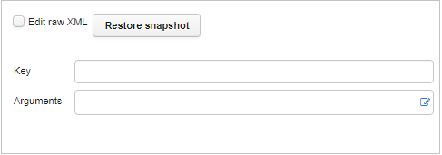
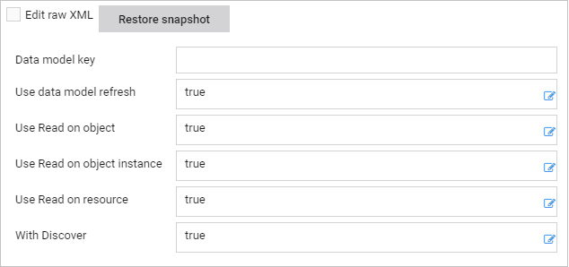
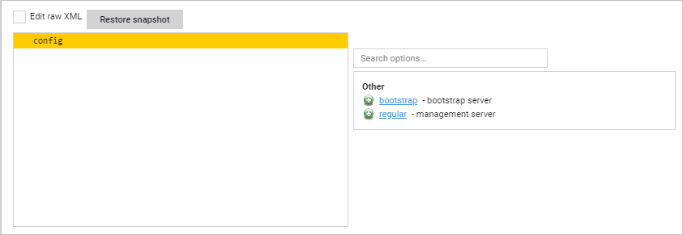
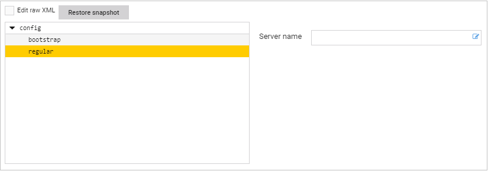
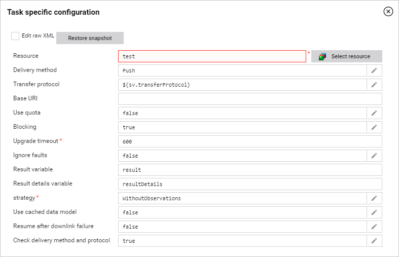
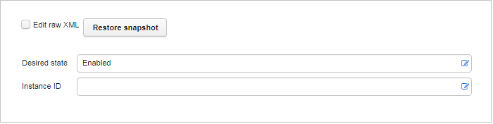
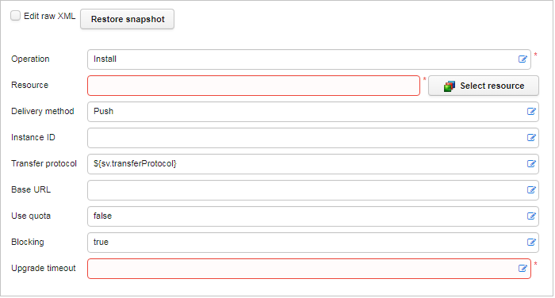
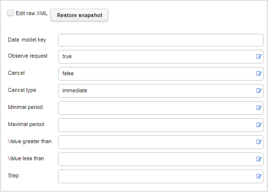

# LwM2M

## cancelAllObserves

It cancels all configured observes for a given device.

## Example backup and restore task templates

Below templates allow you to perform backup or restore task on LwM2M devices. To use them instead of default backup and restore tasks, add the **customBackupTask** property or
the **customRestoreTask** property on a target device or group with a corresponding name of a template.

   - *customBackupTask*

         <config>
           <store target="lastBackupTimestamp" value="${device.getProperty(task.id + '-lastBackupTimestamp', '0')}" />
           <store target="intervalTime" value="${task.properties.getOr('intervalTime','168')}" />
           <if expr="${#lastBackupTimestamp.toLong + #intervalTime.toLong * 3600 * 1000 &lt; date.now.millis}">
             <store target="currentNumber" value="${device.getProperty(task.id + '-nextNumber', '0')}" />
             <store target="resourceId" value="${'backup-' + device.id + '-' + task.id + '-' + #currentNumber}" />
             <store target="timestampProperty" value="${#resourceId + '-Timestamp'}" />
             <log message="performing backup, interval: ${#intervalTime}, currentNumber: ${#currentNumber}, lastBackupTimestamp:    ${date.fromMillis(#lastBackupTimestamp.toLong).format}" />
             <get key="KEY TO GET BACKUP IMAGE" output="image" />
             <editResource destination="${#resourceId}" source="backupTemplate">
               <operation regex="template" replacement="${#image}" replaceAll="true" />
               <resourceProperty name="softwareVersion" value="${device.softwareVersion}" />
               <resourceProperty name="relatedDeviceProperties" value="${#timestampProperty}" />
               <resourceProperty name="customRestoreTask" value="RESTORE TASK TEMPLATE NAME" />
             </editResource>
             <store target="${#timestampProperty}" value="${date.now.millis}" type="devProp" />
             <if expr="${task.properties.getOr('intervalTime', '0').toInt &gt; 0}">
               <store target="${task.id + '-lastBackupTimestamp'}" value="${date.now.millis}" type="devProp" />
               <store target="${task.id + '-nextNumber'}" value="${(#currentNumber.toInt + 1) % task.properties.getOr('backupNumber', '5').toInt}"    type="devProp" />
             </if>
         </config>

      In *customBackupTask* replace:

       - *"KEY TO GET BACKUP IMAGE"* with a resource on which you want to perform backup, for example, *Device.Configuration.0.Full Config*
       - *"RESTORE TASK TEMPLATE NAME"* with a name of a restore task template that will be applied to restore this key (optional).

   - *customRestoreTask*

         <config>
          <if expr="${task.properties.get('resourceId')!=null}">
            <store target="resourceId" value="${task.properties.get('resourceId')}" />
            <else>
              <store target="newestTimestamp" value="0" />
              <store target="startDate" value="${task.properties.getOr('fromDate', '1971.00.00 00:00:00').toDate('yyyy.MM.dd HH:mm:ss').millis}" />
              <store target="endDate" value="${task.properties.getOr('toDate', date.now.format('yyyy.MM.dd HH:mm:ss')).toDate('yyyy.MM.dd HH:mm:ss').millis   }" />
              <foreach list="${device.properties.keySet.filter(_.startsWith('backup-')).filter(_.endsWith('-Timestamp'))}">
                <log message="${device.properties.get(#i)}" />
                <store target="timestamp" value="${device.properties.get(#i)}" />
                <if expr="${#startDate.toLong &lt; #timestamp.toLong and #timestamp.toLong &lt; #endDate.toLong and  #timestamp.toLong &gt;    #newestTimestamp.toLong}">
                  <store target="newestTimestamp" value="${#timestamp}" />
                  <store target="resourceId" value="${#i.stripSuffix('-Timestamp')}" />
                </if>
              </foreach>
              <log message="${#resourceId}" />
            </else>
          </if>
          <log message="Restoring: ${#resourceId} " />
          <readResource resourceId="${#resourceId}" varName="content" />
          <set key="KEY TO GET BACKUP IMAGE" value="${#content}" />
         </config>

     In *customRestoreTask* replace:

       - *"KEY TO GET BACKUP IMAGE"* with a resource to be restored, for example, *Device.Configuration.0.Full Config*.

## ExecuteTask

It is supported by LWM2M. It executes a data model parameter's key to start a proper process on devices.

| Property name | XML attribute | Type   | Description                                                      |
|---------------|---------------|--------|------------------------------------------------------------------|
| key           | key           | string | A data model parameter's key that will be executed.              |
| arguments     | arguments     | string | A string conforming to protocol-defined syntax.                  |

## Lwm2mBestEffortGetTask

This task is supported by LwM2M. It gets the device parameters in the best-effort way. It is used by the system as a default task for refreshing the data model.

| Property name               | XML attribute         | Type    | Description                                                                                                                                                 |
|-----------------------------|-----------------------|---------|-------------------------------------------------------------------------------------------------------------------------------------------------------------|
| Data model key              | key                   | string  | Requests only for children of a given key will be performed.                                                                                                |
| Use data model refresh      | useRefreshDataModel   | boolean | Allows to try to refresh a full data model. This parameter applies only when a key is an empty path.                                                        |
| Use Read on object          | useObjectRead         | boolean | Allows to use *Read* requests targeting a LwM2M object to get children of the given key.                                                                    |
| Use Read on object instance | useObjectInstanceRead | boolean | Allows to use *Read* requests targeting a LwM2M object instance to get children of the given key.                                                           |
| Use Read on resource        | useResourceRead       | boolean | Allows to use *Read* requests targeting a LwM2M resource to get children of the given key.                                                                  |
| With Discover               | useDiscover           | boolean | Allows to use the *Discover* request. This request allows to find executable and write-only parameters supported by a device. It also retrieves attributes. |

## Lwm2mBootstrapConfiguration

Allows to initially configure devices and connect them with a regular server as well as reconfigure devices and connect them with a bootstrap server.

## Lwm2mBootstrapTask

Allows to initially configure devices and connect them with a regular server as well as a bootstrap server.

This tag allows two subtags:

| Property name | Description                        |
|---------------|------------------------------------|
| bootstrap     | A bootstrap server configuration.  |
| regular       | A management server configuration. |

Both subtags have one field:

| Property name | XML attribute | Type   | Description                                                              |
|---------------|---------------|--------|--------------------------------------------------------------------------|
| Server name   | serverName    | string | A name of a server to be configured. The list contains names of servers. |

## Lwm2mFirmwareUpdateTask

It executes the firmware download procedure.

| Property name                  | XML attribute               | Type    | Description                                                                                                                                                                                                                                                |
|--------------------------------|-----------------------------|---------|------------------------------------------------------------------------------------------------------------------------------------------------------------------------------------------------------------------------------------------------------------|
| Resource                       | resourceId                  | string  | A firmware image file.                                                                                                                                                                                                                                     |
| Delivery method                | transferMethod              | string  | **Push` - use CoAP blockwise transfer, **Pull` - use URI for download.                                                                                                                                                                   |
| Transfer protocol              | protocol                    | string  | A protocol to conduct a client pull.                                                                                                                                                                                                                       |
| Base URL                       | baseUrl                     | string  | Protocol, host and port. If it is not set, then it will be determined on the basis of an download protocol and SVs                                                                                                                                         |
|                                |                             |         | (preferredPublicURLBase/preferredPublicURLBaseHTTP/preferredPublicURLBaseFTP). If SV is not available, then a default value from Coiote DM                                                                                                                 |
|                                |                             |         | configuration will be used.                                                                                                                                                                                                                                |
| Use quota                      | useQuota                    | boolean | Use quota to restrict resources available for the task.                                                                                                                                                                                                    |
| Blocking                       | blocking                    | boolean | If it is set to *true*, then other tasks will not be executed until this task ends.                                                                                                                                                                        |
| Upgrade timeout                | timeoutInSec                | integer | Timeout is seconds.                                                                                                                                                                                                                                        |
| Ignore faults                  | ignoreFaults                | boolean | Determines whether task execution will be terminated if any firmware update failure occurs (it will if set to 'false').                                                                                                                                    |
| Result variable                | resultVar                   | string  | Identifier of variable under which firmware update result will be stored (ERROR or SUCCESS). This variable can be referenced later in task processing.                                                                                                     |
| Result details variable        | resultDetailsVar            | string  | Identifier of variable under which firmware update result details will be stored. This variable can be referenced later in task processing.                                                                                                                |
| Use cached data model          | useCacheForInitialStateRead | boolean | Cached data model data is used for initial read to decide whether FOTA state machine restart is needed. If the cached data model is empty, standard data model is checked as a fallback.                                                                   |
| Resume after downlink failure  | resumeAfterDownlinkFailure  | boolean | Firmware upgrade resumes execution upon new contact with the device if it stopped during the last communication due to a downlink failure. The place it stopped before is used as a starting point, so it begins by retrying the last unsuccessful action. |
| Check transfer/delivery method | checkDeliveryAndProtocol    | boolean | Determines if transfer/delivery method check during the Firmware Upgrade by the FOTA task is performed or not.                                                                                                                                             |

## Lwm2mSoftwareActivationTask

It executes activation and deactivation of software.

| Property name | XML attribute | Type   | Description                                     |
|---------------|---------------|--------|-------------------------------------------------|
| Desired state | desiredState  | string | A desired state of package activation.          |
| Instance ID   | instanceId    | string | An instance ID representing a software package. |

## Lwm2mSoftwareManagementTask

It executes installation and uninstallation of software.

| Property name     | XML attribute  | Type    | Description                                                                                                                                |
|-------------------|----------------|---------|--------------------------------------------------------------------------------------------------------------------------------------------|
| Operation         | operation      | string  | An operation that will be performed.                                                                                                       |
| Resource          | resourceId     | string  | A package file.                                                                                                                            |
| Delivery method   | transferMethod | string  | **Push` - use CoAP blockwise transfer, **Pull` - use URI for download.                                                   |
| Instance ID       | instanceId     | string  | An instance ID representing a software package.                                                                                            |
| Transfer protocol | protocol       | string  | A protocol to conduct a client pull.                                                                                                       |
| Base URL          | baseUrl        | string  | Protocol, host and port. If it is not set, then it will be determined on the basis of an download protocol and SVs                         |
|                   |                |         | (preferredPublicURLBase/preferredPublicURLBaseHTTP/preferredPublicURLBaseFTP). If SV is not available, then a default value from Coiote DM |
|                   |                |         | configuration will be used.                                                                                                                |
| Use quota         | useQuota       | boolean | Use quota to restrict resources available for the task.                                                                                    |
| Blocking          | blocking       | boolean | If it is set to *true*, then other tasks will not be executed until this task ends.                                                        |
| Upgrade timeout   | timeoutInSec   | integer | Timeout is seconds.                                                                                                                        |

## ObserveTask

Performs Observe and WriteAttributes operations on LWM2M devices.

| Property name      | XML attribute          | Type    | Description                                                                                                                                                                                                                                                    |
|--------------------|------------------------|---------|----------------------------------------------------------------------------------------------------------------------------------------------------------------------------------------------------------------------------------------------------------------|
| Data model key     | key                    | string  | A data model key of a parameter for which an observation request will be sent.                                                                                                                                                                                 |
| Observe request    | sendObservationRequest | boolean | It sends the WriteAttributes request. Setting this attribute to *true* causes an observation request to be additionally sent. The WriteAttributes request cannot be sent for a currently observed key, the previous observation must be canceled first.        |
| Cancel             | cancel                 | boolean | It is set to *false* by default. When it is set to *true* it cancels observation for a given key.                                                                                                                                                              |
| Cancel type        | cancelType             | string  | Canceling is available in two modes: **immediate` (actively sent to a device) and **lazy` (sent in a response to next device message).                                                                                                       |
| Minimum period     | minimumPeriod          | integer | A minimal interval in seconds between sent observations.                                                                                                                                                                                                       |
| Maximum period     | maximumPeriod          | integer | A maximal interval in seconds between sent observations.                                                                                                                                                                                                       |
| Value greater than | greaterThan            | integer | Notifications are sent only if a monitored value is greater than this threshold.                                                                                                                                                                               |
| Value less than    | lessThan               | integer | Notifications are sent only if a monitored value is lower than this threshold.                                                                                                                                                                                 |
| Step               | step                   | integer | If a value of a step is specified, then a notification is sent only when a value changed by difference is equal or greater than the step. For example, **Step** is set to *2*, a notification will be sent when a value changes, for example, from *3* to *5*. |
