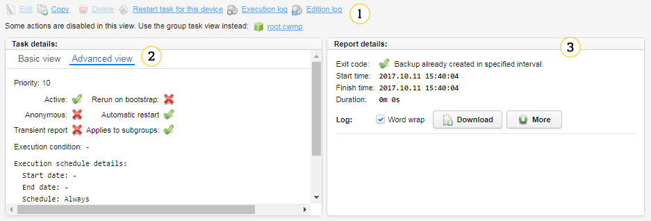

# Tasks - overview

## What are tasks?

Consider a task as a single piece of operation that can be performed on a device. In fact, (almost) every interaction between the server and a device is represented as the task. Example of such operations are:

   * Setting a Wi-Fi password
   * Rebooting a device
   * Backing up the configuration.

Some tasks are simple and dedicated to achieving a single goal, like LwM2M data model manipulation or FW (firmware) upgrade. Other are more advanced, for example, *ParameterValueTracerTask* can monitor parameters or *XMLTask* which is a powerful and efficient tool for provisioning, monitoring and handling unusual situations.

Each task possesses:

   * Configuration - a set of parameters that defines what the task does.
   * Task report - a storage for task variables and execution results.
   * Execution log - additional information about task execution.

Devices have a list of tasks that will be invoked during the next session (interaction) with the
device (no matter why this session occurs). This list can be found in :menuselection:`Device inventory --> Device tasks`.
Task execution order depends on various things (More details in the **Task Priorities** section) but tables show tasks in exactly the same order as they will be executed on the device during a session.
When you select a row from that list you will see additional information about task execution.

1. **Actions** - the following actions can be performed on the task instance:
   * **Edit** - click it to edit a task configuration.
   * **Copy** - click it to create a new task instance based on the current one.
   * **Advance to group** - click it to copy a device task to a group. Be careful when you use this option because the selected task will be performed on a whole group of devices so if there is something wrong with this task, many devices will be affected.
   * **Delete** - click it to delete this task instance.
   * **Restart task** - click it to restart the task.
   * **Execution log** - click it to see the execution log.
   * **Edition log** - click it to see a history of this task editing.
2. **Task details** - see details of the task, you can use the following tabs: **Basic view** and **Advanced view**.
3. **Reports details** - a list of variables, execution results and executions logs.
