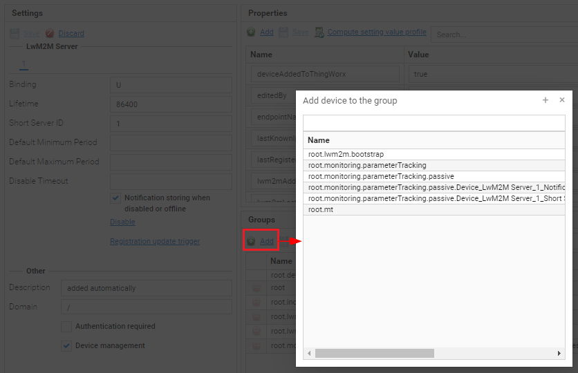
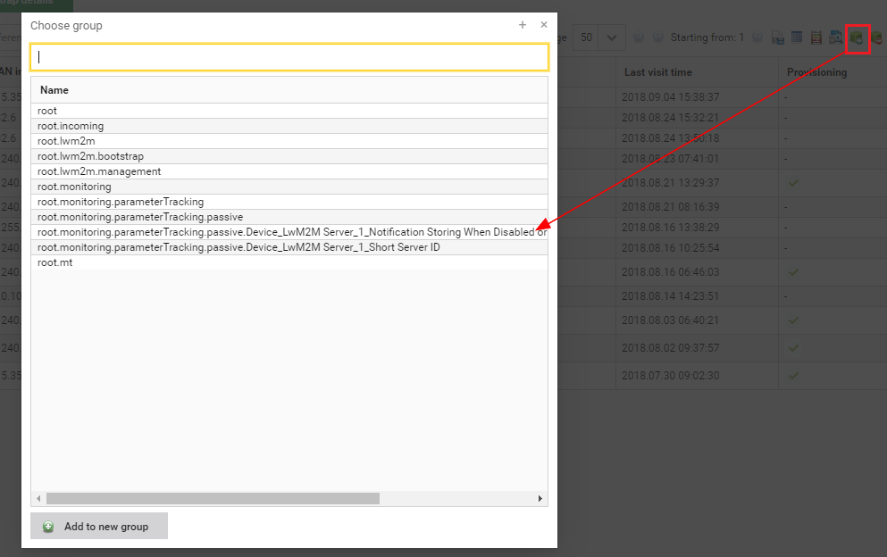
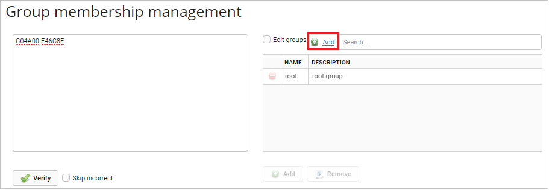
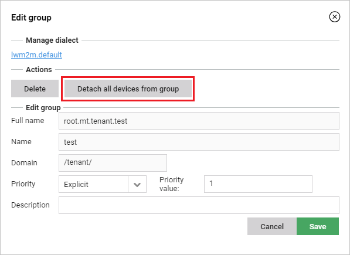
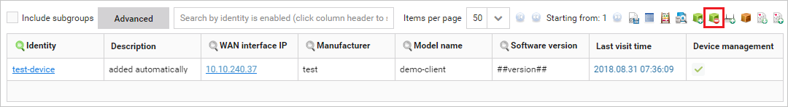

# Adding devices to groups

Learn how to add devices to groups.

**Option 1:**

0. Go to **Device inventory** and on the list of devices, find a device you want to add to a group and click it.
0. Depending on the type of a device go to:
    - The **General management** tab
    - The **Configuration** tab.
0. In the **Groups** panel click the **Add** link.

0. Select a group and click the **Save** link.

**Option 2:**

!!! note
    Use this way of adding devices if you want to add **all devices** from the list to a selected group.

0. Go to **Device inventory** and click the **Add to group** icon.

0. From the list of groups select the group by clicking it.

    !!! tip
        If you need to create a new group, click the **Add to new group** button, provide a name of the new group - it should start with *root* followed by a comma, for example, *root.fortests*, and optionally its description. Click the **Confirm** button.

0. Confirm your choice by clicking the **Yes** button.

**Option 3:**

1. Go to **Device actions -> Group membership management**.
2. In the left area, type or paste a list of devices (one device identity per line).
3. Click the **Verify** button to verify IDs. If the verification is not successful, click the **Edit** button and correct the identities marked in red.
4. Add groups to which you want to add devices by clicking the **Add** link and clicking the group name.

    !!! tip
        To add many groups at the same time, select the **Edit groups** check box and paste each group in a new line.

5. Click the **Add** button.

**Option 4:**

To move devices from one group to another you can use migration rules. To learn how to use them, refer to the [Migrations](Migrations.md) chapter.

## Deleting devices from groups

Read this section to learn how to delete devices from groups.

**Option 1:**

1. Go to **Device groups**.
2. From the list of groups, select a group from which you want to detach devices.
3. Click the **Edit** button.

  .. note:: Keep in mind, that **all devices** will be detached from the selected group.

4. In the **Edit group** window, click the **Detach all devices from group** button.

5. Click the **Save** button.

**Option 2:**

1. Go to **Device groups** and from the groups tree select a group by clicking it.
2. Go to **Devices**. You can now see all devices that belong to the selected group.

  .. note:: Keep in mind, that **all devices** that you see on the list will be removed.

3. Click the **Remove from group** icon.

