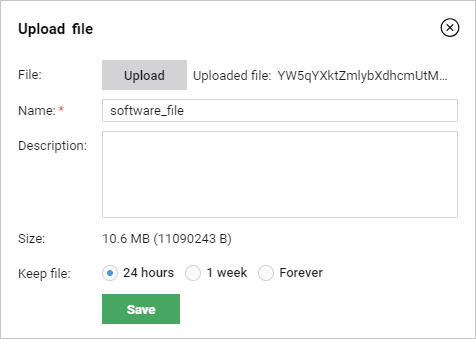
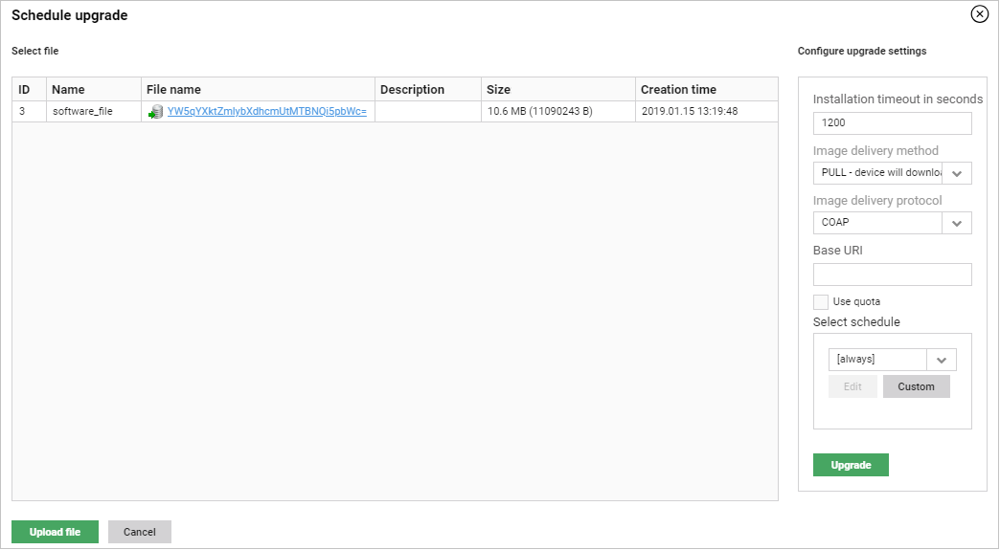
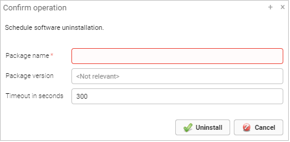
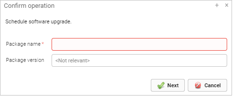

# Managing LwM2M software for device groups

Read this instruction to learn how to manage software for groups of LwM2M devices.

## Installing software for LwM2M groups

To install software on a group of devices:

1. Go to **Device groups**.
2. From a list of groups, select a group for which you want to install the software package.
3. Go to the **LwM2M software** tab.
4. Click the **Schedule new software installation** link.
5. Configure your installation:
    * From the list of available software files, select a file that you want to install. If you want to add a new file, then:
         * Click the **Upload file** button.
         * Click the **Upload** button and select a file.
         * Into the **Name** field, type a name of the file or leave the name added automatically.
         * Optional: Into the **Description** field, type a description.
         * Decide for how long you want to keep a file in the system by selecting a proper check box.
         * Click the **Save** button.
            {:style="float: left;margin-right: 1177px;margin-top: 17px;"}

            !!! tip
                You can also upload a software file using **Resources** but remember that you have to select **software** from the **Category** list to make this file visible in the **LwM2M software** tab.

     * Decide on a timeout of your installation (how much time can elapse before it fails) by typing a proper value into the **Installation timeout in seconds** field.
     * Decide on a delivery method by selecting a proper option from the **Image delivery method** list.
     * Decide on a delivery protocol by selecting a proper option from the **Image delivery protocol** list.
     * Provide a proper URI into the **Base URI** field.
     * Select the **Use quota** check box to restrict resources available for the task.
     * Decide on a schedule for the installation. If you want the installation to start right away, from the **Select schedule** list, select **always**.
     
6. Click the **Upgrade** button.

## Uninstalling software packages for LwM2M groups

To uninstall a software package from a group of devices:

1. Go to **Device groups**.
2. From a list of groups, select a group for which you want to uninstall the software package.
3. Go to the **LwM2M software** tab.
4. Click the **Uninstall** link.
5. Configure your uninstallation:

     * Into the **Package name** field, type a name of a package.
     * Into the **Package version** field, type a package version. Otherwise all packages that have the same name will be uninstalled.
     * Decide on a timeout of your uninstallation (how much time can elapse before it fails) by typing a proper value into the **Timeout in seconds** field.
       {:style="float: left;margin-right: 1177px;margin-top: 17px;"}
6. Click the **Uninstall** button.

## Upgrading software packages for LwM2M groups

To upgrade a software package on a group of devices:

1. Go to **Device groups**.
2. From a list of groups, select a group for which you want to uninstall the software package.
3. Go to the **LwM2M software** tab.
4. Click the **Upgrade** link.
5. Configure your upgrade:
     * Into the **Package name** field, type a name of a package.
     * Into the **Package version** field, type a package version. Otherwise all packages that have the same name will be upgraded.
{:style="float: left;margin-right: 1177px;margin-top: 17px;"}
6. Click the **Next** button.
7. Continue configuring your upgrade:
     * From a list of available software files, select a file that you want to use for upgrade. If you want to add a new file:
           * Click the **Upload file** button.
           * Click the **Upload** button and select a file.
           * Into the **Name** field, type a name of the file or leave the name added automatically.
           * Optional: Into the **Description** field, type a description.
           * Decide for how long you want to keep a file in the system by selecting a proper check box.
           * Click the **Save** button.
           {:style="float: left;margin-right: 1177px;margin-top: 17px;"}

        !!! tip
            You can also upload a software file using **Resources** but remember that you have to select **software** from the **Category** list to make this file visible in the **LwM2M software** tab.

     * Decide on a timeout of your upgrade (how much time can elapse before it fails) by typing a proper value into the **Upgrade timeout in seconds** field.
     * Decide on a delivery method by selecting a proper option from the **Image delivery method** list.
     * Decide on a delivery protocol by selecting a proper option from the **Image delivery protocol** list.
     * Provide a proper URI into the **Base URI** field.
     * Select the **Use quota** check box to restrict resources available for the task.
     * Decide on a schedule for your upgrade. If you want the upgrade to start right away, from the **Select schedule** list, select **always**.

      

8. Click the **Upgrade** button.
