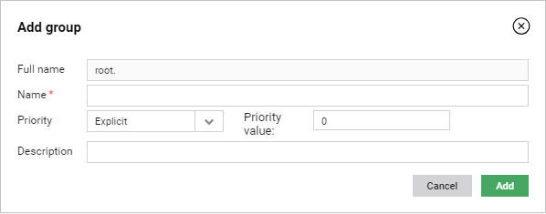

# Managing groups

Learn how to add and edit a group and how to see how many devices are assigned to it.

## Adding groups

To add a group:

1. Go to **Device groups**.
2. Click a proper place on a groups tree where you want to add a new group.
3. Click the **Add** button, provide a name for the group (this is mandatory).

     !!! tip
         Keep in mind that you will not be able to edit the group name.

4. From the **Priority** list, select a priority. Remember that the higher number you set, the higher priority the group has.
5. Provide a description of the group.
6. Click the **Add** link.

    

## Editing groups

To edit a group:

1. Go to **Device groups**.
2. From the list of groups, select a group you want to edit.
3. Click the **Edit** button.
4. In the **Edit group** window, provide changes.
5. Click the **Save** button.

## Deleting groups

To delete a group:

1. Go to **Device groups**.
2. From the list of groups, select a group you want to delete.
3. Click the **Edit** button.
4. In the **Edit group** window, click the **Delete** button.
5. Confirm the action by clicking the **Yes** button.

## Checking how many devices are in a group

To check how many devices are in a group:

1. Go to **Device groups** and from the groups tree select a group by clicking it.
2. Go to **Devices**. You can now see all devices that belong to the selected group. You can click the **Devices count** icon to count how many devices are on the list.
