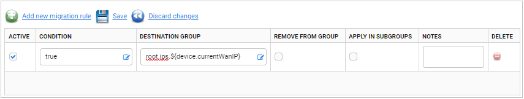
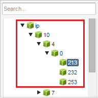
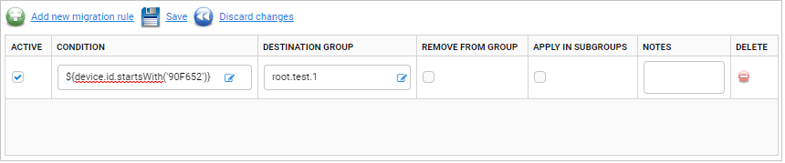

# Migrations

Read this chapter to learn some details about migrations, see some examples and useful conditions.

## Overview

The following laws apply to the group dispatch process:

0. Evaluated rules come from groups that a device belongs to (directly or indirectly when the **Apply in subgroups** check box is selected or only directly otherwise).
0. For every two groups of which one is an ancestor of the other, rules from the ancestor group are evaluated before rules from the descendant group. An unlikely exception is when the device does not belong to the ancestor group at the time when rules from descendants are evaluated, but it is added to the ancestor group later during the group dispatch.
0. In the scope of a single group, rules are evaluated concurrently, that is:
     * Conditions and destination groups of all rules are evaluated.
     * If at least one rule has the **Remove from group** check box selected, the device is then moved out of the currently evaluated group. It will also be removed from all its descendant groups, if that rule has the **Apply in subgroups** check box selected.
     * Finally, the device is added to all previously computed destination groups.
In other words, rules from a single group do not affect each other in any way. This is to avoid arbitrary relationships between group dispatch rules inside the single group.
0. Group changes are visible immediately:
     * A group dispatch will evaluate rules from groups that the device was added to by the previously evaluated rules.
     * The group dispatch will not evaluate rules from groups that the device was removed from as a result of evaluation of previous rules.
0. Every rule is evaluated at most once to avoid cycles.

## Example

If you want to create group and subgroup names from IP addresses of devices, one way to do it is by creating the following rule:

* Into the **Destination group** field, type:

        root.ips.${device.currentWanIP}

* Into the **Condition** field, type:

        1 or ${true}

 

This rule will create a group for each IP address and will add a device with this IP to the group. What is more, dots are levels separators so groups will be grouped by octets.

## Useful conditions

Conditions use the powerful [Expressions](Expressions.md) tool. You can use them to create complex and precise migration rules. Take a look at some simple conditions:

* true if a device ID is F8D111-394B7E:

        ${device.id == 'F8D111-394B7E'}

* true if a software version is A:

        ${device.softwareVersion == 'A'}

* true if a manufacturer OUI is F8D111:

        ${Device.DeviceInfo.ManufacturerOUI == 'F8D111'}

* true if SV with a key *CRCErrors* of a current device is NOT equal to *0* (remember, all SVs have a string type):

        ${device.getProperty('CRCErrors') != '0'}

* true if SV with a key *CRCErrors* of a current device is equal to *0* (remember, all SVs have the string type):

        ${device.getProperty('CRCErrors') == '0'}

## Setting up migration rules

Learn how to create a migration rule.

To set up a migration rule:

1. Go to **Device groups -> Migrations** and select the source group. To find the group, you can use the search bar located in the upper part of this panel.
2. To create a new rule, click the **Add new migration rule** link.

    !!! tip
        Syntax of each migration rule is checked while you type it. What is more, if the migration rule is not correctly performed; then the field in which you typed it is marked in red. When you hover over the field, you will see the error description.

3. Enter a migration condition, for example, *${device.id.startsWith('90F652')}*. After entering *${}* and placing the cursor between brackets, available options are prompted.
4. Set the destination group, for example, *root.test.1*. You can also use regular expressions to point to a specific group.

    !!! note
        The name of the destination group should not contain the ":" mark, end with a ".", or break the multitenancy rule. Otherwise, an error will occur and the **Destination group** field will be marked in red.

      

5. To use the rule, select the **Active** check box.
6. To execute the rule also for devices belonging to subgroups of the source group, select the **Apply in subgroups** check box.
7. To add important information about the rule, type it into the **Notes** field.
8. To delete:
      * The selected rule, click the **Delete** icon.
      * A device from the group after the rule evaluation, select the **Remove from group** check box.
9. To execute the newly created or modified rule, click the **Save** link.
