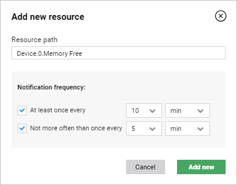

# Setting resource observation on device groups

Read this chapter to learn how to set observation of resources on a group of devices.

To set resource observation:

1. Go to **Device groups**.
2. From a list of groups, select a group for which you want to observe resources.
3. Go to the **Value tracking** tab.
4. Click the **Add new** button.
5. Configure observation:

     * Into the **Resource path** field, type or copy (for example, from **Device inventory -> Objects**) a path to a resource that you want to observe.
     * Select a proper check box to define how often you want to get notifications.

6. Click the **Add new** button.

