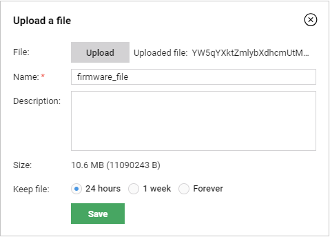
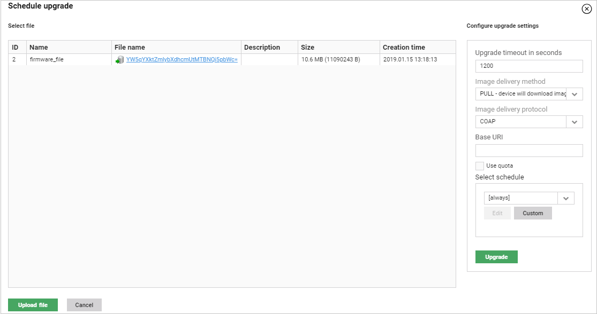

# Upgrading firmware for LwM2M groups

Read this instruction to learn how to upgrade firmware for groups of LwM2M devices.

To upgrade firmware on a group of devices:

1. Go to **Device groups**.
2. From a list of groups, select a group for which you want to upgrade firmware.
3. Go to the **LwM2M firmware** tab.
4. Click the **Schedule new firmware upgrade** link.
5. Configure your upgrade:

   * From a list of available firmware files, select a file that you want to use for upgrade. If you want to add a new file:

     * Click the **Upload file** button.
     * Click the **Upload** button and select a file.
     * Into the **Name** field, type a name of the file or leave the name added automatically.
     * Optional: Into the **Description** field, type a description.
     * Decide for how long you want to keep a file in the system by selecting a proper check box.
     * Click the **Save** button.

!!! tip
    You can also upload a firmware file using **Resources** but remember that you have to select **firmware** from the **Category** list to make this file visible in the **LwM2M firmware** tab.

   * Decide on a timeout of your upgrade (how much time can elapse before it fails) by typing a proper value into the **Upgrade timeout in seconds** field.
   * Decide on a delivery method by selecting a proper option from the **Image delivery method** list.
   * Decide on a delivery protocol by selecting a proper option from the **Image delivery protocol** list.
   * Provide a proper URI into the **Base URI** field.
   * Select the **Use quota** check box to restrict resources available for the task.
   * Decide on a schedule for your upgrade. If you want the upgrade to start right away, from the **Select schedule** list, select **always**.

6. Click the **Upgrade** button.

!!! tip
    In the **Profiles** tab, you can set the ****firmwareUpdateUseObserve**** setting value to ****true**** to issue an Observe on the "State" and "Update result" resources while upgrading. This will allow the server to check if the devices have already completed each of the upgrade stages (e.g. downloaded the firmware image).
