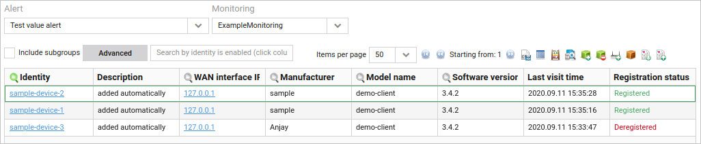

# Viewing monitoring alerts

Use the **Monitoring alerts** tab to see a list of devices for which a particular alert was raised for a selected monitoring. If there is no monitoring set on the particular group, the **Monitoring** and **Alert** lists are disabled.

To see a list of devices:

1. Go to **Device groups -> Monitoring alerts**.
2. From a group tree, select a group.
3. From the **Monitoring** list, select a monitoring.
4. From the **Alert** list, select an alert to see on which devices it is raised.
5. To include subgroups of the selected group, select the **Include subgroups** check box. The list showing devices with their details is displayed.

