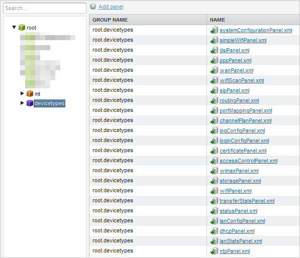

# Bundled setting panels

Preconfigured panels can be browsed in group management center, in the *root.devicetypes* group. Their definition is overridden at the system start-up, so they should not be changed as modifications will be lost on next system restart. If you want to modify them, they should be overridden for *root.devicetypes* subgroups.

!!! note
    Panels will be shown only if a data model supports such features.

Take a look at the table below to learn more about the panels.

| Access configuration     | Description                                                                                 |
|--------------------------|---------------------------------------------------------------------------------------------|
| systemConfigurationPanel | This panel contains settings for SV- stored system configuration.                           |
| simpleWifiPanel          | Simple panel for Wi-Fi configuration. Only basic settings are included.                     |
| dslPanel                 | Simple panel for changing basic DSL settings (VPC, encapsulation) of active DSL connection. |
| pppPanel                 | Simple view for managing active PPP connection account details.                             |
| wanPanel                 | Advanced panel for WAN settings (including PPP, IP and DSL settings).                       |
| wifiScanPanel            | Raw data visualization for Wi-Fi scan results.                                              |
| sipPanel                 | VoIP configuration panel.                                                                   |
| routingPanel             | Network routing configuration.                                                              |
| portMappingPanel         | Port mapping (port forwarding) configuration.                                               |
| channelPlanPanel         | Panel for administrating channel plan for WiMAX devices.                                    |
| logConfigPanel           | Custom log configuration for Broadcom vendor specific parameters.                           |
| loginConfigPanel         | Custom accounts configuration for Broadcom vendor specific parameters.                      |
| certificatePanel         | Custom certificates configuration for Broadcom vendor specific parameters.                  |
| accessControlPanel       | Custom remote access configuration for Broadcom vendor specific parameters.                 |
| wimaxPanel               | Panel for WiMAX settings configuration.                                                     |
| storagePanel             | Simple panel for storage service management.                                                |
| wifiPanel                | Advanced panel for Wi-Fi settings.                                                          |
| transferStatsPanel       | Read only panel with transfer statistics information.                                       |
| statusPanel              | Read only panel with status of device services like: DSL, VoIP, Wi-FI and statistics.       |
| lanConfigPanel           | Configuration of device LAN interface.                                                      |
| dhcpPanel                | Configuration of DHCP server.                                                               |
| lanStatsPanel            | Read only panel with LAN transfer statistics.                                               |
| ntpPanel                 | Panel for administrating NTP settings.                                                      |
