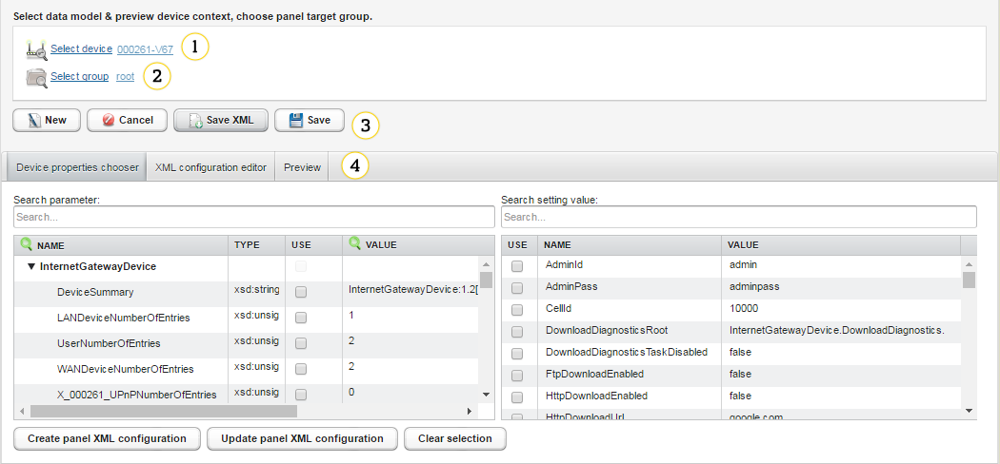
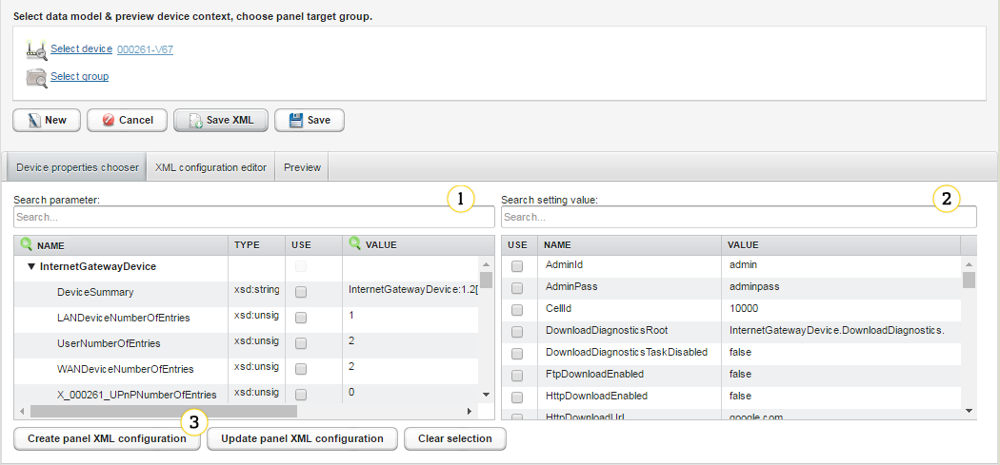
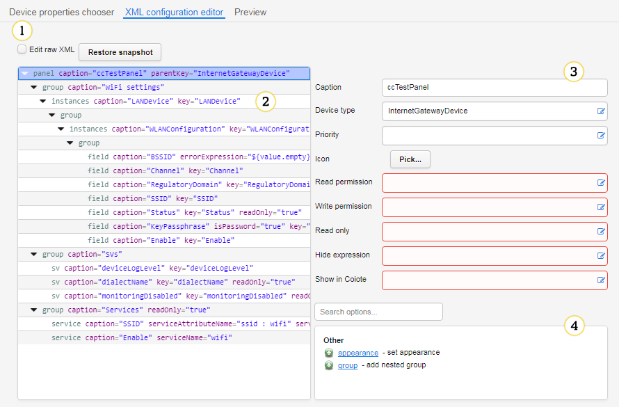
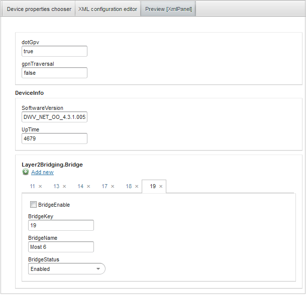

# Setting panel editor

Panel editor provides help through the whole setting panel design process:

* Wizard, that uses a device source data model and setting value profile and generates XML definition
* Advanced XML editor that provides visual XML panel definition builder
* Preview panel that lets you see a live component, generated from a current definition.

Detailed tags and attributes reference manual can be found in [Panel_editor_tags](Panel_editor_tags.md).
Even though a panel can be easily designed and deployed in about 5 minutes, read the [Setting Panel Examples - Tips & Tricks](Setting_Panel_Examples_-_Tips_and_Tricks.md) chapter to provide examples of advanced features and customization.

## Interface

Access to the Panel editor is via **Administration -> Panel editor**.

1. **Select device**- use it to select a data model and setting profile source device. Currently chosen one is used for generating the panel preview.
2. **Select group**- use it to select a group to which you want to link the panel.
3. Buttons:

   * **New**- use it to create an empty panel definition.
   * **Cancel**- use it to discard changes and close the definition.
   * **Save XML**- use it to start downloading the XML panel definition.
   * **Save**- use it to save the panel in a context of a selected group.

4. Tabs:

 * **Device properties chooser**- an XML panel definition wizard.
 * **XML configuration editor**- a visual XML definition editor.
 * **Preview**- a live panel preview.

## Device properties chooser

For selected device, panel definition can be generated using its data model parameters and setting values. Desired properties should be chosen and **Create panel xml configuration** button used to generate panel definition.

1. **Device properties chooser**- use it to present a device data model, including current parameter values.
2. **Setting values chooser** - use it to present a device setting value profile, including a calculated value for the current device.
3. **Create panel XML configuration**- use it to create and override panel XML configuration.

## XML configuration editor

1. **Editor mode switch** - use it to switch between visual editor and plain-text editor.
2. **Visual editor tags table** - use it to see an XML document structure, you can use the drag and drop functionality, copying and deleting tags.
3. **Visual editor selected tag properties** - use it to see available tag properties and fill them using prompts and expression syntax completion.
4. **Visual editor tags adder** - use it to see allowed subtags.

## Preview

Selecting the **Preview** tab, generates component using definition from **XML configuration editor**, it allows the user to interactively test edited configuration. Every time tab is accessed, preview is rebuilt from scratch in order to reflect every change in a definition.

