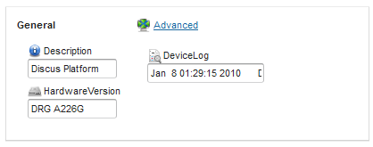

# Setting panel examples - tips and tricks

## Custom captions and descriptions

Meaningful components captions and field descriptions (shown in tool-tip) help understanding their usage. By default, when generated using **XML configuration editor**, captions are equal to the last part of item **key** attribute. If changed, new values are taken into account, for example:

| Use case                           | Definition                                                                                             | Item caption       | Item description                            |
|------------------------------------|--------------------------------------------------------------------------------------------------------|--------------------|---------------------------------------------|
| Auto-generated tag, description    | **field caption="DownloadTransports" key="Capabilities.PerformanceDiagnostic.DownloadTransports"** | DownloadTransports | Supported ''DownloadDiagnostics'' transport |
| Customized caption and description | **field key="Capabilities.PerformanceDiagnostic.DownloadTransports" caption="Download transports" description="Available download transports"**   | DownloadTransports | Available download transports               |
|

!!! note
    Advanced users can use translation keys as caption and description attribute values.

## Using permissions

Access to panel and its components can be limited using permissions:

 * read permission (**readPermission**) - limits access, so if you do not have one, panel or component is not displayed,
 * write permission (**writePermission**) - limits modifications, so if you do not have one, panel or component is in the read-only mode.

!!! note
    Permissions cascade down into the components hierarchy, so if you do not have a required permission, it affects the component and all its content. Lack of the write permission for a group, makes all other sub-groups and fields read only, while absence of the read permission, logically, makes sub-components invisible.

Besides permissions, there are two extensions that help to fine-grain access:

 * read only (**readOnly**) - if set to *true*, it disables edit for a marked component and its sub-components, and works as permanent lack of the write permission.
 * disabling instance management (**disableEdit**) - a persistent read-only mode for object instances array, you cannot add or remove instances. It does not cascade, if no other permissions specified, instance properties can be modified.

To give an example, a panel for checking a device status and changing basic, administration settings can be designed as follows:

	<panel priority="0" caption="Device status" parentKey="InternetGatewayDevice" icon="STATUS">
	  <group caption="Status">
	    <group caption="Time" key="Time">
	      <field caption="CurrentLocalTime" key="CurrentLocalTime" readOnly="true" />
	      <!--...-->
	    </group>
	    <instances caption="Lines" key="Services.VoiceService.1.VoiceProfile.1.Line" disableEdit="true">
	      <group>
		<group caption="SIP" key="SIP">
		  <field caption="AuthPassword" key="AuthPassword" />
		  <!--...-->
		</group>
	      </group>
	    </instances>
	  </group>
	  <group caption="Administration" readPermission="deviceManager.devices">
	    <group caption="ManagementServer" key="ManagementServer">
	      <field caption="PeriodicInformEnable" key="PeriodicInformEnable" writePermission="deviceManager.devices.edit" />
	      <field caption="PeriodicInformInterval" key="PeriodicInformInterval" />
	    </group>
	    <instances caption="Bridging" key="Layer2Bridging.Bridge" writePermission="deviceManager.devices.edit">
	      <group>
		<field caption="BridgeEnable" key="BridgeEnable" />
		<!--...-->
	      </group>
	    </instances>
	  </group>
	</panel>

Considering a different permission set, components access matrix changes as follows (X - not visible, R - readable, W - writable, (I) - instance management):

| Item/exact user permission set                           | {deviceManager.devices, deviceManager.devices.edit} | {deviceManager.devices} | {deviceManager.devices.edit} | {}   |
|----------------------------------------------------------|-----------------------------------------------------|-------------------------|------------------------------|------|
| Time.CurrentLocalTime                                    | R                                                   | R                       | R                            | R    |
| Lines                                                    | R(I)                                                | R(I)                    | R(I)                         | R(I) |
| Lines.SIP.AuthPassword                                   | RW                                                  | RW                      | RW                           | RW   |
| (Administration)                                         | RW                                                  | RW                      | X                            | X    |
| (Administration) ManagementServer.PeriodicInformEnable   | RW                                                  | R                       | X                            | X    |
| (Administration) ManagementServer.PeriodicInformInterval | RW                                                  | RW                      | X                            | X    |
| (Administration) Layer2Bridging.Bridge                   | RW(I)                                               | R(I)                    | X                            | X    |
| (Administration) Layer2Bridging.Bridge.BridgeEnable      | RW                                                  | R                       | X                            | X    |

Note how an instance management access level affects its subcomponents (permission set = {deviceManager.devices}):

 * Lines & Lines.SIP.AuthPassword - **disableEdit** property does not affect sub-components writability.
 * Layer2Bridging.Bridge & Layer2Bridging.Bridge.BridgeEnable - usage of **writePermission**, in case of lack of required one, makes sub-components read-only.

The same rules apply if the properties are used on a level of a panel element, with an exception when you do not have a read permission on the top level, the panel will not be rendered and shown in the browser (Device settings or Self management views).

## Modifying item key

A data model related key attribute is used in a cumulative way [Setting Panel XML Definition](Setting_Panel_XML_Definition.md), by enforcing nested XML elements, to use parent key as their own key suffix. It is handy if one follows data model hierarchy building user interface, it may have to be tuned up. Auto-generated panel configuration might look as follows:

	<panel priority="0" parentKey="InternetGatewayDevice">
	  <group caption="DeviceInfo" key="DeviceInfo">
	    <field caption="Description" key="Description" />
	    <!--...-->
	  </group>
	  <group caption="Time" key="Time">
	    <field caption="CurrentLocalTime" key="CurrentLocalTime" />
	    <!--...-->
	  </group>
	</panel>

Device status properties are presented in separate groups. If you want to put them into one group and give the container more meaningful name, you can accomplish it using:

	<panel priority="0" parentKey="InternetGatewayDevice">
	  <group caption="Device status">
	    <field caption="Description" key="DeviceInfo.Description" />
	    <field caption="SoftwareVersion" key="DeviceInfo.SoftwareVersion" />
	    <field caption="CurrentLocalTime" key="Time.CurrentLocalTime" />
	    <field caption="DaylightSavingsUsed" key="Time.DaylightSavingsUsed" />
	  </group>
	</panel>

!!! note
    The **key** attribute can be multi-part.

## Absolute key

Equally, it can be done by setting the **absoluteKey** property to *true*, which enforces that **key** property is not treated relative to its parent key, but device data model root object.
Definition can be written down:

	<panel priority="0" parentKey="InternetGatewayDevice">
	  <group caption="DeviceInfo" key="DeviceInfo">
	    <field caption="Description" key="Description" />
	    <!--...-->
	    <field caption="CurrentLocalTime" key="Time.CurrentLocalTime" absoluteKey="true"/>
	    <!--...-->
	  </group>
	</panel>

## Instances key

Modifying the generated key should be done carefully in case of instances, where exact instance numbers have to be included. Considering the panel for managing Wi-Fi settings, which is usually available on WLAN interface, there is no need to clutter the interface with instance management for **LANDevice** and **WLANConfiguration**.
The generated definition is as follows:

	<panel priority="0" caption="WiFi" parentKey="InternetGatewayDevice">
	  <group>
	    <instances caption="LANDevice" key="LANDevice">
	      <group>
		<instances caption="WLANConfiguration" key="WLANConfiguration">
		  <group caption="1">
		    <field caption="SSID" key="SSID" />
		    <!--...-->
		  </group>
		</instances>
	      </group>
	    </instances>
	  </group>
	</panel>

and can be rewritten into:

	<panel priority="0" caption="WiFi" parentKey="InternetGatewayDevice">
	  <group key="LANDevice.1.WLANConfiguration.1">
	    <field caption="SSID" key="SSID" />
	    <!--...-->
	  </group>
	</panel>

In order to ensure existing instance numbers to be chosen, expression, that will be discussed in detail later, can be used:

	<panel priority="0" caption="WiFi" parentKey="InternetGatewayDevice">
	  <group key="LANDevice.${value.get(0)}.WLANConfiguration.${value.get(0)}">
	    <field caption="SSID" key="SSID" />
	    <!--...-->
	  </group>
	</panel>

## Alternative key

The case when some parameters do not exist in the data model can be handled by specifying alternative, using the **alternativeKey** property.

## Force showing missing items

If the parameter cannot be found in the data model, by default, related field is not rendered. Such behavior can be suppressed by setting **showIfEmpty** to *true*, that causes rendering read-only field with the **N/A** value.

## Limiting field values list

Sometimes it is required to limit a list of possible field values as well as provide descriptive names for enumeration items.

## Capabilities list

The values list can be specified using the **capabilities** attribute in two ways:

 * Auto-generated values list - following TR-069 specification, some parameters have predefined values set, which is taken into account rendering field. That property should not, but can be overridden by user defined capabilities,
   specifying capabilities path to parameter that contain comma-separated list of available values,
   in place.
 * User defined comma-separated list of allowed values.

!!! Note
    If user provided capabilities are used, result combo box allows for an input of new values as well as, a special (EMPTY) value, mapped to an empty expression.

## Map of values

If possible parameter values are low-level, it can be helpful to provide more informative description displayed for end users. As DHCP lease time must be specified in seconds, some interval presets can be provided using the **valuesMap** attribute:

	<panel priority="0" parentKey="InternetGatewayDevice">
	  <group caption="LANDevice" key="LANDevice.1.LANHostConfigManagement">
	    <field caption="DHCPLeaseTime" key="DHCPLeaseTime" capabilities="-1,3600,43200,86400" valuesMap="${map('-1' -&gt; 'Infinite', '3600' -&gt; '1 hour', '43200' -&gt; '12 hours', '86400' -&gt; '24 hours')}" />
	  </group>
	</panel>

Mappings should be provided as expression that evaluates to list of pairs - value and its description.

!!! note
    Advanced users can use translation keys as mappings description, second item in mapping pair.

## Using expressions

Values of many attributes can be provided as [Expressions](Expressions.md), the available evaluation contexts go as follows:

| Panel Name     | Source Group  | Explanation                                                                                                                                                                                  |
|----------------|---------------|----------------------------------------------------------------------------------------------------------------------------------------------------------------------------------------------|
| date           | date object   | Contains utility functions for manipulating Date objects.                                                                                                                                    |
| device         | device object | Current device properties.                                                                                                                                                                   |
| dm             | dm object     | A device data model root item. It is available at every level of a setting panel and it is always the same.                                                                                  |
| node           | node object   | A current panel node, different for every group, field, etc.                                                                                                                                 |
| res            | res object    | It provides access to CSV resources.                                                                                                                                                         |
| sv             | sv object     | SVs in a current device profile.                                                                                                                                                             |
| value          |               | It is available for fields and SVs, it represents a current field value. An underlying object is treated as a string by default and it should be converted to other data types if necessary. |
| Helper methods |               |                                                                                                                                                                                              |
| date           | date object   | Contains utility functions for manipulating Date objects.                                                                                                                                    |
| format         | format object | Formatting methods, normalizing values, pretty printing.                                                                                                                                     |
| math           | math object   | Advanced mathematical operations.                                                                                                                                                            |
| net            | net object    | Network properties related methods, IP address operations.                                                                                                                                   |
| string         | string object | String manipulation methods.                                                                                                                                                                 |

## Expression examples

| Contexts                                                                                                      | Expression                                                                      | Output                   | Description                                                         |
|---------------------------------------------------------------------------------------------------------------|---------------------------------------------------------------------------------|--------------------------|---------------------------------------------------------------------|
| node.getPath() = ‘InternetGatewayDevice.LANDevice.1.LANUSBInterfaceConfig.1.Stats.BytesSent' value =‘2999277’ | ${format.normalizeBytes(format.asNumber(value).longValue)}                      | 2,9 MiB                  | Display transfer in normalized way                                  |
| node.getPath() = ‘InternetGatewayDevice.LANDevice.1.LANHostConfigManagement.MinAddress' value =‘192.168.1.1’  | ${net.isIp(value)}                                                              | TRUE                     | Validate DHCP min. IP address is a valid and covered by subnet mask |
| dm                                                                                                            | ${dm.getFieldByPath(‘InternetGatewayDevice. DeviceInfo.HardwareVersion’).value} | current hardware version | Directly address field and obtain it’s value                        |

!!! note
    Note the difference between **getCachedValue() (cachedValue)** and **getValue() (value)**. The former is equal to a value stored in the data model or loaded from related **XmlTask**, **set** tags. In contrast, **cachedValue** reflects, live value, changed by user editing values using panel. **value** should be read, if it is a read-only value (also in other setting panels displayed simultaneously), while **cachedValue** is suitable for dynamic content that reacts to a current field value.

## Hide expression

Use the hide expression option to limit access to panel and its parts. If the hide expression option is specified for any item and evaluated to *true*, then a component and its sub-components are hidden. You may want to show some configuration only if required parameters are available in the data model, or depending on their actual value.
Giving example, some devices support daylight savings configuration, but for the other, daylight savings panel should not be present:

	<panel priority="0">
	  <group key="Time">
	    <!--...-->
	    <group caption="Daylight savings" hideExpression="${dm.getFieldByPath(device.getRootObject()+'Time.DaylightSavingsUsed')==null}">
	      <field key="DaylightSavingsStart"/>
	      <field key="DaylightSavingsEnd"/>
	      <!--...-->
	    </group>
	  </group>
	</panel>

Depending on a current beacon type, proper security options can be shown:

	<panel priority="420" caption="deviceManager.panel.wlan" icon="WIFI" parentKey="InternetGatewayDevice">
	  <group>
	    <instances key="LANDevice.${value.get(0)}.WLANConfiguration">
	      <group>
		<field key="BeaconType" notifyingOnValueChange="true"/>
	      </group>
	      <group hideExpression="${dm.getFieldByPath(node.getPath()+'.BeaconType').getCachedValue() == '11i'}">
		<!--Conditionally show group only if beacon type current value is '11i'-->
	      </group>
	      <group hideExpression="${dm.getFieldByPath(node.getPath()+'.BeaconType').getCachedValue() == 'WPA'}">
		<!--Conditionally show group only if beacon type current value is 'WPA'-->
	      </group>
	    </instances>
	  </group>
	</panel>

Refreshing a panel on a value change
by using a field or SV attribute **notifyingOnValueChange** and setting it to *true* causes panel rebuilding every time its value changes. It can be used for interactive showing and hiding panel parts, for example, considering the Wi-Fi security panel from the previous example:

	...
	   <field key="BeaconType" notifyingOnValueChange="true"/>
	...

Introducing that setting refreshed a panel and shows a proper security setting panel for each beacon type.

## Obfuscating passwords

Sensitive data should be protected using password fields. By default, field/SV keys, which contain such phrases as: 'password', 'WEPKey', 'KeyPassphrase' are considered passwords and obfuscated by default. Such behavior, if not desired, can be changed using the **isPassword** attribute. Set it to *true* to treat item as a password and to *false* to always show plain text values.

To give an example:

	<panel caption="Passwords" parentKey="InternetGatewayDevice">
	  <group>
	    <sv caption="Some sensitive data" key="sensitiveData" isPassword="true" />
	  </group>
	  <group caption="ManagementServer" key="ManagementServer">
	    <field caption="ConnectionRequestPassword" key="ConnectionRequestPassword" isPassword="false"/>
	    <field caption="Password" key="Password" />
	  </group>
	</panel>

The above panel configuration creates a password field for SV, even though its name does not contain 'password' or similar special phrase. Simultaneously, suppresses password field usage for **ConnectionRequestPassword** and makes a panel display it in a plain text. The **Password** parameter is obfuscated by default.

## Format expression

Devices provide their operational statistics using, usually, read-only parameters, which may contain actual uptime, transfer or noise margins. Those values are expressed in base units, such as: bytes, seconds, bells and parameter value can be formatted before displaying it to end user. Expression context **format** should be used for that purpose as it provides methods for converting units. Context **value** should be first converted to a number as it is treated as a string by default.

	<panel priority="0" caption="XmlPanel-Tue May 07 10:44:34 CEST 2013" parentKey="InternetGatewayDevice">
	  <group caption="DeviceInfo" key="DeviceInfo">
	    <field caption="UpTime" key="UpTime" formatExpression="${ format.secondsToPeriod(format.asNumber(value).longValue)}" />
	  </group>
	  <group key="WANDevice.1.WANDSLInterfaceConfig">
	    <field key="UpstreamNoiseMargin" formatExpression="${format.asNumber(value).longValue/10} dB" />
	  </group>
	  <group key="WANDevice.${value.get(0)}.WANConnectionDevice.${value.get(0)}.WANPPPConnection.${value.get(0)}.Stats">
	    <field caption="EthernetBytesReceived" key="EthernetBytesReceived" formatExpression="${format.normalizeBytes(format.asNumber(value).longValue)}" />
	  </group>
	</panel>

## Checking values

Field values can be interactively validated against defined conditions, if they are not met, you are warned by a field being highlighted or an error indicator being shown.

### Validation expression

A current field value can be validated using **validationExpression**, for example, provided value must be valid IP address:

	<panel priority="0" parentKey="InternetGatewayDevice">
	  <group caption="LANDevice" key="LANDevice.1.LANHostConfigManagement">
	    <field caption="MinAddress" key="MinAddress" validationExpression="${net.isIp(value)}" />
	  </group>
	</panel>

### Thresholds - warning & alert expression

If direct value validation is not the case, range check may be required. You can define thresholds, which can be interpreted as values warning and/or alert states. For instance, there may be preconfigured download transfer limits:

   * Warning level - 5 GiB - when download speed is administratively cut down
   * Alert level - 10 GiB - when link is being cut off.

You can be warned about an account state by using such a panel:

	<panel priority="0" parentKey="InternetGatewayDevice">
	  <group key="WANDevice.${value.get(0)}.WANConnectionDevice.${value.get(0)}.WANPPPConnection.${value.get(0)}.Stats">
	    <field caption="EthernetBytesReceived" key="EthernetBytesReceived" formatExpression="${format.normalizeBytes(format.asNumber(value).longValue)}" warningExpression="${ format.asNumber(value).longValue &gt; 5368709120L}" errorExpression="${ format.asNumber(value).longValue &gt; 10737418240L}" />
	  </group>
	</panel>

## Managing instances

The **instances** tag let's you customize instances display. Their list can be filtered using **filterInstancesExpr**, the value context contains a list of existing instances numbers, a result should be a list of instances to display, for example:

	<panel priority="0" caption="Bridging" parentKey="InternetGatewayDevice">
	  <group>
	    <instances caption="Layer2Bridging.Bridge" key="Layer2Bridging.Bridge" filterInstancesExpr="${list(value.get(0), value.get(1))}" disableEdit="true">
	      <group caption="1">
		<field caption="BridgeEnable" key="BridgeEnable" />
		<field caption="BridgeKey" key="BridgeKey" />
		<field caption="BridgeName" key="BridgeName" />
		<field caption="BridgeStatus" key="BridgeStatus" />
	      </group>
	    </instances>
	  </group>
	</panel>

The following expression:

    ${list(value.get(0), value.get(1))}

constructs a result list from first two elements of an existing instances list. On the other hand, the list can be prepared by hand, using static configuration:

    1,2,3

or special property:

    ${list(value.get(0))}

that returns first, existing instance number.

Disabling edit option allows to disable add or remove instance actions, but it does not affect inner components (in comparison to not granted read/write permission). Considering above example, you cannot add or remove bridging instances, but you can still edit its properties.

## Styling

Panel design can be adjusted using the **appearance** tag, which applies to its direct parent.

### Sizings

Component sizings manage how much space component occupies, horizontally and vertically. Allowed values can be expressed in pixels or using percentage, for example,: **100px**, **70%**. Also special settings are provided:

* **SIZE_FULL** (100%) - causes the component to use all available space.
* **SIZE_UNDEFINED** (-1px) - makes the component shrink, only to size required by its content.

### Horizontal

The Horizontal (horizontal) property, if used for a group, it arranges sub-components horizontally.

### No border & margin

In order to remove a group border and margin around content, set **noborder** and **nomargin** properties to *true*.

### Bold

The **bold** property makes item caption display in a bold text style.

### Icon

Every component in a setting panel can have an icon chosen from the list preconfigured for the Coiote DM application.

### Advanced

Components can be wrapped into an expandable component, by using the **advanced** option for a group.

Configuration:

	<panel priority="0" parentKey="InternetGatewayDevice">
	  <group key="DeviceInfo">
	    <group caption="General">
	      <field caption="Description" key="Description">
		<appearance width="100px" icon="ALERT_INFO" />
	      </field>
	      <field caption="HardwareVersion" key="HardwareVersion">
		<appearance width="100px" icon="HARD_DISK" />
	      </field>
	      <appearance noborder="true" />
	    </group>
	    <group caption="Advanced">
	      <field caption="DeviceLog" key="DeviceLog">
		<appearance icon="LOGS" />
	      </field>
	      <appearance advanced="true" nomargin="true" noborder="true" />
	    </group>
	    <appearance width="100%" height="-1px" horizontal="true" />
	  </group>
	</panel>

Renders as:

## Custom CSS style

Panel definition may contain CSS style snippets, which will be applied directly to the **appearance** target tag. You should use Custom CSS carefully as it might interfere with existing styling rules. You can change, for example, color and font size:

	<panel priority="0" parentKey="InternetGatewayDevice">
	  <group caption="DeviceInfo" key="DeviceInfo">
	    <field caption="SoftwareVersion" key="SoftwareVersion" />
	    <appearance style="color: red;&#xA;font-size: medium;" />
	  </group>
	</panel>
