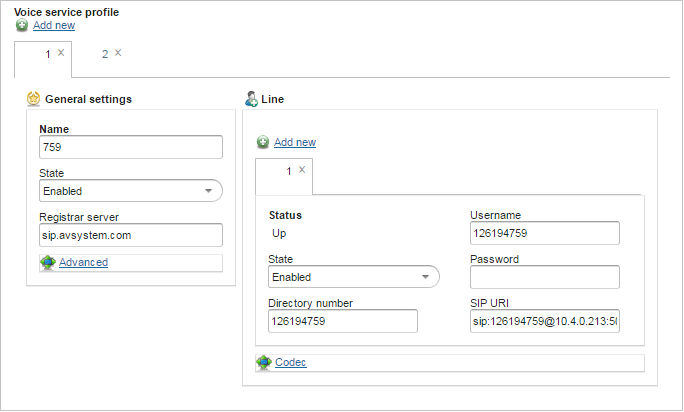
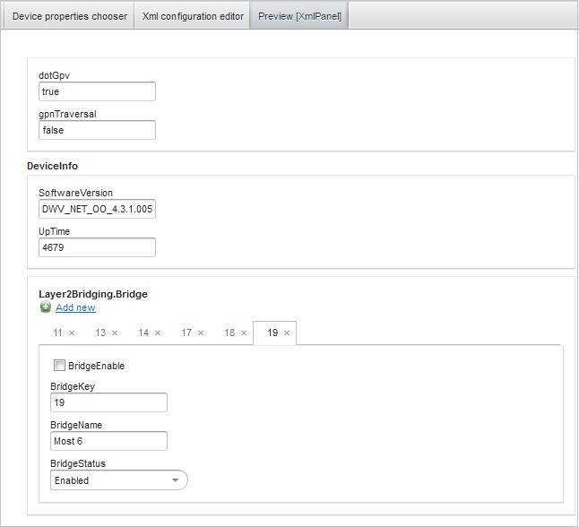
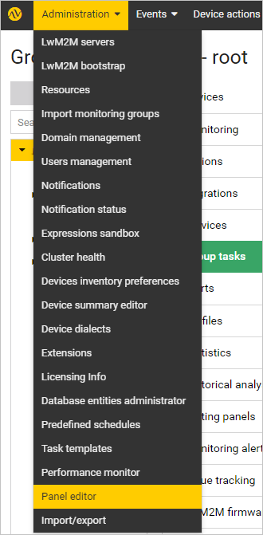
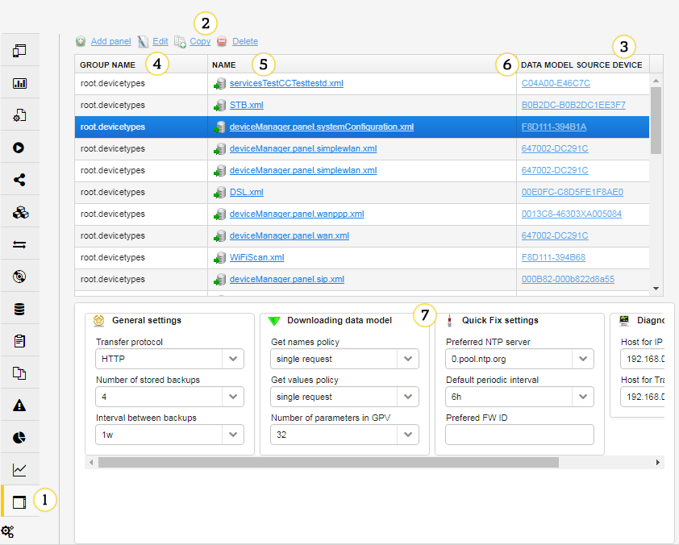

# Setting panels - overview

Setting panels were created to provide a higher level of abstraction for editing device properties. It is possible to extract and group basic properties, such as device data model parameters and setting values into a consistent view of configuration. They are entities bound to groups and available for devices, which belong to them. Loading mechanism provides support for varying device capabilities, which depends on its type, firmware version or group membership, by aggregating all available panels and overriding them, if it is implied by groups' parent-child relationship.
They are fully manageable entities from the Coiote DM point of view, having proper privileges lets you create new setting panels as well as modify and delete existing ones. Necessary tooling and administration views are provided. Vast functional and appearance configuration capabilities make them a good solution for customizing an installation with finely tailored views that improve your experience.

**Key points:**

 * Structured, user friendly device configuration UI
 * Data model edition
 * Setting values edition
 * Editable available panels set for a device
 * Ability to override panel definition for specific device, firmware types, and logical groups
 * XML definition, that can be edited even by hand
 * Appearance customization
 * Permission restricted panel
 * Dynamic content, dependent on a current panel state
 * Capabilities list, formatting, validating, values bounds check, mapping low-level, protocol related values to meaningful ones
 * Expression and completion support.

## Panel content

A component contains fields that help you edit device properties. Depending on their data type, they present plain text, check box or list of available capabilities as well as managing data model objects instance management. Navigation is improved by arranging fields into logical groups and enhancing their look by proper using of layout or icons. Modified values highlighting, values validation and thresholds check help you in filling a form properly.

## Loading rules

Panels are entities, which are configured for device groups and loaded for devices. Set of panels, which can be shown to you for the chosen device is called device's effective panels profile. Calculation rules are the following:

 * Panels are recognized by their name.
 * Panels effective profile contains all panels configured for groups that the chosen device belongs to, including all their parent groups.
 * If there are two panels with the same name, the panel from the most specific group is chosen.
 * If there are two panels with the same name, but there is no parent-child relationship between their group, the panel from the group with the higher priority is chosen.
 * If the priorities of groups is the same, both panels are loaded.

**Example**

Considering configuration and device that belongs to **root.tests** and **root.devicetypes.manufacturer**:

| Group                         | Priority | Panels                              |
|-------------------------------|----------|-------------------------------------|
| root                          | 0        | status.xml                          |
| root.tests                    | 5        | wifi.xml, wan.xml, voip.xml         |
| root.dev                      | 5        | voip.xml                            |
| root.devicetypes              | 0        | wifi.xml, wan.xml, lan.xml, ntp.xml |
| root.devicetypes.manufacturer | 0        | wifi.xml, lan.xml, sip.xml          |

Results in a device effective profile:

| Panel name         | Source group                  | Explanation                                                                          |
|--------------------|-------------------------------|--------------------------------------------------------------------------------------|
| status.xml         | root                          | `root` is parent of `root.tests`                                                 |
| wifi.xml           | root.tests                    | `root.tests` has the highest priority of groups with `wifi.xml` configured       |
| wan.xml            | root.tests                    | `root.tests` has higher priority than root.devicetypes                             |
| duplicate voip.xml | root.tests, root.dev          | `root.tests` and `root.dev` have the same priority                               |
| lan.xml            | root.devicetypes.manufacturer | panel from `root.devicetypes.manufacturer` overrides one from `root.devicetypes` |
| ntp.xml            | root.devicetypes              | panel exists only in `root.devicetypes`                                            |
| sip.xml            | root.devicetypes.manufacturer | panel exists only in `root.devicetypes.manufacturer`                               |

!!! note
    It is recommended to configure device panels for the `root.devicetypes` hierarchy, where differences in devices data model (which panels mostly depend on) can be best handled by overriding panels for more specific device types.

## Access

Coiote DM provides separate views for use and administration of panels and a fully featured editor.

### Direct use

Panels are designed for modifying device properties, so they can be found in device's management center view under **Device settings** submenu.

### Device Settings view

1. **Device settings** - a submenu to manage a setting panel.
2. **VoIP Settings** - a setting panel tab.
3. **Edit** - opens a panel editor for a selected panel definition.
4. **Override** - creates a settings panel that overrides the selected panel definition.

!!! note
    The **Edit** and **Override** buttons are available only for users who have a required privilege for panels creation or edition.

### Administration

Panel management focuses on two aspects:

 * Panel group membership, which with device membership results in available panels set for end user,
 * Panel definition - their actual content.

The former is provided in group management center view after selection of a group and the **Setting panels** submenu, while the latter, via **Panel editor**.
New panels can be created using **Setting panels**, which is available in **Administration -> Panel editor** .

## Setting panels view

1. **Setting panels** submenu.
2. Buttons:

   * **Add panel** - use it to open a panel editor, with a group context set to a selected group.
   * **Edit** - use it to open the panel editor for a selected panel.
   * **Copy** - use it to copy the selected panel, overriding selected panel, if a source one was inherited; new one with copied content, if the source one belongs to the current group.
   * **Delete** - use it to remove the panel.

3. **Panels list** - a list of panels that exist in the elected group hierarchy.
4. **Group name** - a panel source group name.
5. **Name** - a panel name, used for calculating panels profile, overridden ones have their name decorated with line-through.
6. **Data model source device** - a device identity that was used as a data model source for panel creation or edition.
7. **Preview** - a setting panel rendered for its data model source device. A preview is rendered, if devices are available on a current Coiote DM installation, it can be changed using panel editor.

### Bundled panels

The Coiote DM installation is provided with sample Bundled setting panels maintained by the Coiote DM developers.
