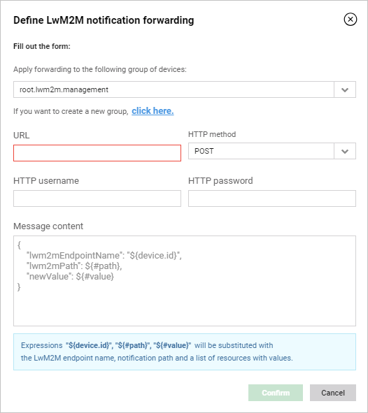

# Forwarding notifications to a REST endpoint

Read this chapter to learn how to forward a message to a REST endpoint.

To forward a notification:

1. Go to **Administration —> Extensions**.
2. In the **My custom REST template** panel, click the **Setup** button.
3. Configure your message:
    * From a list of groups, select a group to which you want to forward a message. If you want to add a new group, click the **click here** link.

    {: .center }

    * Into the **URL** field, type an URL to which the message will be sent. You can use expressions inside the URL.
    * From the **HTTP method** list, select a method you want to use.
    * If you want to use basic authentication, into proper fields, type a username and a password.
    * Into the **Message content** field, type the message that you want to forward in a JSON format. If you leave this field blank; then a default message (displayed in gray) will be forwarded.
    * You can use **Expressions**:
        * *${#path}* - a placeholder for a path of a resource, instance or object that is observed.
        * *${#value}* - a placeholder for an observed value sent in the notification.

    !!! note
        *${#path}* and *${#value}* are valid JSONs so due to the format they cannot be in additional quotation marks (if they will, the format of the entire message will be invalid). Other expressions need to be inside quotation marks.

4. Click the **Confirm** button. The properly configured task executes on a selected group of devices.
