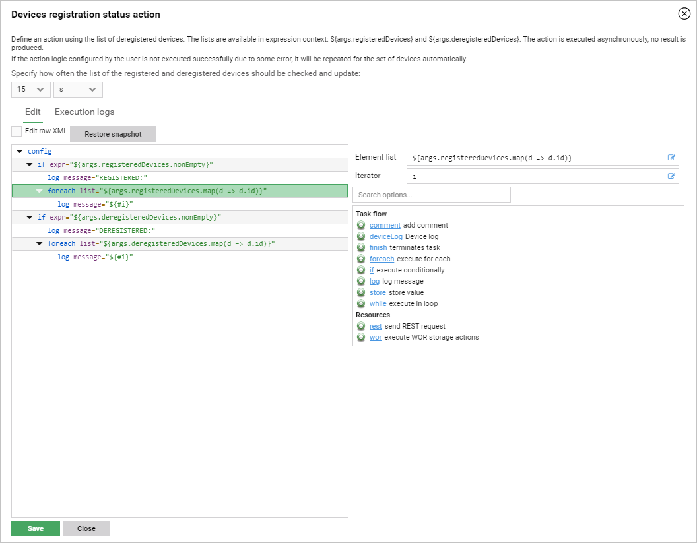

# Setting up registration status action

The registration status action extension lets you configure actions performed on the lists of registered and deregistered devices. Read the instructions below to learn how to set them up.

To configure the registration status action extension:

1. Go to **Administration —> Extensions**.
2. In the **Devices registration status action** panel, click the **Setup** button.
3. In the window that appears, configure your action:

    {: .center }

4. In the **Edit** tab, define your action logic. The lists of registered and deregistered devices are available in the `${args.registeredDevices}` and `${args.deregisteredDevices}` expression contexts.

    !!! note
        Each newly executed action is performed on the list of devices that have registered/deregistered within the defined interval. Note that if the action execution fails, it will be retried within the subsequent time interval.

5. You can also specify how often the status of registered/deregistered devices should be checked and updated using the time interval and time unit dropdowns.
6. After you have configured your registration status action, click **Save**. Action execution will start immediately.
7. If you want to check the status of execution of your configured action, go to the **Execution logs** tab.

## Example setup

Assuming that your config directory is called *my-config*:

1. Create file `my-config/entities/carp.conf`:

    ```
  entities {
    "com.avsystem.ump.core.db.entities.carp.Carp" {
      "/DevicesRegistrationStatus" = {
        "hook" : "DevicesRegistrationStatus"
        "definition" : """<config><log message="Hello!" /></config>"""
        domain: "/"
        logLevel = 3
        properties {
          jobIntervalTimeSeconds : "60"
        }
      }
    }
  }
    ```

2. Add the following to my-config/beans.conf:

    ```
  commonEntitiesList += ${abstractDataTransceiverEntry}{
    importOption = ADD_NEW_AND_UPDATE_EXISTING
    map."com.avsystem.ump.core.db.entities.carp.Carp" = /my-config/entities/carp.conf
  }
    ```

    !!! warning
        Note that you need to adjust *my-config* inside!

3. Optionally, you can adjust the following entries in `my-config/cdm.conf` to your liking:

    ```
 smg.mod.dataTransceiver {
   carpRegistrationStatusPostImportHook {
     # After a CARP is imported, the fist execution of the CARP job
     # will be delayed by a random duration between the two provided
     # This is meant as a form of preventing many computation- and I/O-
     # intensive tasks from executing at once during system startup
     # You can set both to the same value to eliminate randomness
     # Or set both to "0s" to disable delay
     minimalInitialDelay = 20s
     maximalInitialDelay = 2min
   }
 }
     ```
