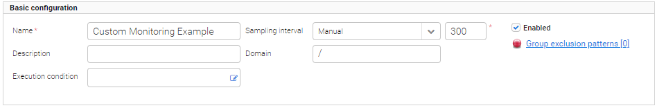
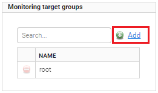
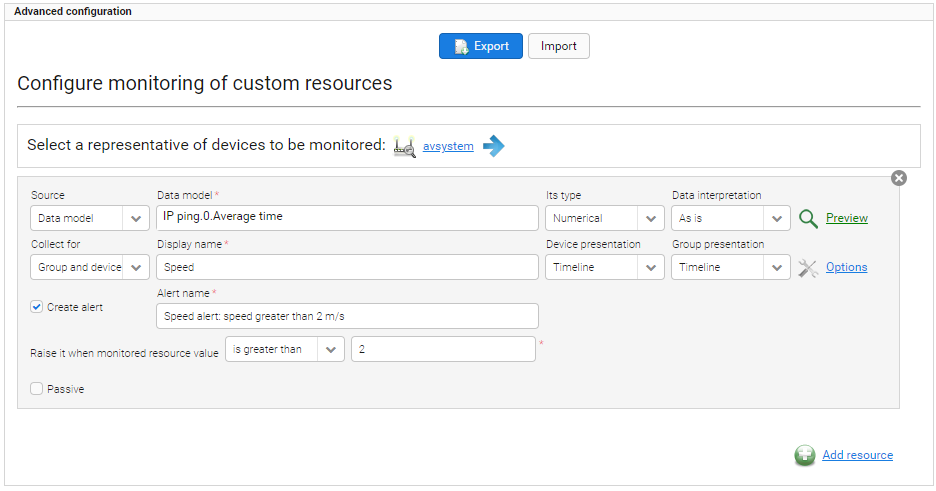
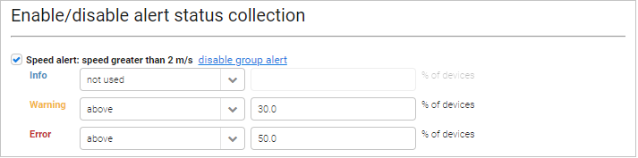

# Adding monitoring

Read this chapter to learn how to add a new monitoring.

To add a monitoring:

1. Go to **Monitoring & Reporting --> Monitoring**.
2. From the **Available monitoring** list, select a type of monitoring by clicking it.
3. Configure basic settings. To learn about basic configuration, read the [Monitoring Configuration](.../Monitoring_Configuration) chapter.
4. From the **Monitoring target groups** list, select groups you want to monitor. To learn more about adding groups, read the step **6** in the [Monitoring Configuration](.../Monitoring_Configuration) chapter.
5. Configure advanced settings. To learn about configuration of an individual monitoring, read the [Specific settings for monitoring](.../Monitoring_Type_Specific_Settings) chapter.
6. Optional: Add additional resources. To learn about configuration of additional resources, read the [Adding custom monitoring](#Adding_custom_monitoring) chapter.
7. Select check boxes next to alerts you want to enable. To learn about alerts of an individual monitoring, read the [Specific settings for monitoring](.../Monitoring_Type_Specific_Settings) chapter.
8. Click the **Save** button.

!!! tip
    * To edit the monitoring, select it from the list and make necessary changes. Do not forget to save them.
    * To delete the monitoring, select it from the list and click the **Delete** button.
    * If you do not want to delete the monitoring but you do not want it to collect samples, clear the **Enabled** check box.

## Adding custom monitoring

Read this chapter to learn how to add custom monitoring that enables you to decide which resources you want to monitor.

To add custom monitoring:

1. Go to **Monitoring & Reporting --> Monitoring**.
2. From the **Available monitoring** list, select a **Custom** monitoring by clicking it.
3. Configure basic settings. In this example, a name is defined, a sampling interval is set to *Manual* and its value is *300*, a domain is set to */*, and the **Enabled** check box is selected.

{: .center }
    *Fig. Basic configuration*

4. In the **Monitoring target groups** panel, click the **Add** link and select proper groups.

{: .center }
    *Fig. Selecting groups*

5. In the **Advanced configuration** panel, click the **Add resource** link to select a representative device. The representative device will be used to validate a configuration of monitoring. You will be warned if resources created by you are not available on the device. Each monitoring may monitor one or more resources, and for each resource an alert can be configured and a separate chart will be created.
6. Configure particular fields:

 * From the **Source** list, select whether this resource will be based on a data model or on a setting value, and into the **Data model** field, type a proper path. In this example, the data model will be selected. The system prompts available objects which are marked in bold. If the device has any instances then the system displays their number on the list. If there are no instances on the selected device, the system cannot prompt them and you need to type object instances values manually (in the place marked as **{i}**).
 * From the **Its type** list, select a proper type.
 * From the **Collect for** list, select if you want to collect data only for a group, device or for both group and device. Configure other related options:

   * Into the **Display name** field, type a name that will be displayed above a chart with results.
   * From the **Device presentation** / **Group presentation** lists, select how results will be presented, for example as a histogram or timeline.
   * Click the **Options** link to configure additional options. Fields available for configuration vary depending on your selection in the **Source** field:

     * **X axis label** - a name of the X axis, it will be visible on a chart.
     * **Y axis label** - a name of the Y axis, it will be visible on the chart.
     * **Aggregation mode** - a way in which data will be presented, if it is a sum or an average of results.

 * To create an alert for this resource, select the **Create alert** check box. Specify its name and define when it will be raised.

{: .center }
    *Fig. Configuring advanced settings*

7. In the **Actions** panel, click the **Save** button.
8. After saving the additional panel **Enable/disable alert status collection** will appear where you can enable group alerts (informing you for how many devices (in %) a particular alert occurred). For each defined alert:

 * In the **Enable/disable alert status collection**, click the **enable group alert** link next to the alert.
 * Define severity levels using lists and define a number above which the particular severity occurs. To disable the particular severity, select **not used** instead of **above**.

{: .center }
    *Fig. Enabling alerts*

9. In the **Actions** panel, click the **Save** button. All resources and alerts will be visible in **Device inventory --> Monitoring**. If you hover over a monitored resource’s graph in any place, you will see its value which was available at the corresponding time. If you hover over an alert’s graph, you will see periods of time the alert was raised/hidden.

**See also:**

* [Monitoring Configuration](.../monitoring-configuration)
* [Monitoring Type Specific Settings](.../Monitoring_Type_Specific_Settings)
