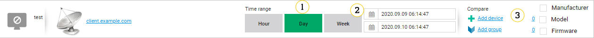
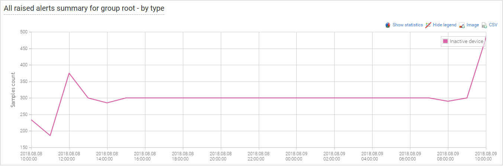

# Browsing monitoring results

As mentioned in [Monitoring](../Monitoring_Module.html), monitoring is applicable for two scopes - devices and groups. Consequently it is reflected by user interface structure for:

* Groups in [Device groups](../../User_Interface_Reference/Device_Groups/Device_Groups.html#monitoring)
* A single device in **Devices management center**.

Those views are similar for all types of monitoring. Typically they look like that:

{: .center }

1. Predefined time ranges: **hour/day/week**.
2. Custom time range beginning and end. Type your requested date or click the **Date** icon and select it from a calendar view.
3. Result comparison. You can compare in a graphical way results with single device(s) (**Add device**) or group(s) (**Add group**). You can remove devices or groups of devices from comparison by clicking the number of selected elements.

A typical results chart looks like this:

{: .center }

It contains the following useful options:

 * **Show statistics** - use it to show statistics for a particular chart.
 * **Hide legend** - use it to hide a legend.
 * **Image** - use it to export a graph as an image file.
 * **CSV** - use it to export data from the graph as raw data in a CSV file format.
 * **Full screen** - use it to expand the graph to the full screen to see details. Close the full screen mode by clicking **x** in right upper corner.

You can also compare two devices on a single chart. This is useful when you need to compare monitoring results of a single device with another one or a group of devices. Comparison between device types shows which of them grant customers better service. To learn how to do this, look at the **Basic filters** screen.
