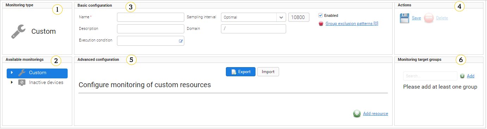
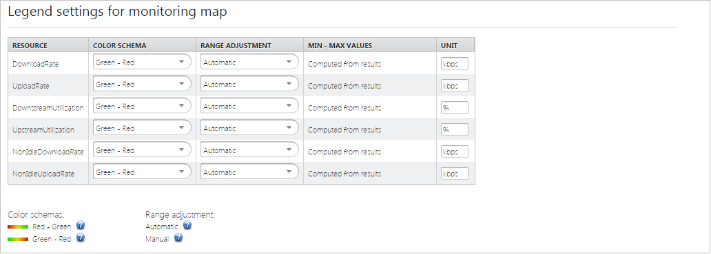

# Monitoring configuration

Enabling monitoring requires preparation of monitoring configuration. Monitoring manager is available in the **Monitoring & Reporting** menu.

{: .center }
   *Fig. Monitoring interface*

1. **Monitoring type** - information showing you which monitoring you selected.
2. A list of available monitoring types.
3. **Basic configuration**:

 *  **Name** - a unique name of monitoring configuration.
 * **Description** - an optional description of monitoring configuration.
 * **Execution condition** - an additional condition that needs to be met to start the monitoring. You should use [Expressions](.../Device_management/Device_operations/Handling_device_data/Expressions.html#expressions) in this field. Type *${* to get a hint.
 * **Sampling interval** - a time period (expressed in seconds) during which one sample should be collected. You can select the sampling interval from the list - **Optimal** (a predefined value) or **Manual** (you can set a value).
 * **Health index metric** - a selection of KPIs. To learn about KPIs of an individual monitoring, read the [Specific settings for monitoring](Monitoring_Type_Specific_Settings.html) chapter.
 * **Domain** - a list of available domains. Select it if you want to restrict access only to particular users. To learn about domains, read the [Managing multitenancy](.../Administration/Managing_Multitenancy.html#ug-m-managing-multitenancy) chapter.
 * **Enabled** - a check box that allows you to enable or disable a monitoring. Samples are not collected for inactive monitoring, but already collected results can be still browsed.
 * **Group exclusion patterns** - a list of regular expression patterns that are used to exclude groups from group aggregate collection.

4. **Actions**

 * **Save** - a button to save a new monitoring.
 * **Delete** - a button to delete the monitoring.

5. **Advanced configuration** - specific configuration for each monitoring. To learn about configuration of an individual monitoring, read the [Specific settings for monitoring](.../Monitoring_Module/Monitoring_Type_Specific_Settings.html) chapter.

 * **Import** and **Export** buttons to export to or import from a XML file monitoring type specific configuration.
 * The **Advanced configuration** can be divided into:

   * A panel with configuration fields specific for a particular monitoring.
   * **Configure monitoring of custom resources** with the **Add resource** icon - additional resources that you can add to be monitored. To learn how to configure additional resources, read the [Custom monitoring](Adding_monitoring.html#adding-custom-monitoring) chapter.
   * **Enable/disable alert status collection** - a list of alerts that you can enable (click the check box next to the alert) or disable (clear the check box).
   * **Legend settings for monitoring map** - for almost all monitoring types you can define legend settings for resources that are visible on a [monitoring map](Monitoring_map/Monitoring_map). You can select:

     * Color schema - how values should be colored. You can select **Red - Green** - lower values will have a red color and higher will have a green color, or **Green - Red** - lower values will have a green color and higher will have a red color.
     * Range adjustment - how values will be computed. You can select **Automatic** - minimum and maximum values will be computed on the basis of monitoring values, or **Manual** - minimum and maximum values will be defined by a user.
     * Unit - which unit will be used, for example, %, kbps, or ms.

{: .center }

   *Fig. Settings of monitoring map legend*

6. **Monitoring target groups** - a monitoring groups selection option. Select monitoring groups by clicking **Add** and selecting particular groups from the list. You can select more than one group at the same time, just keep the window open. To stop adding groups, close the window.
   To delete a group from monitoring, click the icon next to it.

!!! tip
    * When a group is selected its descendants are not accessible as they are also monitoring groups by definition.
    * When the **root** group is selected, then no more groups can be selected.
