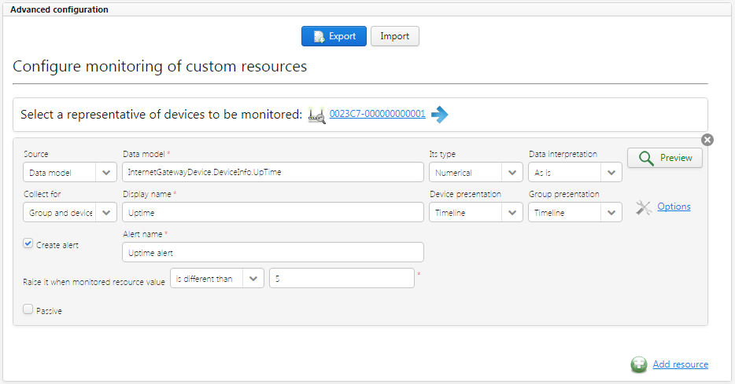

# Custom

Use the *Custom* monitoring to create a fully customized monitoring to satisfy your needs. The monitoring is based on data model parameters and on setting values, you decide what you want to use.

   *Fig. Monitoring - Custom*

Advanced configuration consists of the following fields:

 * **Add resource** - click it to add a new resource, then you will be able to select which parameter or setting value you want to monitor on the basis of a device.
 * **Representative of monitored devices** - a device representative that you selected after clicking the **Add resource** link. The device representative will be used to validate a configuration of Custom monitoring. You will be warned if resources created by you are not available on the representative device.

   * Click the **Preview** icon to see a current value of resources on the representative device.
   * Click the name of the device to change it to another one.
   * Save your configuration first, otherwise it will be lost. Click the blue arrow to go to **Device inventory** and see the device details.

 * **Source** - defines if the resource is taken from the data model or from setting values. Select:

   * **Data model** - to take the resource from the data model. The system prompts available resources, which are marked in bold. If a device has any instances then the system displays their number on the list. If there are no instances on the selected device, the system cannot prompt them and you need to type object instances values manually (type them in the place marked as **{i}**). Read more in [Data model key prompts](#Data_model_key_prompts).
   * **Setting value** - to take the resource from the setting values.

 * **Its type** - defines if a resource is expressed as text or as a number.
 * **Data interpretation** - a list of available ways of presenting your data, if it should be expressed, for example, as a percentage or sample count.
 * **Preview** - the icon shows if your configuration is correct. Green means correct and red means incorrect configuration. Click the icon to see a hint. If the configuration is correct, a value of a resource for the representative device is shown.
 * **Collect for** - click it to decide if you want to collect data only for a group, device or for both group and device.
 * **Display name** - a name that will be displayed above a chart with results.
 * **Device presentation**/**Group presentation** - defines how results will be presented, for example as a histogram or timeline.
 * **Options** - additional options that you can configure. Fields available for configuration vary depending on your selection in the **Source** field:

   * **X axis label** - a name of the X axis, it will be visible on a chart.
   * **Y axis label** - a name of the Y axis, it will be visible on the chart.
   * **Aggregation mode** - a way in which data will be presented, if it is a sum or an average of results.

 * **Create alert** - select it to create an alert for a particular resource.
 * **Alert name** - a name of the alert.
 * **Raise it when monitored resource value** - a list of conditions from which you select one for the resource. If the defined condition is met, then the alert is raised. Conditions vary depending on the configuration set in the **Its type** field. If you select, for example, **is absent from the following list**, type a value and press **Enter**. To remove the value, click it.
 * **Passive** - select it to indicate that the resource is passive.

!!! tip
    You can add as many resources as you want. For each of them a separate chart will be created.
